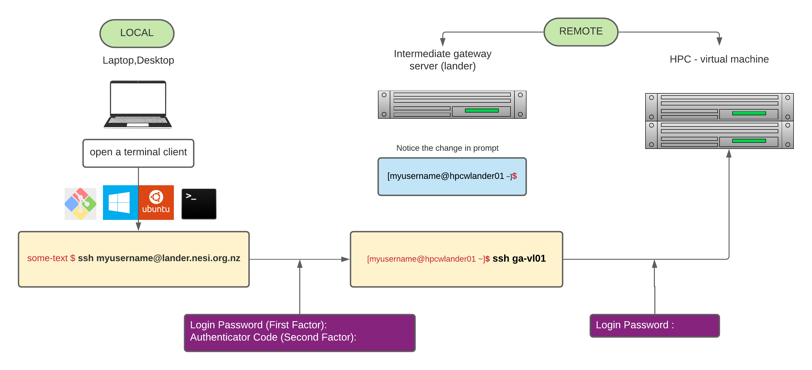
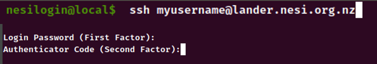
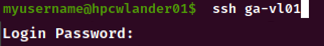

1. Type `ssh myusername@lander.nesi.org.nz` on yout local terminal (replace `myusername` with your **NeSI username**). 

2. Then respond to `Login Password (First Factor) :` and `Authentication Code (Second Factor):` accordingly 

   >**NOTE** : Entering either of these factors into terminal will not record any key strokes such as `*` to show an entry being made.  If you make a mistake, press and hold the the `Backspace` key  for few seconds to delete everything 

   

3. Once logged into `lander`, type `ssh ga-vl01` and enter the same password as before to `Login Password:` prompt. 