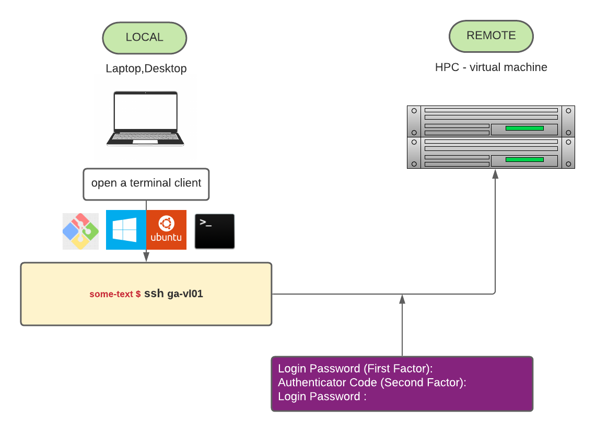
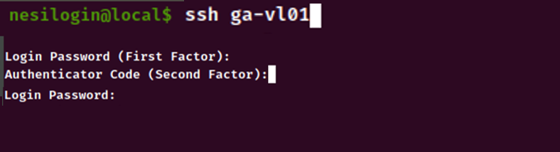

* Once [2_Local_Terminal_Setup](../2_Local_Terminal_Setup(recommended)/README.md) was completed, login into the virtual machine can be done with a single command with respect to the two step process used in [1_Access_Training_via_LocalTerminal](../1_Access_TrainingVM_via_LocalTerminal/README.md)

1. Type `ssh ga-vl01` on yout local terminal 

2. Then respond to `Login Password (First Factor) :` ,`Authentication Code (Second Factor):` and `Login Password :` accordingly 

   >**NOTE** : Entering either of these factors into terminal will not record any key strokes such as `*` to show an entry being made.  If you make a mistake, press and hold the the `Backspace` key  for few seconds to delete everything 

   

