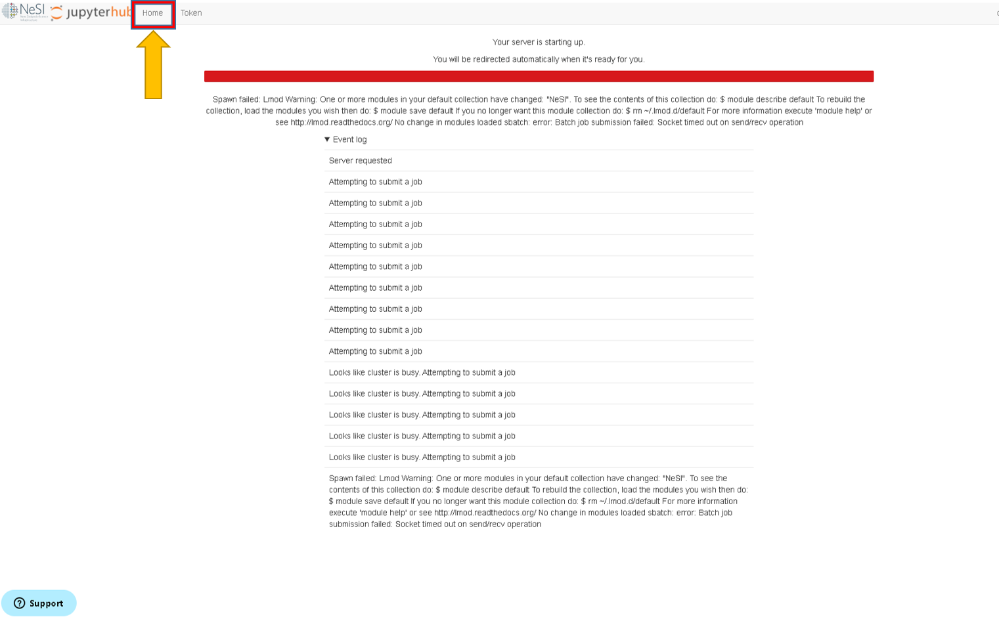

### During startup

1. Occasionnaly, jupyter session will not launch immediately and will stall on the folllowing screen for few minutes. If you are to experience this, click `Home` button on top left corner

1. It will re-direct to a page simlilar to below. Then click `Stop My Server` and wait for `Server Not Running` page

3. Then click on `Launch Sever` to restart the launch

* * * 
### During a session

1. There can be instances where the server will stop during a session. This could be either due to incorrect `Wall time` at the startup or an issue from the server end itself. If so, below are the most likely messages to prompt on the screen 

2. If you are to encouter either of those errors or someting similar, Click `Hub Control Panel` under `File`

3. Then click `Stop My server` , wait for `Server Not Running` page and then click on `Launch Sever` to restart the launch
