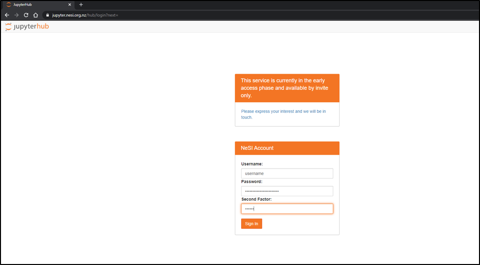

1. Follow https://jupyter.nesi.org.nz/hub/login
2. 
Enter NeSI username, HPC password and 6 digit second factor token 

3. 
Choose server options as below 

4. Log into `ga-vl01` virtual machine vie jupyter terminal 