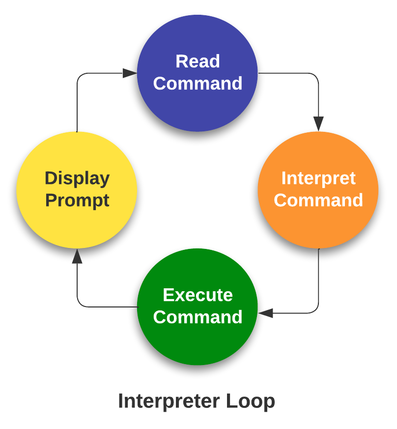

# Introduction to HPC & HPC job scheduler

### Defining high-performance computing

The simplest way of defining high-performance computing is by saying that it is the using of high-performance computers (HPC). However, this leads to our next question what is a HPC .

!!! info "HPC"

    A high-performance computer is a network of computers in a cluster that typically share a common purpose and are used to accomplish tasks that might otherwise be too big for any one computer.

<br>
<p>While modern computers can do a lot (and a lot more than their equivalents 10-20 years ago), there are limits to what they can do and the speed at which they are able to do this. One way to overcome these limits is to pool computers together to create a cluster of computers. These pooled resources can then be used to run software that requires more total memory, or need more processors to complete in a reasonable time.</p>

<p>One way to do this is to take a group of computers and link them together via a network switch. Consider a case where you have five 4-core computers. By connecting them together, you could run jobs on 20 cores, which could result in your software running faster.</p>

### HPC architectures

<p>Most HPC systems follow the ideas described above of taking many computers and linking them via network switches.  described above is:</p>
<br>

!!! info "What distinguishes a high-performance computer from the computer clusters"

    * The number of computers/nodes 
    * The strength of each individual computer/node 
    * The network interconnect – this dictates the communication speed between nodes. The faster this speed is, the more a group of individual nodes will act like a unit.


### NeSI Mahuika Cluster architecture

NeSI Mahuika cluster (CRAY HPE CS400) system consists of a number of different node types. The ones visible to researchers are:


* Login nodes
* Compute nodes

!!! info ""

    === "Overview of HPC Architecture"

        <br>
        {width="700"}
        <br>

    === "Composition of a node"

        <br><center>
        {width="500"}
        </center><br>

    === "In reality"

        <center>
        {width="700"}
        </center>


### From Hardware to Software

Over 90% HPCs & supercomputers employ Linux as their operating system.  Linux has four essential properties which make it an excellent operating system for the HPCs &  science community:

!!! quote ""

    
    === "Performance"
        Performance of the operating system can be optimized for specific tasks such as running small portable devices or large supercomputers.

    === "Functionality"
        A number of community-driven scientific applications and libraries have been developed under Linux such as molecular dynamics, linear algebra, and fast-Fourier transforms.

    === "Flexibility" 
        The system is flexible enough to allow users to build applications with a wide array of support tools such as compilers, scientific libraries, debuggers, and network monitors.

    === "Portability"
        The operating system, utilities, and libraries have been ported to a wide variety of devices including desktops, clusters, supercomputers, mainframes, embedded systems, and smart phones.

!!! info "The Linux operating system is made up of three parts; the ^^kernel^^, the ^^shell^^ and the software"

    Kernel − The kernel is the heart of the operating system. It interacts with the hardware and most of the tasks like memory management, task scheduling and file management.

    ^^**Shell**^^ − The shell is the utility that processes your requests (acts as an interface between the user and the kernel). When you type in a command at your terminal, the shell *interprets* (operating as in ^^*interpreter*^^) the command and calls the program that you want. The shell uses standard syntax for all commands. The shell recognizes a limited set of commands, and you must give commands to the shell in a way that it understands: Each shell command consists of a command name, followed by command options (if any are desired) and command arguments (if any are desired). The command name, options, and arguments, are separated by blank space. 

    - An ^^*interpreter*^^ operates in a simple loop: It accepts a command, interprets the command, executes the command, and then waits for another command. The shell displays a "prompt," to notify you that it is ready to accept your command.
    <center>
    {width="200"}
    </center>


### Accessing software via modules

On a high-performance computing system, it is quite rare that the software we want to use is available when we log in. It is installed, but we will need to “load” it before it can run.

Before we start using individual software packages, however, we should understand the reasoning behind this approach. The three biggest factors are:

* software incompatibilities
* versioning
* dependencies

One of the workarounds for this issue is Environment modules. A module is a self-contained description of a software package — it contains the settings required to run a software package and, usually, encodes required dependencies on other software packages.

There are a number of different environment module implementations commonly used on HPC systems and the one used in NeSI Mahuika cluster is `Lmod` where the `module` command is used to interact with environment modules.

!!! info "Viewing, Accessing and Deploying software with `module` command""

    * View available modules

    ```bash
    #View all modules
    $ module avail

    # View all modules which match the keyword in their name
    $ module avail KEYWORD

    # View all modules which match the keyword in their name or description
    $ module spider KEYWORD
    ```

    * Load a specific program

        >All module names on NeSI Software stack have a version and toolchain/environment suffixes. If none is specified, then the default version of the software is loaded. The default version can be seen with the `module avail modulename` command (corresponding module name will have `(D)` suffix)

    ```bash
    $ module load Module_Name
    ```


    * Unload all current modules

    ```bash
    $ module purge
    ```
    >Please **do not** use `$module --force purge`

    * Swap a currently loaded module for a different one

    ```bash
    $ module switch CURRENT_MODULE DESIRED_MODULE
    ```
## Working with job scheduler

<center>{width="500"}</center>

An HPC system might have thousands of nodes and thousands of users. How do we decide who gets what and when? How do we ensure that a task is run with the resources it needs? This job is handled by a special piece of software called the scheduler. On an HPC system, the scheduler manages which jobs run where and when. In brief, scheduler is a 


* Mechanism to control access by many users to shared computing resources
* Queuing / scheduling system for users’ jobs
* Manages the reservation of resources and job execution on these resources 
* Allows users to “fire and forget” large, long calculations or many jobs (“production runs”)

!!! info "Why do we need a scheduler ?"

    * To ensure the machine is utilised as fully as possible
    * To ensure all users get a fair chance to use compute resources (demand usually exceeds supply)
    * To track usage - for accounting and budget control
    * To mediate access to other resources e.g. software licences

    **Commonly used schedulers**

    * Slurm
    * PBS , Torque
    * Grid Engine
    * LSF – IBM Systems

    <center>{width="800"}</center>

    <small>Researchers can not communicate directly to  Compute nodes from the login node. Only way to establish a connection OR send scripts to compute nodes is to use scheduler as the carrier/manager</small>


### Life cycle of a slurm job

<br>
<center>{width="800"}</center>
<br>


??? info "Commonly used Slurm commands"

    | Command        | Function                                                                                             |
    |:---------------|:------------------------------------------------------------------------------------------------------|
    | `sbatch`       | Submit non-interactive (batch) jobs to the scheduler                                                 |
    | `squeue`       | List jobs in the queue                                                                               |
    | `scancel`      | Cancel a job                                                                                         |
    | `sacct`        | Display accounting data for all jobs and job steps in the Slurm job accounting log or Slurm database|
    | `srun`         | Slurm directive for parallel computing                                                                      |
    | `sinfo`        | Query the current state of nodes                                                                     |
    | `salloc`       | Submit interactive jobs to the scheduler                                                             |


About

### Anatomy of a slurm script and submitting first slurm job 🧐

As with most other scheduler systems, job submission scripts in Slurm consist of a header section with the shell specification and options to the submission command (`sbatch` in this case) followed by the body of the script that actually runs the commands you want. In the header section, options to `sbatch` should be prepended with `#SBATCH`.

<br>
{width="700"}
<br>

!!! quote ""

    Commented lines are ignored by the bash interpreter, but they are not ignored by slurm. The `#SBATCH` parameters are read by slurm when we submit the job. When the job starts, the bash interpreter will ignore all lines starting with `#`. This is very similar to the shebang mentioned earlier, when you run your script, the system looks at the `#!`, then uses the program at the subsequent path to interpret the script, in our case `/bin/bash` (the program `bash` found in the */bin* directory

---

??? info "Slurm variables"

    | header          | use                                 | description                                          |
    |:--------------- |:------------------------------------|:-----------------------------------------------------|
    |--job-name 	  | `#SBATCH --job-name=MyJob` 	        |The name that will appear when using squeue or sacct. |
    |--account 	      | `#SBATCH --account=nesi12345` 	    |The account your core hours will be 'charged' to.     |
    |--time 	      | `#SBATCH --time=DD-HH:MM:SS` 	    |Job max walltime.                                     |
    |--mem 	          | `#SBATCH --mem=512MB` 	            |Memory required per node.                             |
    |--cpus-per-task  | `#SBATCH --cpus-per-task=10` 	    |Will request 10 logical CPUs per task.                |
    |--output 	      | `#SBATCH --output=%j_output.out` 	|Path and name of standard output file. `%j` will be replaced by the job ID.         |
    |--mail-user 	  | `#SBATCH --mail-user=me23@gmail.com`|address to send mail notifications.                   |
    |--mail-type 	  | `#SBATCH --mail-type=ALL` 	        |Will send a mail notification at BEGIN END FAIL.      |
    |                 | `#SBATCH --mail-type=TIME_LIMIT_80` |Will send message at 80% walltime.                    |


??? question "Exercise"
    Copy the contents of the `BLAST/` folder to your current directory, using the following command

    ```bash
    cp -r /nesi/nobackup/nesi02659/SLURM/BLAST ./
    ```

    We will then navigate into this directory with the `cd` command, and inspect the text of the file `blast-test.sh` using `less` or `nano`.

    ```bash
    cd BLAST/

    less blast-test.sh
    ```

    Evaluate the contents of the `blast-test.sh` script. Take a note of the basic slurm variables, path variables, etc. We will revisit these in the afternoon, when you create your own slurm scripts.

    Submit the script to the job queue as below.

    ```
    sbatch blast-test.sh
    ```