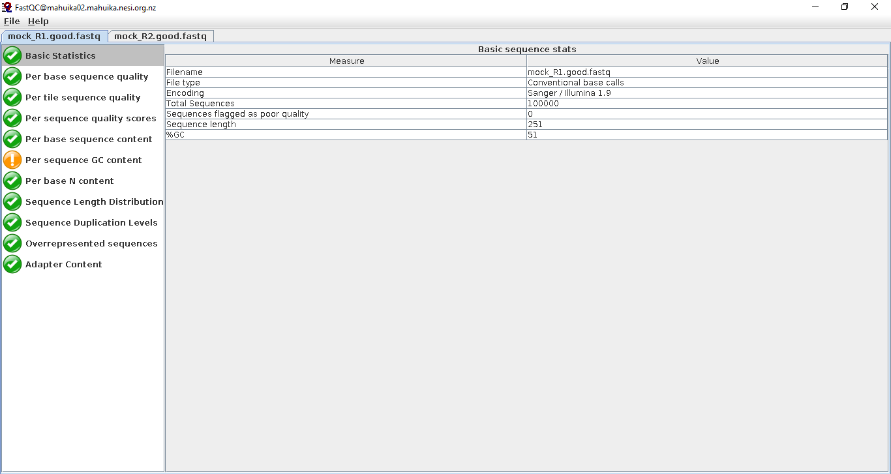
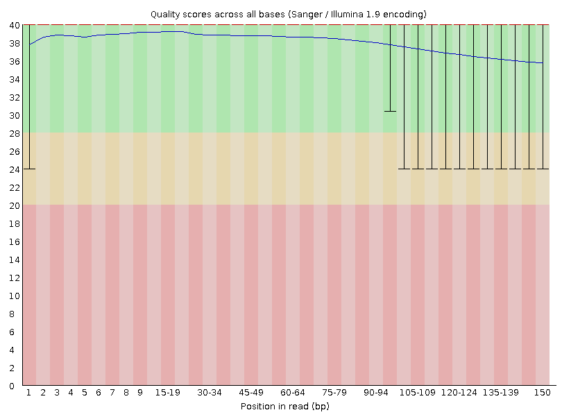
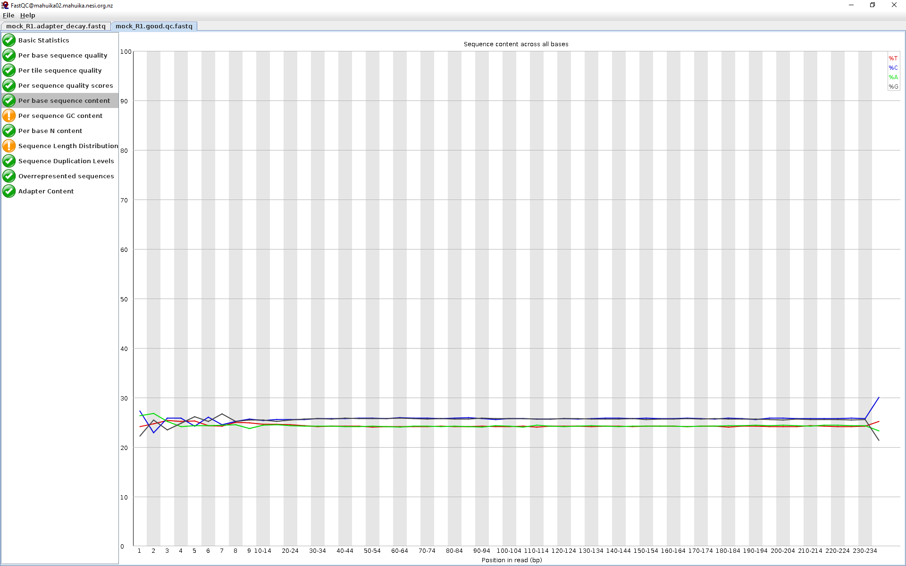

# Quality filtering raw reads

!!! info "Objectives"

    * [Visualising raw reads with `FastQC`](#visualising-raw-reads)
    * [Read trimming and adapter removal with `trimmomatic`](#read-trimming-and-adapter-removal-with-trimmomatic)
    * [Diagnosing poor libraries](#diagnosing-poor-libraries)
    * [Understand common issues and best practices](#understand-common-issues-and-best-practices)
    * [*Optional*: Filtering out host DNA with `BBMap`](#optional-filtering-out-host-dna)

<center>
{width="350"}
</center>
---

### Visualising raw reads

`FastQC` is an extremely popular tool for checking your sequencing libraries, as the visual interface makes it easy to identify the following issues:

1. Adapter/barcode sequences
1. Low quality regions of sequence
1. Quality drop-off towards the end of read-pair sequence

#### Loading *FastQC*

These exercises will take place in the `2.fastqc/` directory. First, navigate to this directory. Copy the command below into your terminal (logged in to NeSI), replacing `<YOUR FOLDER>`, and then running the command.

```bash
cd /nesi/nobackup/nesi02659/MGSS_U/<YOUR FOLDER>/2.fastqc/
```

To activate `FastQC` on NeSI, you need to first load the module using the command

```bash
module purge
module load FastQC/0.11.9
```

#### Running *FastQC*

We will run `FastQC` from the command line as follows:

```bash

fastqc mock_R1.good.fastq.gz mock_R2.good.fastq.gz
```

#### Viewing the outputs from *FastQC*

`FastQC` generates output reports in `.html` files that can be viewed in a standard web browser. 

Fortunately, if you're currently using the terminal within `Jupyter hub` for today's session, we can open the `.html` files directly from here:

* Click on the directory icon in the top left to open the directory navigator pane (if not already open).
* The default viewed location will be the overall project that you have logged in to (in this case, the 'Genomics Aotearoa Virtual Lab Training Access (nesi02659)' project). 
* Click through `MGSS_U`, into your directory, and then into the `2.fastqc/` directory. 
* Double click on the output `...fastqc.html` files to open them in the a new tab within the `Jupyter hub`.

Examples of the output files are also available for download [here](../resources/fastqc_results.zip).

Note that `FastQC` does not load the forward and reverse pairs of a library in the same window, so you need to be mindful of how your samples relate to each other. 




At a first glance, we can see the follow statistics:

1. The data is stored in Sanger / Illumina 1.9 encoding. *This will be important to remember when read trimming.*
2. There are 100,000 reads in the file
3. The maximum sequence length is 251 base pairs. *This is good to check, since the data were generated using Illumina
2x250 bp sequencing.*

Have a quick look through the menu sidebar on the left. As you can see, the data has passed most of the basic parameters.

**Per-base sequence quality**


**Per base sequence content**


**Adapter Content**


**Per sequence GC content**


The only aspect of the data that `FastQC` is flagging as potentially problematic is the GC% content of the data set. This observation is expected as we deal with a mixed community and organisms. Therefore, it is unlikely that there will be a perfect normal distribution around an average value. For example, a community comprised of low- and high-GC organisms would manifest a bimodal distribution of peaks which would be a problematic outcome in terms of the expectations of `FastQC`, but completely consistent with the biology of the system.

#### *FastQC* outputs for libraries with errors

Lets take a look at a library with significant errors. Process the sequence file `mock_R1.adapter_decay.fastq` with `FastQC`.

```bash
fastqc mock_R1.adapter_decay.fastq.gz
```

Compare the results with the `mock_R1.good.fastq.gz` file.

Which of the previous fields we examined are now flagged as problematic? How does this compare with your expectation? Are there any which should be flagged which are not?

**Per-base sequence quality**




---

### **Read trimming and adapter removal with *trimmomatic***

<center>
{width="300"}
</center>

There are a multitude of programs which can be used to quality trim sequence data and remove adapter sequence. For this exercise we are going to use `trimmomatic`, but this should in no way be interpreted as an endorsement of `trimmomatic` over equivalent tools like `BBMap`, `sickle`, `cutadapt` or any other.

For a first run with `trimmomatic`, type the following commands into your console:

```bash
module load Trimmomatic/0.39-Java-1.8.0_144

trimmomatic PE -threads 2 -phred33 \
               mock_R1.adapter_decay.fastq.gz mock_R2.adapter_decay.fastq.gz \
               mock_R1.qc.fastq.gz mock_s1.qc.fastq.gz mock_R2.qc.fastq.gz mock_s2.qc.fastq.gz \
               HEADCROP:10 SLIDINGWINDOW:4:30 MINLEN:80
```

There is a lot going on in this command, so here is a breakdown of the parameters in the command above

!!! info ""

    |Parameter|Type|Description|
    |:---|:---:|:---|
    |PE|*positional*|Specifies whether we are analysing single- or paired-end reads|
    |-threads 10|*keyword*|Specifies the number of threads to use when processing|
    |-phred33|*keyword*|Specifies the fastq encoding used|
    |mock_R1.adapter_decay.fastq.gz / mock_R2.adapter_decay.fastq.gz|*positional*|The paired forward and reverse reads to trim|
    |mock_R1.qc.fastq.gz|*positional*|The file to write forward reads which passed quality trimming, if their reverse partner also passed|
    |mock_s1.qc.fastq.gz|*positional*|The file to write forward reads which passed quality trimming, if their reverse partner failed (orphan reads)|
    |mock_R2.qc.fastq.gz / mock_s2.qc.fastq.gz|*positional*|The reverse-sequence equivalent of above|
    |HEADCROP:10|*positional*|Adapter trimming command. Remove the first 10 positions in the sequence|
    |SLIDINGWINDOW:4:30|*positional*|Quality filtering command. Analyse each sequence in a 4 base pair sliding window and then truncate if the average quality drops below Q30|
    |MINLEN:80|*positional*|Length filtering command. Discard sequences that are shorter than 80 base pairs after trimming|


!!! success "Terminal output"

    ```
    TrimmomaticPE: Started with arguments:
     -threads 10 -phred33 mock_R1.adapter_decay.fastq.gz mock_R2.adapter_decay.fastq.gz mock_R1.qc.fastq.gz mock_s1.qc.fastq.gz mock_R2.qc.fastq.gz mock_s2.qc.fastq.gz HEADCROP:10 SLIDINGWINDOW:4:30 MINLEN:80
    Input Read Pairs: 100000 Both Surviving: 75684 (75.68%) Forward Only Surviving: 12783 (12.78%) Reverse Only Surviving: 2311 (2.31%) Dropped: 9222 (9.22%)
    TrimmomaticPE: Completed successfully
    ```

Running the trimmed files back through `FastQC`, we can see that this signifcantly improves the output.

**Quality of reads**


**Nucleotide distribution**




---

### Considerations when working with *trimmomatic*

**Order of operations**

The basic format for a `trimmomatic` command is

```bash
trimmomatic PE <keyword flags> <sequence input> <sequence output> <trimming parameters>
```

The trimming parameters are processed in the order you specify them. This is a deliberate behaviour, but can have some unexpected consequences for new users.

For example, consider these two scenarios:

```bash
trimmomatic PE <keyword flags> <sequence input> <sequence output> SLIDINGWINDOW:4:30 MINLEN:80

trimmomatic PE <keyword flags> <sequence input> <sequence output> MINLEN:80 SLIDINGWINDOW:4:30
```

In the first run, we would not expect any sequence shorter than 80 base pairs to exist in the output files. However, we might encounter them in the second command. This is because in the second command we remove sequences shorter than 80 base pairs, **_then_** perform quality trimming. If a sequence is trimmed to a length shorter than 80 base pairs **_after_** trimming, the `MINLEN` filtering does not execute a second time. In the first instance, we do not perform trimming **_before_** size selection, so any reads that start longer than 80 base pairs, but are trimmed to under 80 base pairs during quality trimming will be caught in the `MINLEN` run.

A more subtle consequence of this behaviour is the interplay between adapter removal and quality filtering. In the command we ran, we try to identify adapters **_before_** quality trimming. Why do you think this is?

---

### *Optional:* Working with the ILLUMINACLIP command

`Trimmomatic` also provides the `ILLUMINACLIP` command, which can be used to pass a FASTA file of adapter and barcode sequences to be found and removed from your data. The format for the `ILLUMINACLIP` parameter can be quite confusing to work with and so we generally favour a `HEADCROP` where possible. If you wish to work with the `ILLUMINACLIP` command, then you can see its use here in the `trimmomatic` [manual](http://www.usadellab.org/cms/uploads/supplementary/Trimmomatic/TrimmomaticManual_V0.32.pdf).

```bash
ILLUMINACLIP:iua.fna:1:25:7
             |       | |  |
             |       | |  |
             |       | |  Simple clip threshold
             |       | Palindrome clip threshold
             |       Seed mismatches
             File of expected sequences
```

There is always some subjectivity in how sensitive you want your adapter (and barcode) searching to be. If the settings are too strict you might end up discarding real sequence data that only partially overlaps with the Illumina adapters. If your settings are not strict enough then you might leave partial adapters in the sequence. Where possible, we favour the use of simple positional trimming.

---

### Diagnosing poor libraries

Whether a library is 'poor' quality or not can be a bit subjective. These are some aspects of the library that you should be looking for when evaluating `FastQC`:

!!! note ""

    1. Does the sequencing length match what you ordered from the facility?
    1. If the sequences are shorter than expected, is adapter read-through a concern?
    1. What does the sequence quality look like for the whole length of the run? Are there any expected/unexpected regions of quality degradation?
    1. Are adapters and/or barcodes removed? 
           - Look at the *Per base sequence content* to diagnose this.
    1. Is there unexpected sequence duplication? 
           - This can occur when low-input library preparations are used.
    1. Are over-represented *k*-mers present? 
           - This can be a sign of adapter and barcode contamination.

---

### Understand common issues and best practices

!!! success ""

    1. Do I need to remove (rare) adapters?
    1. I don’t know if adapters have been removed or not
    1. How do I identify and remove adapter read-through
    1. Identifying incomplete barcode/adapter removal
    1. Over aggressive trimming
    1. GC skew is outside of expected range

---

### *Optional*: Filtering out host DNA

Metagenome data derived from host-associated microbial communities should ideally be filtered to remove any reads originating from host DNA. This may improve the quality and efficiency of downstream data processing (since we will no longer be processing a bunch of data that we are likely not interested in), and is also an important consideration when working with metagenomes that may include data of a sensitive nature (and which may also need to be removed prior to making the data publicly available). This is especially important for any studies involving human subjects or those involving samples derived from Taonga species.

There are several approaches that can be used to achieve this. The general principle is to map your reads to a reference genome (e.g. human genome) and remove those reads that map to the reference from the dataset. 

!!! note "Note"

    This process may be more complicated if a reference genome for your host taxa is not readily available. In this case an alternative method would need to be employed (for example: predicting taxonomy via `Kraken2` and then filtering out all reads that map to the phylum or kingdom of your host taxa).

This exercise provides an example using `BBMap` to map against a masked human reference genome and retain only those reads that do *not* map to the reference. Here we are mapping the quality-filtered reads against a pre-prepared human genome that has been processed to mask sections of the genome, including those that:
 
- are presumed microbial contaminant in the reference
- have high homology to microbial genes/genomes (e.g. ribosomes)
- those that are of low complexity 
 
This ensures that reads that would normally map to these sections of the human genome are *not* removed from the dataset (as genuine microbial reads that we wish to retain might also map to these regions), while all reads mapping to the rest of the human genome are removed.

!!! note "Note"

    The same process can be used to remove DNA matching other hosts (e.g. mouse), however you would need to search if anyone has prepared (and made available) a masked version of the reference genome, or create a masked version using `bbmask`. The creator of BBMap has made available masked human, mouse, cat, and dog genomes. More information, including links to these references and instructions on how to generate a masked genome for other taxa, can be found within [this thread](http://seqanswers.com/forums/showthread.php?t=42552).*

#### Downloading the masked human reference genome

The masked reference genome is available via [Google drive](https://drive.google.com/file/d/0B3llHR93L14wd0pSSnFULUlhcUk/edit?usp=sharing) and [Zenodo](https://zenodo.org/record/1208052). For this workshop, we have provided you with the file within the `4.evaluation/BBMask_human_reference/` directory.

??? note "Downloading your own copy of the masked genome"

    We can use `gdown` to download this file from Google drive via the command line.

    To install `gdown`, we can use `pip`. 

    ```bash
    # Install gdown (for downloading from google drive)
    module purge
    module load Python/3.10.5-gimkl-2022a
    pip install --user gdown
    ```

    Next, download the reference. It will also be necessary to first add your local `bin` location to the `PATH` variable via the `export PATH=...` command, as this is where `gdown` is located (modify `<your_username>` before running the code below).

    ```bash
    mkdir BBMask_human_reference/
    cd BBMask_human_reference/

    export PATH="/home/<your_username>/.local/bin:$PATH"

    gdown https://drive.google.com/uc?id=0B3llHR93L14wd0pSSnFULUlhcUk
    ```

#### Indexing the reference genome and read mapping with *BBMap*

We will cover more about read mapping in [later exercises](https://genomicsaotearoa.github.io/metagenomics_summer_school/day2/ex6_initial_binning/). For now, it is important to know that it is first necessary to build an index of the reference using the read mapping tool of choice. Here, we will first build a `BBMap` index, and then use `BBMap` to map the quality-filtered reads to that index, ultimately retaining only those reads that do *not* map to the index.

Build index reference via `BBMap`. We will do this by submitting the job via slurm. 

!!! note "Note"

    See [Preparing an assembly job for slurm](https://genomicsaotearoa.github.io/metagenomics_summer_school/day1/ex3_assembly/) for more information about how to submit a job via slurm.

Create a new script named `host_filt_bbmap_index.sl` using `nano`:

!!! terminal "code"

    ```bash
    nano host_filt_bbmap_index.sl
    ```

!!! warning "Warning"
    
    Paste or type in the following. Remember to update `<YOUR FOLDER>` to your own directory.

!!! terminal "code"

    ```bash
    #!/bin/bash -e
    
    #SBATCH --account       nesi02659
    #SBATCH --job-name      host_filt_bbmap_index
    #SBATCH --time          00:20:00
    #SBATCH --mem           32GB
    #SBATCH --cpus-per-task 12
    #SBATCH --error         %x_%j.err
    #SBATCH --output        %x_%j.out
    
    # Working directory
    cd /nesi/nobackup/nesi02659/MGSS_U/<YOUR FOLDER>/2.fastqc/BBMask_human_reference/
    
    # Load BBMap module
    module purge
    module load BBMap/39.01-GCC-11.3.0
    
    # Build indexed reference file via BBMap
    bbmap.sh ref=hg19_main_mask_ribo_animal_allplant_allfungus.fa.gz    
    ```

Save your script by pressing <kbd>Ctrl</kbd> + <kbd>o</kbd> , then exit the editor by pressing <kbd>Ctrl</kbd> + <kbd>x</kbd> .

Submit your newly created script to the scheduler as follows:

!!! terminal "code"

    ```bash
    sbatch host_filt_bbmap_index.sl
    ```


Finally, map the quality-filtered reads to the reference via `BBMap`. Here we will submit the job as a slurm array, with one array job per sample. 

Again, we will create a script using `nano`: 

!!! terminal "code"

    ```bash
    nano host_filt_bbmap_map.sl
    ```

!!! warning "Warning"
    Paste or type in the following. Remember to update `<YOUR FOLDER>` to your own directory.

!!! terminal "code"

    ```bash
    #!/bin/bash -e

    #SBATCH --account       nesi02659
    #SBATCH --job-name      host_filt_bbmap_map
    #SBATCH --time          01:00:00
    #SBATCH --mem           27GB
    #SBATCH --array         1-4
    #SBATCH --cpus-per-task 20
    #SBATCH --error         %x_%A_%a.err
    #SBATCH --output        %x_%A_%a.out

    # Set up working directories
    cd /nesi/nobackup/nesi02659/MGSS_U/<YOUR FOLDER>/2.fastqc/
    mkdir -p host_filtered_reads/

    # Load BBMap module
    module purge
    module load BBMap/39.01-GCC-11.3.0

    # Run bbmap
    srun bbmap.sh -Xmx27g -t=$SLURM_CPUS_PER_TASK \
      minid=0.95 maxindel=3 bwr=0.16 bw=12 quickmatch fast minhits=2 qtrim=rl trimq=10 untrim \
      in1=../3.assembly/sample${SLURM_ARRAY_TASK_ID}_R1.fastq.gz \
      in2=../3.assembly/sample${SLURM_ARRAY_TASK_ID}_R2.fastq.gz \
      path=BBMask_human_reference/ \
      outu1=host_filtered_reads/sample${SLURM_ARRAY_TASK_ID}_R1_hostFilt.fastq \
      outu2=host_filtered_reads/sample${SLURM_ARRAY_TASK_ID}_R2_hostFilt.fastq
    ```

Breaking down this command a little:

!!! quote ""

    - We pass the path to the `ref` directory (the reference we just built) to `path=...`.
    - Provide quality-filtered reads as input (i.e. output of the `trimmomatic` process above). In this case, we will provide the FASTQ files located in `../3.assembly/` which have been processed via `trimmomatic` in the same manner as the exercise above. These are four sets of paired reads (representing metagenome data from four "samples") that the remainder of the workshop exercises will be working with.
    - The flags `-Xmx27g` and `-t=$SLURM_CPUS_PER_TASK` set the maximum memory and thread (AKA CPUs) allocations, and must match the `--mem` and `--cpus_per_task` allocations in the slurm headers at the top of the script.
    - The rest of the settings in the `BBMap` call here are as per the recommendations found within [this thread](http://seqanswers.com/forums/showthread.php?t=42552) about processing data to remove host reads.
    - Finally, the filtered output FASTQ files for downstream use are written to the `host_filtered_reads/` directory (taken from the outputs `outu1=` and `outu2=`, which include only those reads that did not map to the host reference genome).

We'll submit the mapping script:

!!! terminal "code"

    ```bash
    sbatch host_filt_bbmap_map.sl
    ```

??? tip "Monitoring job progress"

    We can monitor our job progress using `squeue --me` or `sacct <job_id>`. This will be covered in further details as part of the main content when we [evaluate assemblies](./ex5_evaluating_assemblies.md#evaluate-the-resource-consumption-of-various-assemblies). 

!!! note "Note"

    Slurm array jobs automatically create a variable `SLURM_ARRAY_TASK_ID` for that job, which contains the array task number (i.e. between 1 and 4 in the case above). We use this to run the command on the sample that matches this array task ID. I.e. array job 3 will run the commands on "sample3" (`sample${SLURM_ARRAY_TASK_ID}` is read in as `sample3`).

The filtered reads are now available in `host_filtered_reads/` for downstream use.

---
