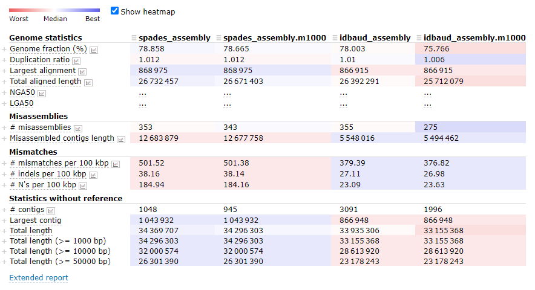
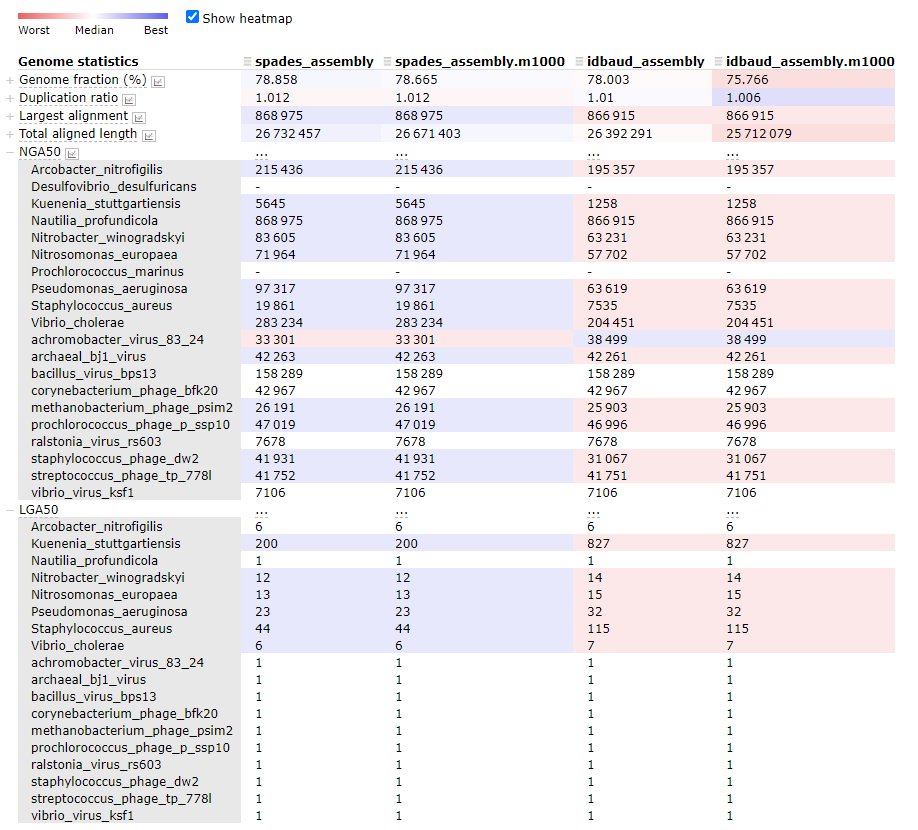
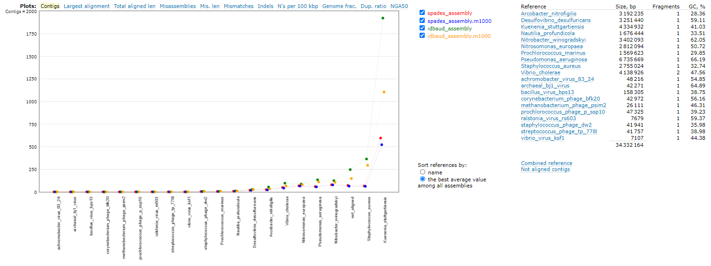
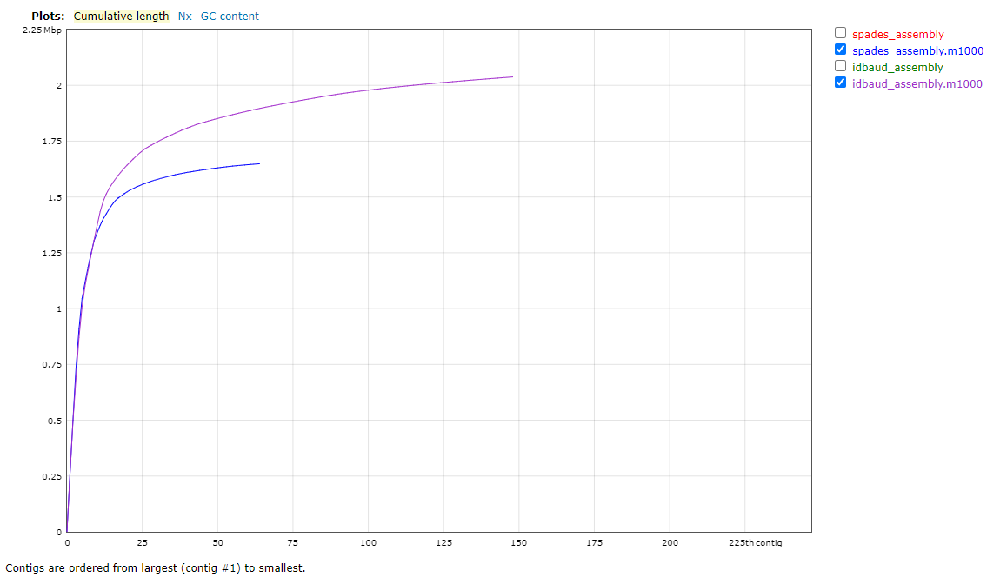

# Evaluating the assemblies

!!! info "Objectives"

    * [Evaluate the resource consumption of various assemblies](#evaluate-the-resource-consumption-of-various-assemblies)
    * [Evaluate the assemblies](#evaluate-the-assemblies)
    * Future considerations

---

### Evaluate the resource consumption of various assemblies

Check to see if your assembly jobs have completed. If you have multiple jobs running or queued, the easiest way to check this is to simply run the `squeue` command.

```bash
squeue --me

#  JOBID     USER ACCOUNT            NAME  ST REASON    START_TIME                TIME TIME_LEFT NODES CPUS
```

If there are no jobs listed, either everything running has completed or failed. To get a list of all jobs we have run in the last day, we can use the `sacct` command. By default this will report all jobs for the day but we can add a parameter to tell the command to report all jobs run since the date we are specifying.

```bash
sacct -S 2020-11-16

#         JobID         JobName     Elapsed     TotalCPU Alloc   MaxRSS      State
#-------------- --------------- ----------- ------------ ----- -------- ----------
#8744675        spades_assembly    00:15:16     01:41:43    10          COMPLETED
#8744675.batch  batch              00:15:16    00:00.547    10    3908K COMPLETED
#8744675.extern extern             00:15:16     00:00:00    10        0 COMPLETED
#8744675.0      spades.py          00:15:15     01:41:42    10 6260072K COMPLETED
#8744677        idbaud_assembly    00:11:06     01:27:42    10          COMPLETED
#8744677.batch  batch              00:11:06    00:00.477    10    3760K COMPLETED
#8744677.extern extern             00:11:06     00:00:00    10        0 COMPLETED
#8744677.0      idba_ud            00:11:05     01:27:42    10 2541868K COMPLETED
```

Each job has been broken up into several lines, but the main ones to keep an eye on are the base JobID values, and the values suffixed with *.0*. The first of these references the complete job. The later (and any subsequent suffixes like *.1*, *.2*) are the individual steps in the script that were called with the `srun` command.

We can see here the time elapsed for each job, and the number of CPU hours used during the run. If we want a more detailed breakdown of the job we can use the `seff` command

```bash
seff 8744675

#Job ID: 8744675
#Cluster: mahuika
#User/Group: dwai012/dwai012
#State: COMPLETED (exit code 0)
#Nodes: 1
#Cores per node: 10
#CPU Utilized: 01:41:44
#CPU Efficiency: 66.64% of 02:32:40 core-walltime
#Job Wall-clock time: 00:15:16
#Memory Utilized: 5.97 GB
#Memory Efficiency: 29.85% of 20.00 GB
```

Here we see some of the same information, but we also get some information regarding how well our job used the resources we allocated to it. You can see here that my CPU and memory usage was not particularly efficient. (Note that for this particular job, 1 hr and 20 GB RAM were requested.) In hindsight I could have request a lot less time and RAM and still had the job run to completion.

CPU efficiency is harder to interpret as it can be impacted by the behaviour of the program. For example, mapping tools like `bowtie` and `BBMap` can more or less use all of their threads, all of the time and achieve nearly 100% efficiency. More complicated processes, like those performed in `SPAdes` go through periods of multi-thread processing and periods of single-thread processing, drawing the average efficiency down.

---

### Evaluate the assemblies

Evaluating the quality of a raw metagenomic assembly is quite a tricky process. Since, by definition, our community is a mixture of different organisms, the genomes from some of these organisms assemble better than those of others. It is possible to have an assembly that looks 'bad' by traditional metrics that still yields high-quality genomes from individual species, and the converse is also true.

A few quick checks I recommend are to see how many contigs or scaffolds your data were assembled into, and then see how many contigs or scaffolds you have above a certain minimum length threshold. We will use `seqmagick` for performing the length filtering, and then just count sequence numbers using `grep`.

These steps will take place in the `4.evaluation/` folder, which contains copies of our `SPAdes` and `IDBA-UD` assemblies.

```bash
module purge
module load seqmagick/0.8.4-gimkl-2020a-Python-3.8.2

cd /nesi/nobackup/nesi02659/MGSS_U/<YOUR FOLDER>/4.evaluation/

seqmagick convert --min-length 1000 spades_assembly/spades_assembly.fna \
                                    spades_assembly/spades_assembly.m1000.fna
grep -c '>' spades_assembly/spades_assembly.fna spades_assembly/spades_assembly.m1000.fna
# spades_assembly/spades_assembly.fna:1343
# spades_assembly/spades_assembly.m1000.fna:945

seqmagick convert --min-length 1000 idbaud_assembly/idbaud_assembly.fna \
                                    idbaud_assembly/idbaud_assembly.m1000.fna
grep -c '>' idbaud_assembly/idbaud_assembly.fna idbaud_assembly/idbaud_assembly.m1000.fna
# idbaud_assembly/idbaud_assembly.fna:5057
# idbaud_assembly/idbaud_assembly.m1000.fna:1996
```

If you have your own assemblies and you want to try inspect them in the same way, try that now. Note that the file names will be slightly different to the files provided above. If you followed the exact commands in the previous exercise, you can use the following commands.

```bash
seqmagick convert --min-length 1000 ../3.assembly/spades_assembly/scaffolds.fasta my_spades_assembly.m1000.fna

seqmagick convert --min-length 1000 ../3.assembly/idbaud_assembly/scaffold.fa my_idbaud_assembly.m1000.fna
```
!!! note "Note"

    The tool `seqtk` is also available on NeSI and performs many of the same functions as `seqmagick`. My choice of `seqmagick` is mostly cosmetic as the parameter names are more explicit so it's easier to understand what's happening in a command when I look back at my log files. Regardless of which tool you prefer, we strongly recommend getting familiar with either `seqtk` or `seqmagick` as both perform a lot of common *fastA* and *fastQ* file manipulations.*

As we can see here, the `SPAdes` assembly has completed with fewer contigs assembled than the `IDBA-UD`, both in terms of total contigs assembled and contigs above the 1,000 bp size. This doesn't tell us a lot though - has `SPAdes` managed to assemble fewer reads, or has it managed to assemble the sequences into longer (and hence fewer) contigs? We can check this by looking at the N50/L50 of the assembly with `BBMap`.

```bash
module load BBMap/39.01-GCC-11.3.0

stats.sh in=spades_assembly/spades_assembly.m1000.fna
```

This gives quite a verbose output:

```bash
A       C       G       T       N       IUPAC   Other   GC      GC_stdev
0.2537	0.2465	0.2462	0.2536	0.0018	0.0000	0.0000	0.4928	0.0956

Main genome scaffold total:         	  945
Main genome contig total:           	  2713
Main genome scaffold sequence total:	  34.296 MB
Main genome contig sequence total:  	  34.233 MB  	0.184% gap
Main genome scaffold N/L50:         	  54/160.826 KB
Main genome contig N/L50:           	  106/72.909 KB
Main genome scaffold N/L90:         	  306/15.236 KB
Main genome contig N/L90:           	  817/4.63 KB
Max scaffold length:                	  1.044 MB
Max contig length:                  	  1.044 MB
Number of scaffolds > 50 KB:        	  152
% main genome in scaffolds > 50 KB: 	  76.69%


Minimum 	Number        	Number        	Total         	Total         	Scaffold
Scaffold	of            	of            	Scaffold      	Contig        	Contig  
Length  	Scaffolds     	Contigs       	Length        	Length        	Coverage
--------	--------------	--------------	--------------	--------------	--------
    All 	           945	         2,713	    34,296,303	    34,233,142	  99.82%
   1 KB 	           945	         2,713	    34,296,303	    34,233,142	  99.82%
 2.5 KB 	           750	         2,453	    33,961,961	    33,903,372	  99.83%
   5 KB 	           586	         2,136	    33,371,126	    33,318,361	  99.84%
  10 KB 	           396	         1,590	    32,000,574	    31,962,900	  99.88%
  25 KB 	           237	           929	    29,506,913	    29,487,807	  99.94%
  50 KB 	           152	           587	    26,301,390	    26,289,386	  99.95%
 100 KB 	            92	           408	    22,108,408	    22,099,623	  99.96%
 250 KB 	            30	           138	    12,250,722	    12,247,681	  99.98%
 500 KB 	             6	            28	     4,735,549	     4,735,329	 100.00%
   1 MB 	             1	             1	     1,043,932	     1,043,932	 100.00%
```

But what we can highlight here is that the statistics for the `SPAdes` assembly, with short contigs removed, yielded an N50 of 106 kbp at the contig level. We will now compute those same statistics from the other assembly options

```bash
stats.sh in=spades_assembly/spades_assembly.fna

stats.sh in=idbaud_assembly/idbaud_assembly.m1000.fna
stats.sh in=idbaud_assembly/idbaud_assembly.fna
```

|Assembly|N50 (contig)|L50 (contig)|
|:---|:---:|:---:|
|**SPAdes** (filtered)|106 kbp|73 |
|**SPAdes** (unfiltered)|107 kbp|72 |
|**IDBA-UD** (filtered)|82 kbp|104 |
|**IDBA-UD** (unfiltered)|88 kbp|97 |

#### *Optional:* Evaluating assemblies using *MetaQUAST*

For more genome-informed evaluation of the assembly, we can use the `MetaQUAST` tool to view our assembled metagenome. This is something of an optional step because, like `QUAST`, `MetaQUAST` aligns your assembly against a set of reference genomes. Under normal circumstances we wouldn't know the composition of the metagenome that led to our assembly. In this instance determining the optimal reference genomes for a `MetaQUAST` evaluation is a bit of a problem. For your own work, the following tools could be used to generate taxonomic summaries of your metagenomes to inform your reference selection:

!!! abstract ""
    1. [Kraken2](https://ccb.jhu.edu/software/kraken2/) (DNA based, *k*-mer classification)
    1. [CLARK](http://clark.cs.ucr.edu/) (DNA based. *k*-mer classification)
    1. [Kaiju](http://kaiju.binf.ku.dk/) (Protein based, BLAST classification)
    1. [Centrifuge](https://ccb.jhu.edu/software/centrifuge/manual.shtml) (DNA based, sequence alignment classification)
    1. [MeTaxa2](https://microbiology.se/software/metaxa2/) or [SingleM](https://github.com/wwood/singlem) (DNA based, 16S rRNA recovery and classification)
    1. [MetaPhlAn2](http://huttenhower.sph.harvard.edu/metaphlan2) (DNA based, clade-specific marker gene classification)

A good summary and comparison of these tools (and more) was recently published by [Ye *et al.*](https://www.ncbi.nlm.nih.gov/pubmed/31398336).

However, since we **_do_** know the composition of the original communities used to build this mock metagenome, `MetaQUAST` will work very well for us today. In your `4.evaluation/` directory you will find a file called `ref_genomes.txt`. This file contains the names of the genomes used to build these mock metagenomes. We will provide these as the reference input for `MetaQUAST`.

```bash
module load QUAST/5.2.0-gimkl-2022a

metaquast.py --references-list ref_genomes.txt --max-ref-number 21 -t 10 \
             --labels SPAdes,SPAdes.m1000,IDBAUD,IDBAUD.m1000 \
             --output-dir quast_results/
             spades_assembly/spades_assembly.fna \
             spades_assembly/spades_assembly.m1000.fna \
             idbaud_assembly/idbaud_assembly.fna \
             idbaud_assembly/idbaud_assembly.m1000.fna
```

By now, you should be getting familiar enough with the console to understand what most of the parameters here refer to. The one parameter that needs explanation is the `--max-ref-number` flag, which we have set to 21. This caps the maximum number of reference genomes to be downloaded from NCBI which we do in the interest of speed. Since there are 21 names in the file `ref_genomes.txt` (10 prokaryote species and 11 viruses), `MetaQUAST` will download one of each. If we increase the number we will start to get multiple references per name provided which is usually desirable.

We will now look at a few interesting assembly comparisons.

When working from a standard terminal logged into NeSI, you can copy the entire folder `4.evaluation/quast_results/latest/` to your local environment using the `scp -r mahuika:/nesi/path/to/quast_results/latest local/path/to/copy/to` command to then open the report. Note that the browser requires JavaScript enabled to render the report: If you are working from the NeSI `Jupyter hub` environment today, the html viewer *within* the NeSI `Jupyter hub` does not currently support this (even if the browser you are running it in does). To view a basic version of the report, download the report file by navigating to the `4.evaluation/quast_results/latest/` folder, right-click `report.html/` and select download. The downloaded file will then open within a new tab in the browser. (*NOTE: rendering the full report requires the other folders from within `latest/` to also be downloaded and available in the same directory as `report.html`. Unfortunately, the `Jupyter hub` environment does not appear to currently support downloading entire folders using this method.*)

An example of the `MetaQUAST` output files are also available for download [here](https://github.com/GenomicsAotearoa/metagenomics_summer_school/blob/master/materials/resources/quast_results.zip).

#### Brief summary of assemblies




#### Comparison of NGA50 between assemblies




#### Comparison of aligned contigs




#### Inspection of unaligned contigs




---
