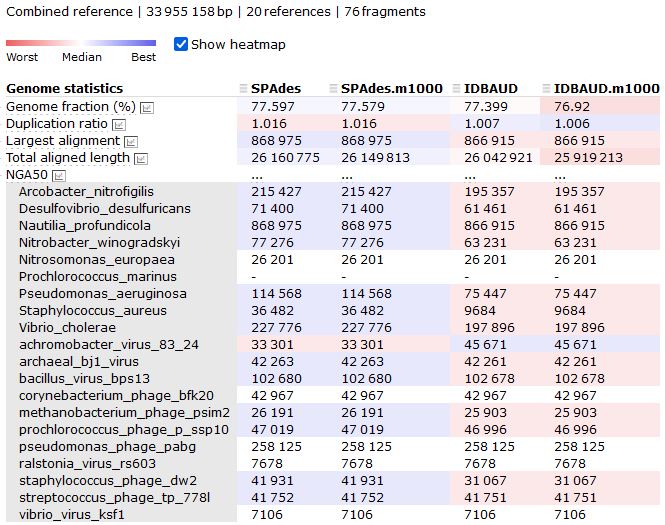
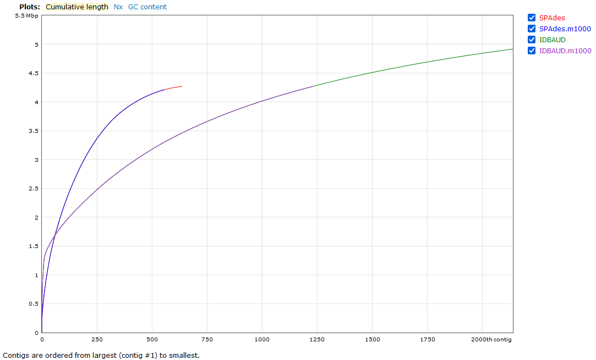

# Evaluating the assemblies

!!! info "Objectives"

    * [Evaluate the resource consumption of various assemblies](#evaluate-the-resource-consumption-of-various-assemblies)
    * [Evaluate the assemblies](#evaluate-the-assemblies)
    * Future considerations

---

<center>
{width="450"}
</center>

## Evaluate the resource consumption of various assemblies

Check to see if your assembly jobs have completed. If you have multiple jobs running or queued, the easiest way to check this is to simply run the `squeue` command.

!!! terminal-2 "Check job progress"

    ```bash
    squeue --me
    ```

!!! circle-check "Terminal output"

    ```
    JOBID         USER     ACCOUNT   NAME        CPUS MIN_MEM PARTITI START_TIME     TIME_LEFT STATE    NODELIST(REASON)    
    39035482      jboe440  nesi02659 spawner-jupy   2      4G interac 2023-08-31T1     7:47:42 RUNNING  wbn004      
    ```

If there are no jobs besides your Jupyter session listed, either everything running has completed or failed. To get a list of all jobs we have run in the last day, we can use the `sacct` command. By default this will report all jobs for the day but we can add a parameter to tell the command to report all jobs run since the date we are specifying.

!!! terminal-2 "Check progress for jobs started on specific date"

    ```bash
    sacct -S 2023-08-12
    ```

!!! circle-check "Terminal output"

    ```
    JobID           JobName          Alloc     Elapsed     TotalCPU  ReqMem   MaxRSS State      
    --------------- ---------------- ----- ----------- ------------ ------- -------- ---------- 
    38483216        spawner-jupyter+     2    07:45:01     00:00:00      4G          NODE_FAIL  
    38483216.batch  batch                2    07:45:01     00:00:00                  CANCELLED  
    38483216.extern extern               2    07:45:01     00:00:00                  CANCELLED  
    38485254        spades_assembly     12    00:14:38     01:56:40     10G          COMPLETED  
    38485254.batch  batch               12    00:14:38     01:56:40         7227872K COMPLETED  
    38485254.extern extern              12    00:14:38     00:00:00                0 COMPLETED
    ```

Each job has been broken up into several lines, but the main ones to keep an eye on are the base `JobID` values. 

??? circle-info "Using `srun`"

    If you use `srun`, the JobID will have values suffixed with *.0*. The first of these references the complete job. The later (and any subsequent suffixes like *.1*, *.2*) are the individual steps in the script that were called with the `srun` command.

We can see here the time elapsed for each job, and the number of CPU hours used during the run. If we want a more detailed breakdown of the job we can use the `nn_seff` command

!!! terminal-2 "Check job resource use"

    ```bash
    nn_seff 38485254
    ```

!!! circle-check "Terminal output"

    ```
    Cluster: mahuika
    Job ID: 38485254
    State: COMPLETED
    Cores: 6
    Tasks: 1
    Nodes: 1
    Job Wall-time:   48.8%  00:14:38 of 00:30:00 time limit
    CPU Efficiency: 132.9%  01:56:40 of 01:27:48 core-walltime
    Mem Efficiency:  68.9%  6.89 GB of 10.00 GB0
    ```

Here we see some of the same information, but we also get some information regarding how well our job used the resources we allocated to it. You can see here that my CPU and memory usage was somewhat efficient but had high memory efficiency. In the future, I can request less time and retain the same RAM and still had the job run to completion.

CPU efficiency is harder to interpret as it can be impacted by the behaviour of the program. For example, mapping tools like `bowtie` and `BBMap` can more or less use all of their threads, all of the time and achieve nearly 100% efficiency. More complicated processes, like those performed in `SPAdes` go through periods of multi-thread processing and periods of single-thread processing, drawing the average efficiency down.

---

## Evaluate the assemblies using `BBMap`

Evaluating the quality of a raw metagenomic assembly is quite a tricky process. Since, by definition, our community is a mixture of different organisms, the genomes from some of these organisms assemble better than those of others. It is possible to have an assembly that looks 'bad' by traditional metrics that still yields high-quality genomes from individual species, and the converse is also true.

A few quick checks I recommend are to see how many contigs or scaffolds your data were assembled into, and then see how many contigs or scaffolds you have above a certain minimum length threshold. We will use `seqmagick` for performing the length filtering, and then just count sequence numbers using `grep`.

These steps will take place in the `4.evaluation/` folder, which contains copies of our `SPAdes` and `IDBA-UD` assemblies.

!!! terminal "code"

    ```bash
    # Load seqmagick
    module purge
    module load seqmagick/0.8.4-gimkl-2020a-Python-3.8.2

    # Navigate to working directory
    cd /nesi/nobackup/nesi02659/MGSS_U/<YOUR FOLDER>/4.evaluation/

    # Filter assemblies and check number of contigs
    seqmagick convert --min-length 1000 spades_assembly/spades_assembly.fna \
                                        spades_assembly/spades_assembly.m1000.fna
    grep -c '>' spades_assembly/spades_assembly.fna spades_assembly/spades_assembly.m1000.fna

    seqmagick convert --min-length 1000 idbaud_assembly/idbaud_assembly.fna \
                                        idbaud_assembly/idbaud_assembly.m1000.fna
    grep -c '>' idbaud_assembly/idbaud_assembly.fna idbaud_assembly/idbaud_assembly.m1000.fna
    ```

!!! circle-check "Terminal output"

    === "`SPAdes`"

        ```
        spades_assembly/spades_assembly.fna:1318
        spades_assembly/spades_assembly.m1000.fna:933
        ```

    === "`IDBA-UD`"

        ```
        idbaud_assembly/idbaud_assembly.fna:5057
        idbaud_assembly/idbaud_assembly.m1000.fna:1996
        ```

If you have your own assemblies and you want to try inspect them in the same way, try that now. Note that the file names will be slightly different to the files provided above. If you followed the exact commands in the previous exercise, you can use the following commands.

!!! terminal "code"

    ```bash
    seqmagick convert --min-length 1000 ../3.assembly/my_spades_assembly/scaffolds.fasta my_spades_assembly.m1000.fna

    seqmagick convert --min-length 1000 ../3.assembly/my_idbaud_assembly/scaffold.fa my_idbaud_assembly.m1000.fna
    ```

!!! note "Choice of software: sequence file manipulation"

    The tool `seqtk` is also available on NeSI and performs many of the same functions as `seqmagick`. My choice of `seqmagick` is mostly cosmetic as the parameter names are more explicit so it's easier to understand what's happening in a command when I look back at my log files. Regardless of which tool you prefer, we strongly recommend getting familiar with either `seqtk` or `seqmagick` as both perform a lot of common FASTA and FASTQ file manipulations.

As we can see here, the `SPAdes` assembly has completed with fewer contigs assembled than the `IDBA-UD`, both in terms of total contigs assembled and contigs above the 1,000 bp size. This doesn't tell us a lot though - has `SPAdes` managed to assemble fewer reads, or has it managed to assemble the sequences into longer (and hence fewer) contigs? We can check this by looking at the N50/L50 (see more information about this statistic [here](https://www.molecularecologist.com/2017/03/29/whats-n50/)) of the assembly with `BBMap`.

!!! terminal "code"

    ```bash
    # Load BBMap module
    module load BBMap/39.01-GCC-11.3.0

    # Generate statistics for filtered SPAdes assembly
    stats.sh in=spades_assembly/spades_assembly.m1000.fna
    ```

This gives quite a verbose output:

!!! circle-check "Terminal output"

    ```bash
    A       C       G       T       N       IUPAC   Other   GC      GC_stdev
    0.2536  0.2466  0.2462  0.2536  0.0019  0.0000  0.0000  0.4928  0.0960

    Main genome scaffold total:             933
    Main genome contig total:               2710
    Main genome scaffold sequence total:    34.300 MB
    Main genome contig sequence total:      34.236 MB       0.186% gap
    Main genome scaffold N/L50:             52/158.668 KB
    Main genome contig N/L50:               107/72.463 KB
    Main genome scaffold N/L90:             302/15.818 KB
    Main genome contig N/L90:               816/4.654 KB
    Max scaffold length:                    1.221 MB
    Max contig length:                      1.045 MB
    Number of scaffolds > 50 KB:            151
    % main genome in scaffolds > 50 KB:     76.76%


    Minimum         Number          Number          Total           Total           Scaffold
    Scaffold        of              of              Scaffold        Contig          Contig  
    Length          Scaffolds       Contigs         Length          Length          Coverage
    --------        --------------  --------------  --------------  --------------  --------
        All                    933           2,710      34,299,647      34,235,702    99.81%
       1 KB                    933           2,710      34,299,647      34,235,702    99.81%
     2.5 KB                    745           2,458      33,980,511      33,921,524    99.83%
       5 KB                    579           2,142      33,383,109      33,329,777    99.84%
      10 KB                    396           1,605      32,059,731      32,022,009    99.88%
      25 KB                    237             936      29,559,828      29,540,698    99.94%
      50 KB                    151             593      26,330,017      26,317,988    99.95%
     100 KB                     91             411      22,108,846      22,100,263    99.96%
     250 KB                     29             141      12,338,782      12,335,701    99.98%
     500 KB                      7              38       5,611,200       5,610,890    99.99%
       1 MB                      1               2       1,221,431       1,221,421   100.00%
    ```

!!! danger "N50 and L50 in BBMap"
    Unfortunately, the N50 and L50 values generated by `stats.sh` are switched. N50 should be a length and L50 should be a count. The results table below shows the corrected values based on `stats.sh` outputs.

But what we can highlight here is that the statistics for the `SPAdes` assembly, with short contigs removed, yielded an N50 of 72.5 kbp at the contig level. We will now compute those same statistics from the other assembly options.

!!! terminal "code"

    ```bash
    stats.sh in=spades_assembly/spades_assembly.fna

    stats.sh in=idbaud_assembly/idbaud_assembly.m1000.fna
    stats.sh in=idbaud_assembly/idbaud_assembly.fna
    ```

|Assembly|N50 (contig)|L50 (contig)|
|:---|:---:|:---:|
|**SPAdes** (filtered)|72.5 kbp|107 |
|**SPAdes** (unfiltered)|72.1 kbp|108 |
|**IDBA-UD** (filtered)|103.9 kbp|82 |
|**IDBA-UD** (unfiltered)|96.6 kbp|88 |

## *(Optional)* Evaluating assemblies using `MetaQUAST`

For more genome-informed evaluation of the assembly, we can use the `MetaQUAST` tool to view our assembled metagenome. This is something of an optional step because, like `QUAST`, `MetaQUAST` aligns your assembly against a set of reference genomes. Under normal circumstances we wouldn't know the composition of the metagenome that led to our assembly. In this instance determining the optimal reference genomes for a `MetaQUAST` evaluation is a bit of a problem. For your own work, the following tools could be used to generate taxonomic summaries of your metagenomes to inform your reference selection:

!!! abstract ""
    1. [Kraken2](https://ccb.jhu.edu/software/kraken2/) (DNA based, *k*-mer classification)
    1. [CLARK](http://clark.cs.ucr.edu/) (DNA based. *k*-mer classification)
    1. [Kaiju](http://kaiju.binf.ku.dk/) (Protein based, BLAST classification)
    1. [Centrifuge](https://ccb.jhu.edu/software/centrifuge/manual.shtml) (DNA based, sequence alignment classification)
    1. [MeTaxa2](https://microbiology.se/software/metaxa2/) or [SingleM](https://github.com/wwood/singlem) (DNA based, 16S rRNA recovery and classification)
    1. [MetaPhlAn2](http://huttenhower.sph.harvard.edu/metaphlan2) (DNA based, clade-specific marker gene classification)

A good summary and comparison of these tools (and more) was published by [Ye *et al.*](https://www.ncbi.nlm.nih.gov/pubmed/31398336).

However, since we **_do_** know the composition of the original communities used to build this mock metagenome, `MetaQUAST` will work very well for us today. In your `4.evaluation/` directory you will find a file called `ref_genomes.txt`. This file contains the names of the genomes used to build these mock metagenomes. We will provide these as the reference input for `MetaQUAST`.

!!! terminal "code"

    ```bash linenums="1"
    #!/bin/bash -e

    #SBATCH --account       nesi02659
    #SBATCH --job-name      metaquast
    #SBATCH --time          00:15:00
    #SBATCH --mem           4GB
    #SBATCH --cpus-per-task 10
    #SBATCH --error         %x_%j.err
    #SBATCH --output        %x_%j.out
    #SBATCH --parition      milan

    # Load module
    module purge
    module load QUAST/5.0.2-gimkl-2018b

    # Working directory
    cd /nesi/nobackup/nesi02659/MGSS_U/<YOUR FOLDER>/4.evaluation

    # Run metaquast    
    metaquast.py --references-list ref_genomes.txt --max-ref-number 21 \
                 -t $SLURM_CPUS_PER_TASK \
                 --labels SPAdes,SPAdes.m1000,IDBAUD,IDBAUD.m1000 \
                 --output-dir metaquast_results/ \
                 spades_assembly/spades_assembly.fna \
                 spades_assembly/spades_assembly.m1000.fna \
                 idbaud_assembly/idbaud_assembly.fna \
                 idbaud_assembly/idbaud_assembly.m1000.fna
    ```

By now, you should be getting familiar enough with the console to understand what most of the parameters here refer to. The one parameter that needs explanation is the `--max-ref-number` flag, which we have set to 21. This caps the maximum number of reference genomes to be downloaded from NCBI which we do in the interest of speed. Since there are 21 taxa in the file `ref_genomes.txt` (10 prokaryote species and 11 viruses), `MetaQUAST` will download one reference genome for each. If we increase  the `--max-ref-number` flag we will start to get multiple reference genomes per taxa provided which is usually desirable.

We will now look at a few interesting assembly comparisons.

!!! note "Viewing HTML in Jupyter Hub"

    The NeSI Jupyter hub does not currently support viewing HTML that require Javascript (even if the browser you are running it in does). To view a basic version of the report, download the report file by navigating to the `4.evaluation/quast_results/` folder, right-click `report.html/` and select download. The downloaded file will then open within a new tab in the browser. 
    
    !!! warning ""
    
        Rendering the full report requires the other folders from within `quast_results/` to also be downloaded and available in the same directory as `report.html`. Unfortunately, the Jupyter hub environment does not appear to currently support downloading entire folders using this method.

An example of the `MetaQUAST` output files are also available for download. You will need to download both [references](../resources/quast_references.zip) and [results](../resources/quast_results_sans_reference.zip). Unzip both within the same directory.

!!! success ""

    === "Brief summary<br>of assemblies"

        

    === "Comparison of NGA50<br>between assemblies"

        

    === "Comparison of<br>aligned contigs"

        

    === "Inspection of<br>unaligned contigs"

        

---
