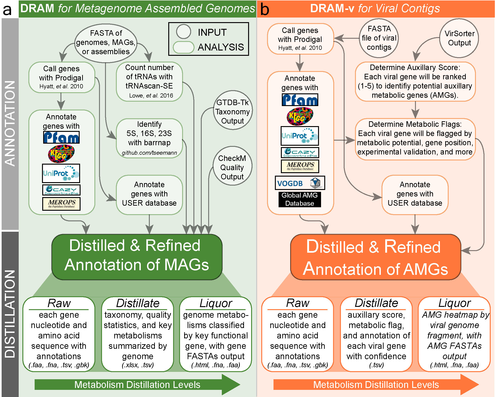

# Gene annotation II: DRAM and coverage calculation

!!! info "Objectives"

    * [Gene prediction and annotation with `DRAM`](#gene-prediction-and-annotation-with-dram-distilled-and-refined-annotation-of-metabolism)
    * [Annotating MAGs with `DRAM`](#annotating-mags-with-dram)
    * [Annotating viral contigs with `DRAM-v`](#annotating-viral-contigs-with-dram-v)
    * [Calculating per-sample coverage stats for prokaryotic bins](#calculating-per-sample-coverage-stats-for-prokaryotic-bins)
    * [Calculating per-sample coverage stats for viral contigs](#calculating-per-sample-coverage-stats-for-viral-contigs)
    * [Select initial goal](#select-initial-goal)

---

## Gene prediction and annotation with `DRAM` (Distilled and Refined Annotation of Metabolism) 

[`DRAM`](http://dx.doi.org/10.1093/nar/gkaa621) is a tool designed to profile microbial (meta)genomes for metabolisms known to impact ecosystem functions across biomes. `DRAM` annotates MAGs and viral contigs using KEGG (if provided by user), UniRef90, PFAM, CAZy, dbCAN, RefSeq viral, VOGDB (Virus Orthologous Groups), and the MEROPS peptidase database. It is also highly customizable to other custom user databases.

`DRAM` only uses assembly-derived FASTA files input by the user. These input files may come from unbinned data (metagenome contig or scaffold files) or genome-resolved data from one or many organisms (isolate genomes, single-amplified genome (SAGs), MAGs).

`DRAM` is run in two stages: annotation and distillation.



### 1. Annotation

The first step in `DRAM` is to annotate genes by assigning database identifiers to genes. Short contigs (default < 2,500 bp) are initially removed. Then, `Prodigal` is used to detect open reading frames (ORFs) and to predict their amino acid sequences. Next, `DRAM` searches all amino acid sequences against multiple databases, providing a single *Raw* output. When gene annotation is complete, all results are merged in a single tab-delimited annotation table, including the best hit for each database for user comparison.

### 2. Distillation 

After genome annotation, a distill step follows with the aim to curate these annotations into useful functional categories, creating genome statistics and metabolism summary files, which are stored in the *Distillate* output. The genome statistics provides most genome quality information required for [MIMAG](https://www.nature.com/articles/nbt.3893) standards, including `GTDB-tk` and `CheckM` information if provided by the user. The summarised metabolism table includes the number of genes with specific metabolic function identifiers (KO, CAZY ID, etc) for each genome, with information obtained from multiple databases. The *Distillate* output is then further distilled into the *Product*, an html file displaying a heatmap, as well as the corresponding data table. We will investigate all these files later on.  

---

## Annotating MAGs with `DRAM`

Beyond annotation, `DRAM` aims to be a data compiler. For that reason, output files from both `CheckM` and `GTDB_tk` steps can be input to `DRAM` to provide both taxonomy and genome quality information of the MAGs. 

### `DRAM` input files

For these exercises, we have copied the relevant input files into the folder `10.gene_annotation_and_coverage/DRAM_input_files/`. `gtdbtk.bac120.summary.tsv` was taken from the earlier `8.prokaryotic_taxonomy/gtdbtk_out/` outputs, and `dastool_bins_checkm.txt` from the result of re-running `CheckM` on the final refined filtered bins in `6.bin_refinement/dastool_bins`.

!!! terminal-2 "Navigate to working directory"

    ```bash
    cd /nesi/nobackup/nesi02659/MGSS_U/<YOUR FOLDER>/10.gene_annotation_and_coverage/
    ```

Along with our filtered bins, the `CheckM` output file (`checkm.txt`) and `GTDB-Tk` summary output `gtdbtk.bac120.summary.tsv` are used as inputs as is.

### `DRAM` annotation

In default annotation mode, `DRAM` only requires as input the directory containing all the bins we would like to annotate in *fastA* format (either .fa or .fna). There are few parameters that can be modified if not using the default mode. Once the annotation step is complete, the mode `distill` is used to summarise the obtained results.

!!! note "UniRef and RAM requirements"

    Due to the increased memory requirements, annotations against the UniRef90 database is not set by default and the flag `–use_uniref` should be specified in order to search amino acid sequences against UniRef90. In this exercise, due to memory and time constraints, we won't be using the UniRef90 database.

We will start by glancing at some of the options for `DRAM`.

!!! terminal "code"

    ```bash
    module purge
    module load DRAM/1.3.5-Miniconda3

    DRAM.py --help
    ```

!!! circle-check "Terminal output"

    ```
    usage: DRAM.py [-h] {annotate,annotate_genes,distill,strainer,neighborhoods,merge_annotations} ...

    positional arguments:
      {annotate,annotate_genes,distill,strainer,neighborhoods,merge_annotations}
        annotate            Annotate genomes/contigs/bins/MAGs
        annotate_genes      Annotate already called genes, limited functionality compared to annotate
        distill             Summarize metabolic content of annotated genomes
        strainer            Strain annotations down to genes of interest
        neighborhoods       Find neighborhoods around genes of interest
        merge_annotations   Merge multiple annotations to one larger set

    options:
      -h, --help            show this help message and exit
    ```

To look at some of the arguments in each command, type the following:

!!! terminal "code"

    ```bash
    # DRAM.py <command> --help

    # For example:
    DRAM.py annotate --help
    ```

### Submitting `DRAM` annotation as a slurm job

To run this exercise we first need to set up a slurm job. We will use the results for tomorrow's distillation step. 

!!! terminal-2 "Create script named `annotate_dram.sl`"

    ```bash
    nano annotate_dram.sl
    ```

!!! warning "Remember to update `<YOUR FOLDER>` to your own folder"

!!! terminal "code"

    ```bash linenums="1"
    #!/bin/bash -e

    #SBATCH --account       nesi02659
    #SBATCH --job-name      annotate_DRAM
    #SBATCH --partition     milan
    #SBATCH --time          5:00:00
    #SBATCH --mem           30Gb
    #SBATCH --cpus-per-task 24
    #SBATCH --error         %x_%j.err
    #SBATCH --output        %x_%j.out

    # Load modules
    module purge
    module load DRAM/1.3.5-Miniconda3

    # Working directory
    cd /nesi/nobackup/nesi02659/MGSS_U/<YOUR FOLDER>/10.gene_annotation_and_coverage

    # Run DRAM
    DRAM.py annotate -i 'dastool_bins/*.fna' \
                     --checkm_quality DRAM_input_files/checkm.txt \
                     --gtdb_taxonomy DRAM_input_files/gtdbtk.bac120.summary.tsv \
                     -o dram_annotations --threads $SLURM_CPUS_PER_TASK
    ```

!!! terminal-2 "Submit the job"

    ```bash
    sbatch annotate_dram.sl
    ```

The program will take 4-4.5 hours to run, so we will submit the jobs and inspect the results tomorrow morning.

---

