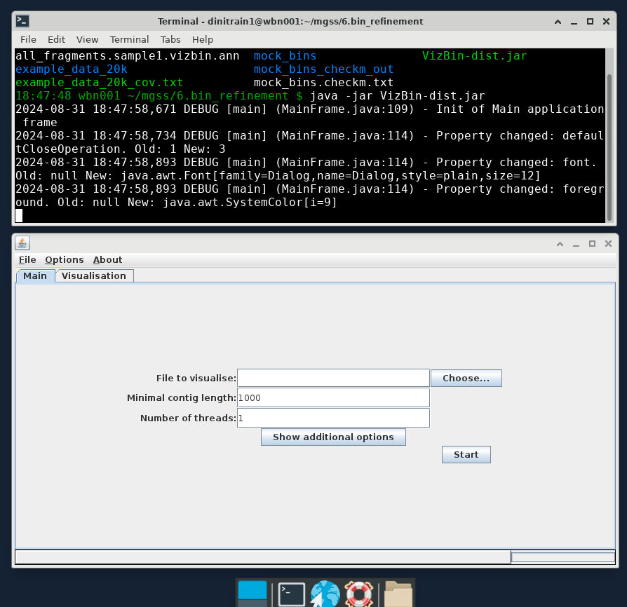
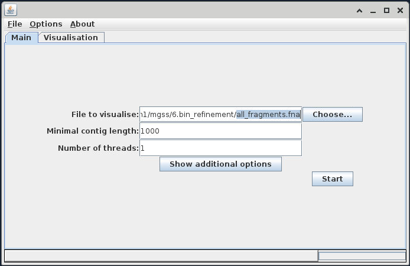
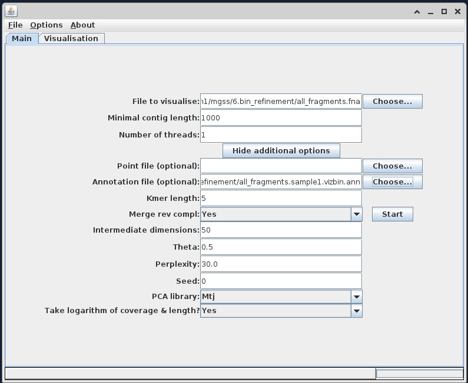
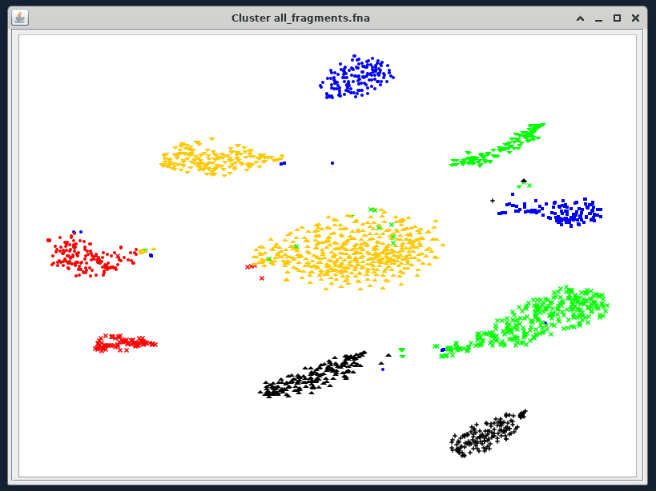

# Manual bin refinement

!!! info "Objectives"

    * [Preparing input files for `VizBin`](#preparing-input-files-for-vizbin)
    * [Projecting a *t-SNE* using `VizBin` and examining bin clusters](#projecting-a-t-sne-and-examining-bin-clusters)
    * [Picking and exporting sequences](#1-picking-and-exporting-sequences)
    * [Refining bins](#2-refining-bins)

---

## Preparing input files for `VizBin`

!!! quote "What is `VizBin`?"

    [`VizBin`](http://claczny.github.io/VizBin/) is a handy, GUI-based tool for creating ordinations of our binning data using the [t-Distributed Stochastic Neighbor Embedding (t-SNE)](https://lvdmaaten.github.io/tsne/) algorithm to project high-dimensional data down into a 2D plot that preserves clustering information. There's a really good video on [YouTube](https://www.youtube.com/watch?v=NEaUSP4YerM) that explains how the algorithm works in high-level terms, but for our purposes you can really consider it as a similar approach to a PCA or NMDS.
    
    On its own, `VizBin` takes a set of contigs and performs the *t-SNE* projection using compositional data. We can optionally provide it files that annotate contigs as belonging to particular bins and a file that adds coverage data to be considered when clustering. Unfortuantely, at this stage `VizBin` only allows a single coverage value per contig, which is not ideal. This is because `VizBin` only uses coverage as a means to modify the visualisation, not the ordination itself. It is possible to create your own *t-SNE* projection using multiple coverage values, however this is beyond the scope of today's exercise, and here we will be providing `VizBin` with coverage values for sample1 only. 
    
    The only required input file for `VizBin` is a single *.fna* file of the concatenated bins. An additional annotation file containing per-contig coverage values and bin IDs can also be provided. Colouring contigs by bin is a really effective way to spot areas that might need refinement.
    
    In the interests of time today, the input files have been generated and are provided in the `6.bin_refinement/` folder: 
    
    * `all_fragments.fna` is a concatenation of the bins of *fragmented* sub-contigs (fragmented to 20k)
    * `all_fragments.sample1.vizbin.ann` is the annotation file containing per-subcontig coverage, label (bin ID), and length values.

!!! note "Contig fragments as input for `VizBin`"

    When running `VizBin`, it is often preferable to split long contigs into smaller pieces in order to increase the density of clustering in the **t-SNE**. The data we are working with today are based on our bins output by `DAS_Tool` in the last binning exercise, but have been further processed using the `cut_up_fasta.py` script that comes with the binning tool `CONCOCT` to cut long contigs into 20k fragments. When reviewing our `VizBin` plots and outputs, it is important to remember that here we are looking at the **fragmented sub-contigs**, rather than the full complete contigs.

For future reference, and for working with your own data, a step-by-step process for generating these files from the dereplicated bins generated by `DAS_Tool` has been provided as an [Appendix](../resources/2_APPENDIX_ex9_Generating_input_files_for_VizBin.md).

For this section, we will be working within `6.bin_refinement/`. Let's first have a quick look at the annotation file.

!!! terminal-2 "Navigate to working directory"

    ```bash
    # Navigate to correct directory
    cd /nesi/nobackup/nesi02659/MGSS_U/<YOUR FOLDER>/6.bin_refinement
    ```

!!! terminal-2 "Inspect `all_bins.sample1.vizbin.ann`"

    ```bash
    head -n 5 all_fragments.sample1.vizbin.ann
    ```

!!! circle-check "Terminal output"

    ```
    coverage,label,length
    17.6626,bin_0.chopped,20000
    15.9561,bin_0.chopped,20000
    17.294,bin_0.chopped,20000
    15.8157,bin_0.chopped,20000
    ```

This file is a comma-delimited table (csv file) that presents the information in the way that `VizBin` expects it. The order of rows in this file corresponds to the order of contigs in the concatenated FASTA file of our fragmented bins, `all_fragments.fna`.

Create a few variations of the *.ann* file with various columns removed, in order to examine the different outputs they can generate.

!!! terminal "code"

    === "Bin ID only"

        ```bash
        cut -f2 -d ',' all_fragments.sample1.vizbin.ann > all_fragments.sample1.vizbin.bin_only.ann
        ```

    === "Bin ID and coverage without length"

        ```bash
        cut -f1,2 -d ',' all_fragments.sample1.vizbin.ann > all_fragments.sample1.vizbin.no_length.ann
        ```

!!! hint "Symbolic links for easy access"

    By default, `VizBin` redirects to your home directory. To make it easy to come back to our working directory, we can make a symbolic link (aka shortcut) that points to here from home.

    ```bash
    ln -sr $(pwd) ~/
    ```

    The flags mean:
    
    *  `-s` designates it as a symbolic, instead of hard link
    *  `-r` indicates that paths are relative

---

## Projecting a *t-SNE* and examining bin clusters

We can now use these files in `VizBin` to curate the contigs in our bins. We will load and view the data in a few different steps.

For this exercise, we will be using the *Virtual Desktop* on NeSI which allows us to use programmes with graphical user interfaces (GUI) within the NeSI computing environment.

!!! jupyter "Initiate the Virtual Desktop"

    1. Click on <kbd>File</kbd> on the top left corner of the Jupyter Hub, and then select <kbd>New Launcher</kbd>. You can also click on the small <kbd>+</kbd> on the tabbed bar next to your terminal tab.
    2. Look for the Virtual Desktop icon and then click on centre of the icon.
        <center>
        
        </center>
    3. A new browser tab named 'TurboVNC:...' should appear and the Virtual Desktop should load.
    4. A successful instance of the Virtual Desktop should look like a desktop environment.

    <center>
    {width=600px}
    </center>

!!! note "Running `VizBin`: local vs remote" 

    Running `VizBin` remotely (e.g. within NeSI) can be slow with full data sets. Running a GUI (such as a program like `VizBin`) remotely can also require additional set up on some PCs. For day-to-day work, we recommend installing `VizBin` on your local machine and downloading the relevant input files (e.g. via `scp ...`) to run locally.

<!--

`VizBin` cannot be opened within the NeSI `Jupyter hub`. For today's exercise, open `VizBin` via either:

**A. Install and run `VizBin` locally**

* Download `VizBin-dist.jar` from [here](https://github.com/claczny/VizBin/releases/tag/v1.0.0)
* You may also need to [install Java locally](https://www.java.com/en/download/manual.jsp) (choose the relevant version for your machine).
* Download the required files from NeSI to your machine (via `scp`, or right-click > download, from within the `Jupyter hub`), or download the example files from [this link](../resources/vizbin_files.zip).
* Double-click `VizBin-dist.jar` to open `VizBin`, and then follow the steps below.

**OR**

**B. Log in via a standard terminal.** 

* Log into NeSI via a standard terminal (*not* the terminal within `Jupyter hub`) and run the following command (*NOTE: this may return an error if X11 forwarding is not set up for your machine. In this case, proceed with the first option above*).

```bash
cd /nesi/nobackup/nesi02659/MGSS_U/<YOUR FOLDER>/6.bin_refinement/

java -jar ../tools/vizbin.jar
```

If this fails to open on your PC, or if it runs prohibitively slowly, team up with 2-3 others in the workshop to run through this exercise together on one machine.

-->

### Initiate `VizBin` within the Virtual Desktop environment

1. In the Virtual Desktop, click on the terminal icon.
    <center>
    
    </center>

    
2. `VizBin` is a Java programme, therefore we will need to load the Java module for it to work. In the terminal, type the following to load the Java module

    !!! warning "Copy/paste in the Virtual Desktop"

        You will not be able to copy text from outside the Virtual Desktop and paste into the Virtual Desktop, in which case you will need to manually type these commands.

    !!! terminal "code"
    
        ```bash
        module load Java/20.0.2
        ```
    
3. In the terminal, navigate to your directory where the Java file resides
    
    !!! warning "Remember to replace `YOUR FOLDER` with your user name."

    !!! terminal "code"
    
        ```bash
        cd /nesi/nobackup/nesi02659/MGSS_U/<YOUR FOLDER>/6.bin_refinement/

        ls
        ```

    !!! circle-check "Terminal output"

        ```
        all_fragments.fna                 example_data_unchopped  mock_fragments.fna
        all_fragments.sample1.vizbin.ann  mock_bins               mock_fragments.sample3.vizbin.bin_only.ann
        example_data_20k                  mock_bins_checkm_out    vizbin_count_table.sh
        example_data_20k_cov.txt          mock_bins.checkm.txt    VizBin-dist.jar
        ```

4. Type the following into your Virtual Desktop terminal to initiate VizBin.
   
    !!! terminal "code"
   
        ```bash
        java -jar VizBin-dist.jar
        ```

5. A successful launch of `VizBin` will look like the following:
   <center>
   {width="600"}
   </center>


### Load input files

Once `VizBin` is open, to get started, click the 'Choose...' button then navigate to the FASTA file `all_fragments.fna`.

!!! tip "`VizBin` directory"

    It is likely that when we click on the 'Choose...' button, the directory that is open will be our NeSI home directory. In that case, we can type in the input FASTA file in the 'File Name' bar: `/nesi/nobackup/nesi02659/MGSS_U/<YOUR FOLDER>/6.bin_refinement/all_fragments.fna`

<center></center>

Once this is imported, use the 'Show additional options' button to expose the advanced options, and add your **'bin only'** *.ann* file into the 'Annotation file (optional)' field.

<center></center>

### Executing the *t-SNE*

For now leave all other parameters as default. Click the 'Start' button to begin building the ordination. When it completes, you should see an output similar to the following:

### Contigs coloured by bin

<center>{width="600"}</center>

??? note "Additional annotations by length and coverage"
    
    If you input `all_bins.sample1.vizbin.ann` as your annotation file, you can see that the visualisation takes contig length (represented by point size) and coverage (represented by opacity) into account.

    <center>
    
    </center>

Similar to other projection techniques, we interpret the closeness of points as a proxy for how similar they are, and because of our *.ann* file we can see which contigs belong to the same bin.

!!! question "What do scaffolds look like?"

    In the example above, we used fragmented scaffolds as input files for VizBin. Take a look at what scaffolds look like with VizBin. Run the following code to generate input files for VizBin to visualise scaffolds.

    !!! terminal "code"

    ```bash linenums="1"
    echo "label" > all_scaffolds.vizbin.ann
    for fasta in example_data_unchopped/*.fna; do
        bin=$(basename ${fasta} .fna)
        cat ${fasta} >> all_scaffolds.fna
        grep '>' ${fasta} | sed "s/.*/${bin}/g" >> all_scaffolds.vizbin.ann
    done
    ```

    Import the newly generated `all_scaffolds.fna` and `all_scaffolds.vizbin.ann` into VizBin to visualise it.

---

## 1. Picking and exporting sequences

We can use the interactive GUI to pick the boundaries of new bins, or to identify contigs which we do not believe should be retained in the data. Have a play around with the interface, testing out the following commands:

1. Left-click and drag: Highlight an area of the ordination to zoom into
1. Right-click, 'Zoom Out', 'Both Axes': Rest of the view
1. Left-click several points: Create a selection of contigs to extract from the data
1. Right-click, 'Selection', 'Export': Save the selected contigs into a new file
1. Right-click, 'Selection', 'Clear selection': Clear the current selection

How you proceed in this stage is up to you. You can either select bins based on their boundary, and call these the refined bins. Alternatively, you could select outlier contigs and examine these in more detail to determine whether or not they were correctly placed into the bin. Which way you proceed really depends on how well the ordination resolves your bins, and it might be that both approaches are needed.

<!--
Today, we will run through an example of selecting potentially problematic (sub)contigs, and then deciding whether or not we want to filter these contigs out of our refined bins. We can use a combination of `VizBin` and `seqmagick` to remove contigs from bins where we do not trust the placement of the contig. We are aiming to reduce each bin to a trusted set of contigs.

## 1. Export `VizBin` clusters
-->

First, for each `VizBin` cluster, select the area around the cluster (via multiple left-clicks around the cluster), right-click, 'Selection', 'Export'. Save this output as `cluster_1.fna`. 

Try this for one or two clusters. In practice, we would do this for each `VizBin` cluster, saving each as a new `cluster_n.fna` file.

### Highlight a cluster to zoom into

<center>
{width="600"}
</center>

### Select the cluster to export

Left-click several points around the cluster

<center>
{width="600"}
</center>

### Export the cluster

Right-click, 'Selection', 'Export'. Save the output as `cluster_1.fna`. 

<center>
{width="600"}
</center>

## 2. Refining bins

VizBin is a general purpose tool for contig/scaffold/fragment visualisation. For this workshop, we're going to attempt to refine a few bins. Refinement can mean reducing contamination, improving completeness and/or splitting strains. Here, we will:

* Diagnose and visualise contig fragments
* Export clusters of contig fragments
* Check distribution of contig fragments across clusters
* Pull new contigs from concatenated bin files to form new bin clusters
* Check if genome metrics improve after manual refinement

For this exercise, we will be using data from the `mock_fragments*` files, `mock_bins/` sub-directory, and additional genome metrics in `mock_bins.checkm.txt`. These files were generated using a different assembly (reads assembled using MEGAHIT) based on a modified sample 3 library, and then binned using MetaBAT2 and MaxBin as per previous lessons.

### Inspect the genome metrics

Open up the file named `mock_bins.checkm.txt`. Take note of the metrics of each bin and consider what we might want to improve on.

### Prepare output directory

We also need to prepare an output directory for the clusters that we export.

!!! terminal "code"

    ```bash linenums="1"
    mkdir -p vb_export
    ```

### Load the files into VizBin

Return to the VizBin set-up dialogue in the Virtual Desktop. Select the following input files:

**File to visualize:** `mock_fragments.fna`

**Annotation file:** `mock_fragments.sample3.vizbin.bin_only.ann`

Your VizBin will look like this:

[image](../figures/ex10_mock_fragments.PNG)

!!! hint "Legends"

    When you have projected the tSNE, you can show the bin identity by right-clicking anywhere on the ordination and then click "Legend". This will give you a box that shows you which contig belongs to which bin.

### Export clusters

Based on information you have on hand, make your selection around points that you think:

* Should form bins (name these sequences `cluster_n.bin_n.fa`, where `bin_n` reminds you which bin most of the fragments come from)
* Are problematic fragments or fragments in doubt (name these sequences `contigs_n.fa`)

!!! tip "You don't have to circle everything, just the ones you think need refining!"

Export the sequences into the `vb_export/` directory we made earlier.

### Check distribution of contig fragments

We have provided you with a script that collects information from your exported fragments in order to check if you need to remove contigs from the aggregated `mock_fragments.fna`. We run this script like so:

!!! terminal "code"

    ```bash linenums="1"
    ./vizbin_count_table.sh -i vb_export/ \
                            -e fa \
                            -c cluster \
                            -s contig
    ```

!!! note "`vizbin_count_table.sh` flags"

    | Flags | Description |
    | :---- | :---- |
    | `-i`  | Input directory where FASTA files of drawn clusters are located |
    | `-e`  | File extension for drawn clusters |
    | `-c`  | File prefix for fragments that form new bins |
    | `-s`  | File prefix for problematic fragments or whose placements are doubtful. |

The script counts how problematic fragments are distributed across different clusters (based on the contig they came from). This helps us make an informed decision if removing a contig from a cluster would impact other clusters.

The outputs are:

* `vb_count_table.txt`: A table of fragments and where other fragments of the same contig are also distributed in different clusters.
* `vb_omit_contigs_tmp.txt`: A list of contigs (*not fragments*) that were designated as problematic to be removed.

### Remove problematic contigs

If your `vb_count_table.txt` has fragments of a contig that are spread across different clusters, you may need to reconsider removing that contig (i.e., there are non-zero counts in multiple cluster columns). This is because removing them may impact the composition of other clusters. 

Otherwise, if problematic contig fragments do not form clusters, we can simply ignore them when reforming new bins. In this exercise, it is highly unlikely you will encounter contig fragments shared across multiple clusters. As such, we will simply ignore the problematic contigs from the concatenated contigs file.

### Form new bins

Start by creating a new directory for refined bins.

!!! terminal "code"

    ```bash
    mkdir -p refined_bins/
    ```

We then create a file with the relevant contigs from our newly formed clusters.

!!! terminal "code"

    ```bash
    for cluster in vb_export/cluster*.fa; do
        grep '>' ${cluster} \
        | sed -e 's/>//g' -e 's/\.concoct_part_[0-9]*//g' \
        | sort -u \
        > ${cluster/.fa/.contigID}
    done
    ```

Then, we use SeqKit to extract the required contigs.

!!! terminal "code"

    ```bash
    module purge
    module load SeqKit/2.4.0

    for ids in vb_export/cluster*.contigID; do
        seqkit grep -f ${ids} <(cat mock_bins/*.fna) > refined_bins/$(basename ${ids} .contigID).fna
    done
    ```

### Check your new bins!

Moment of truth! How did your decisions impact the genome metrics of the refined bins? Run your selections through CheckM and see how you did!

!!! terminal "code"

    ```bash linenums="1"
    #!/bin/bash -e
    #SBATCH --account       nesi02659
    #SBATCH --job-name      CheckM_vb_exports
    #SBATCH --partition     milan
    #SBATCH --time          00:20:00
    #SBATCH --mem           50GB
    #SBATCH --cpus-per-task 10
    #SBATCH --error         %x_%j.err
    #SBATCH --output        %x_%j.out

    # Load modules
    module purge
    module load CheckM/1.2.3-foss-2023a-Python-3.11.6

    # Working directory
    cd /nesi/nobackup/nesi02659/MGSS_U/<YOUR FOLDER>/6.bin_refinement/

    # Run CheckM
    checkm lineage_wf -t $SLURM_CPUS_PER_TASK \
                      --pplacer_threads $SLURM_CPUS_PER_TASK \
                      -x fna --tab_table -f refined_bins.checkm.txt \
                      refined_bins/ refined_bins.checkm_out/
    ```

### Human refinement vs automated binning

Did you do better than the automated binning software? Consider the following:

!!! question ""

    * Were the new clusters more complete?
    * How much contamination was removed?
    * Was there an substantial trade-off between completeness and contamination?
    * How would you pre-process the sequences differently prior to manual refinement?
    * Are there additional information that would have helped you in the decision-making process?

When your CheckM run finishes, check and compare how you did!

<!--
### Food for thought: bin diagnosis and refinement

Did you do better or worse? Which metrics improved and which deteriorated? What were some trade-offs 


## 2. Export potentially problematic contigs

### Select problematic contigs to examine

Zoom in,  make a selection of potentially problematic contigs, and export as above.

<center>
{width="600"}
</center>

Try this for one or two problematic contigs (or subsets of contigs). In practice, you could repeat this for all potentially problematic contigs, saving each export as a new `contigs_n.fna` file.

!!! abstract "Note"

    For the subsequent step using `vizbin_count_table_2022.sh`, all exported cluster files must share a common prefix (e.g. `cluster...fna`), and all files of problematic contigs must also share a common prefix (e.g. `contigs...fna`).*

---
-->


<!--
## *(Optional)* Refining and filtering problematic contigs from bins

### Create a count table of counts of our problematic contigs across each bin

You'll recall that, prior running `VizBin`, the contigs in our bins were first cut into fragments to improve the density of the clusters in the *t-SNE* projection. As such, the problematic contigs we have exported from `VizBin` are *sub-contig* fragments, rather than full contigs from our bins. It is entirely possible that different fragments of the original contigs have been placed in different clusters during our `VizBin` analysis - including cases where most sub-contigs have clustered with the bin we expect, and a small number have been identified as "problematic" (i.e. clustered with other bins). Based on the information from these extracted problematic sub-contigs, we now have to carefully consider whether or not we want to remove the *full* contig from our bin data.

To do this, we will generate a table containing each exported "problematic" sub-contig, and counts of how many of its sister sub-contigs (each of the other sub-contig fragments derived from the same original parent contig) fall into each `VizBin` cluster.

For this exercise, a folder of the exported files from `VizBin` for all clusters (`cluster_[1-n].fna`) and problematic sub-contigs (`contigs_[1-n].fna`) has been provided at `vizbin_example_exports/`

We will input these files to the shell script `vizbin_count_table_2022.sh` to generate a count table of the exported subcontigs across each `VizBin` cluster (`vb_count_table.txt`), as well as a working list of contigs to potentially remove from our final bin data (`vb_omit_contigs_tmp.txt`).

For future reference, a copy of this script is available for download [here](https://github.com/GenomicsAotearoa/metagenomics_summer_school/tree/master/docs/scripts).

!!! terminal "code"

    ```bash
    ./vizbin_count_table_2022.sh -i vizbin_example_exports/
    ```

The only required input to `vizbin_count_table_2022.sh` is the path to the cluster and contigs files exported from `VizBin`. By default, the script looks for the prefix `cluster...` for the cluster file names, `contig...` for the files of problematic sub-contigs, and the file extension `.fna` for each. The arguments `-s <contig_file_prefix> -c <cluster_file_prefix> -e <fasta_file_extension>` can optionally be provided if your file name formats differ from the default.

View the output count table:

!!! terminal "code"

    ```bash
    less vb_count_table.txt
    ```

Example excerpt:

| Subcontig_ID| Subcontig_vb_cluster | cluster_1_count | cluster_2_count | cluster_3_count | cluster_4_count | cluster_5_count | Total_count |
| :- | :-: | :-: | :-: | :-: | :-: | :-: | :-: |
| >bin_3_NODE_81_length_109410_cov_1.136244.concoct_part_1 | cluster_5 | 0 | 0 | 0 | 4 | 1 | 5 |
| >bin_3_NODE_289_length_18049_cov_1.596107.concoct_part_0 | cluster_5 | 0 | 0 | 0 | 0 | 1 | 1 |
| >bin_3_NODE_349_length_12681_cov_1.204936.concoct_part_0 | cluster_5 | 0 | 0 | 0 | 0 | 1 | 1 |

Note that in the case of the first contig from the excerpt above, the 'problematic' contig is only one of 5 sub-contigs, and all other 4 sub-contigs are in the expected cluster. In this case, we likely do *not* want to remove this contig from the bin.

### Generate a list of contigs to *exclude* from filtering

Create a list of contigs identified from `vb_count_table.txt` that are *not* to be filtered out by seqmagick in the next step. For example, those contigs that have sub-contigs split across multiple `VizBin` clusters, and for which it's reasonable to actually keep the contig (such as when a flagged selected sub-contig exported from vizbin is in one unexpected cluster, but all other sub-contigs from that parent contig are in the expected cluster; in this case, you likely *don't* want to filter out the parent contig from the data set moving forward). 

Below is an example. Simply replace the contig IDs between the quotes for as many lines as necessary for your data. 

!!! note "Write/append outputs and extracting contig ID"

    1. The first line below must always have only one `>` character, while all subsequent lines must have two (i.e. `>>`) to append correctly to the list.
    2. We want the original contig ID here, *not* the sub-contig, so make sure to remove the `.concoct_part_n` fragment number at the end if there is one.

!!! terminal "code"

    ```bash
    echo "bin_3_NODE_81_length_109410_cov_1.136244" > vb_keep_contigs.txt
    ```

### Create final `vb_omit_contigs_filtered.txt` list of contigs to filter from bins

Using `grep`, filter contigs we wish to keep (after assessing `vb_count_table.txt`) out of the working `vb_omit_contigs_tmp.txt` list. 

This creates `vb_omit_contigs_filtered.txt`, which we will then pass to `seqmagick` to filter these contigs out of our actual bin FASTA files.

!!! terminal "code"

    ```bash
    grep -v -f vb_keep_contigs.txt vb_omit_contigs_tmp.txt > vb_omit_contigs_filtered.txt
    ```

### Filter suspect contigs (based on `VizBin` analysis) from the bin data

Use `seqmagick --exclude-from-file ...` to filter problematic contigs (those contigs listed in `vb_omit_contigs_filtered.txt`) out of the initial *unchopped* bin FASTA files, generating final bins for downstream processing.

!!! terminal "code"

    ```bash 
    mkdir filtered_bins/

    # Load seqmagick
    module purge
    module load seqmagick/0.8.4-gimkl-2020a-Python-3.8.2

    # filter problematic contigs out of original bin files
    for bin_file in example_data_unchopped/*.fna; do
        bin_name=$(basename ${bin_file} .fna)
        seqmagick convert --exclude-from-file vb_omit_contigs_filtered.txt ${bin_file} filtered_bins/${bin_name}.filtered.fna
    done
    ```

Our filtered bins for downstream use are now in `filtered_bins/`

---

## *(Optional)* Comparing pre- and post-filtered bins via `CheckM`

The end goal of this process is the generation of a final set of refined bins. Following this, the `CheckM` procedure should be re-run, this time on the refined `filtered_bins/`. This provides `CheckM` metrics for the final actual (filtered) bin set, and also an opportunity to compare between pre- and post-filtering to see if the `VizBin` bin refinement steps have, for example, improved the degree of contamination in the bins.

For this exercise, a copy of the output from running `CheckM` on the `filtered_bins/` is available at `6.bin_refinement/filtered_bins_checkm.txt`. View the previous `CheckM` output and the filtered bins output to compare via `cat`.

!!! terminal "code"

    ```bash
    cat filtered_bins_checkm.txt 
    ```

!!! circle-check "Content of `filtered_bins_checkm.txt`"

    | Bin Id | Marker lineage | # genomes | # markers | # marker sets | 0 | 1 | 2 | 3 | 4 | 5+ | Completeness | Contamination | Strain heterogeneity |
    | :- | :-: | :-: | :-: | :-: | :-: | :-: | :-: | :-: | :-: | :-: | :-: | :-: | :-: |
    | bin_0.filtered | k__Bacteria (UID3060) | 138 | 338 | 246 | 1 | 327 | 9 | 1 | 0 | 0 | 99.59 | 3.79 | 0.00 |
    | bin_1.filtered | k__Bacteria (UID3060) | 138 | 338 | 246 | 1 | 336 | 1 | 0 | 0 | 0 | 99.59 | 0.41 | 0.00 |
    | bin_2.filtered | g__Staphylococcus (UID301) | 45 | 940 | 178 | 20 | 918 | 2 | 0 | 0 | 0 | 98.32 | 0.11 | 0.00 |
    | bin_3.filtered | c__Betaproteobacteria (UID3959) | 235 | 414 | 211 | 1 | 408 | 5 | 0 | 0 | 0 | 99.97 | 0.90 | 0.00 |
    | bin_4.filtered | c__Deltaproteobacteria (UID3218) | 61 | 284 | 169 | 10 | 274 | 0 | 0 | 0 | 0 | 94.08 | 0.00 | 0.00 |
    | bin_5.filtered | o__Pseudomonadales (UID4488) | 185 | 813 | 308 | 25 | 787 | 1 | 0 | 0 | 0 | 96.87 | 0.11 | 0.00 |
    | bin_6.filtered | k__Bacteria (UID2565) | 2921 | 149 | 91 | 11 | 136 | 2 | 0 | 0 | 0 | 90.66 | 0.61 | 0.00 |
    | bin_7.filtered | p__Cyanobacteria (UID2143) | 129 | 471 | 367 | 0 | 470 | 1 | 0 | 0 | 0 | 100.00 | 0.14 | 0.00 |
    | bin_8.filtered | f__Bradyrhizobiaceae (UID3695) | 47 | 693 | 296 | 3 | 690 | 0 | 0 | 0 | 0 | 99.47 | 0.00 | 0.00 |
    | bin_9.filtered | g__Vibrio (UID4878) | 67 | 1130 | 369 | 4 | 1125 | 1 | 0 | 0 | 0 | 99.46 | 0.03 | 0.00 |

!!! terminal "code"

    ```bash
    cat ../5.binning/checkm.txt 
    ```

!!! circle-check "Content of `checkm.txt`"

    | Bin Id | Marker lineage | # genomes | # markers | # marker sets | 0 | 1 | 2 | 3 | 4 | 5+ | Completeness | Contamination | Strain heterogeneity |
    | :- | :-: | :-: | :-: | :-: | :-: | :-: | :-: | :-: | :-: | :-: | :-: | :-: | :-: |
    | maxbin.001.fasta | k__Bacteria (UID3060) | 138 | 338 | 246 | 1 | 327 | 9 | 1 | 0 | 0 | 99.59 | 3.79 | 0.00 |
    | maxbin.002.fasta | k__Bacteria (UID3060) | 138 | 338 | 246 | 1 | 336 | 1 | 0 | 0 | 0 | 99.59 | 0.41 | 0.00 |
    | metabat.10_sub | g__Staphylococcus (UID301) | 45 | 940 | 178 | 20 | 918 | 2 | 0 | 0 | 0 | 98.32 | 0.11 | 0.00 |
    | metabat.11 | c__Betaproteobacteria (UID3959) | 235 | 414 | 211 | 1 | 408 | 5 | 0 | 0 | 0 | 99.97 | 0.90 | 0.00 |
    | metabat.12 | c__Deltaproteobacteria (UID3218) | 61 | 284 | 169 | 10 | 274 | 0 | 0 | 0 | 0 | 94.08 | 0.00 | 0.00 |
    | metabat.2 | o__Pseudomonadales (UID4488) | 185 | 813 | 308 | 25 | 787 | 1 | 0 | 0 | 0 | 96.87 | 0.11 | 0.00 |
    | metabat.3_sub | k__Bacteria (UID2565) | 2921 | 149 | 91 | 11 | 136 | 2 | 0 | 0 | 0 | 90.66 | 0.61 | 0.00 |
    | metabat.4 | p__Cyanobacteria (UID2143) | 129 | 471 | 367 | 0 | 470 | 1 | 0 | 0 | 0 | 100.00 | 0.14 | 0.00 |
    | metabat.5 | f__Bradyrhizobiaceae (UID3695) | 47 | 693 | 296 | 3 | 690 | 0 | 0 | 0 | 0 | 99.47 | 0.00 | 0.00 |
    | metabat.7 | g__Vibrio (UID4878) | 67 | 1130 | 369 | 4 | 1125 | 1 | 0 | 0 | 0 | 99.46 | 0.03 | 0.00 |
    
An example of an updated slurm script to run `CheckM` on the `filtered_bins/` is as follows:

!!! terminal "code"

    ```bash linenums="1"
    #!/bin/bash -e
    #SBATCH --account       nesi02659
    #SBATCH --job-name      checkm_refined_bins
    #SBATCH --partition     milan
    #SBATCH --time          00:20:00
    #SBATCH --mem           50GB
    #SBATCH --cpus-per-task 10
    #SBATCH --error         %x_%j.err
    #SBATCH --output        %x_%j.out

    module purge
    module load CheckM/1.2.3-foss-2023a-Python-3.11.6

    cd /nesi/nobackup/nesi02659/MGSS_U/<YOUR FOLDER>/6.bin_refinement/

    checkm lineage_wf -t $SLURM_CPUS_PER_TASK --pplacer_threads $SLURM_CPUS_PER_TASK -x fna \
                      --tab_table -f filtered_bins_checkm.txt \
                      filtered_bins/ filtered_bins_checkm_out/
    ```

The data you have been working with was created using the `cut_up_fasta.py` script that comes with the binning tool `CONCOCT`. It was run to cut contigs into 20k fragments, to better add density to the cluster. If you would like to visualise the data using different contig fragment sizes, you can create these using the following commands (replace `YOUR_CONTIG_SIZE` with the size of interest, e.g. `10000`):

!!! terminal "code"

    ```bash
    module purge
    module load CONCOCT/1.0.0-gimkl-2018b-Python-2.7.16

    mkdir custom_chop/

    # Fragment contigs within each bin, outputting to custom_chop/
    for bin_file in example_data_unchopped/*;
    do
        bin_name=$(basename ${bin_file} .fna)
        cut_up_fasta.py -c YOUR_CONTIG_SIZE -o 0 --merge_last ${bin_file} > custom_chop/${bin_name}.chopped.fna
    done

    # Concatenate the chopped bins into single .fna
    cat custom_chop/*.fna > all_bins_custom_chop.fna
    ```

You can open `all_bins_custom_chop.fna` in `VizBin` to view the clustering with this new fragmentation threshold. 

If you wish to also provide an annotation file to colour by bin, this can be generated with the following:

!!! terminal "code"

    ```bash
    # Set up annotation file headers
    echo "label" > custom_chop.vizbin.ann

    # loop through custom_chop .fna files
    for bin_file in custom_chop/*.fna; do
        # extract bin ID
        binID=$(basename ${bin_file} .fna)
        # loop through each sequence header in bin_file, adding binID to custom_chop.vizbin.ann for each header present
        for header in `grep ">" ${bin_file}`; do
            # Add binID to vizbin.ann for each header present
            echo "${binID}" >> custom_chop.vizbin.ann
        done
    done
    ```

If you wish to generate the full annotation file, including coverage and length values, you will need to go through the process outlined in the [Appendix for this exercise](../resources/2_APPENDIX_ex9_Generating_input_files_for_VizBin.md).  

---

## *(Optional)* Scripts for processing data with *ESOMana*

A suite of tools for creating input files for `ESOMana` can be found on github [here](https://github.com/tetramerFreqs/Binning).

The tool `ESOMana` can be downloaded from [SourceForge](http://databionic-esom.sourceforge.net/).

---
-->