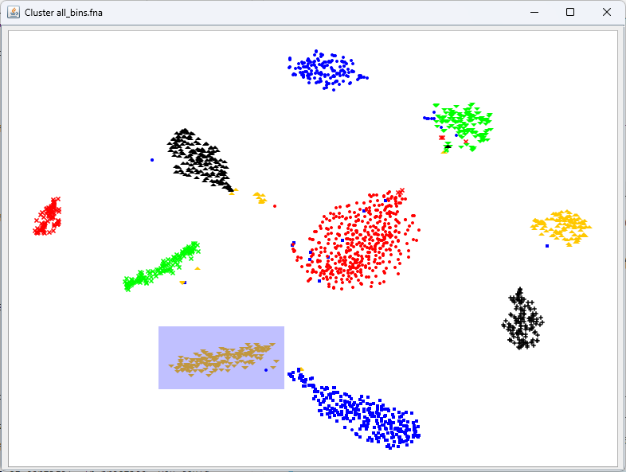
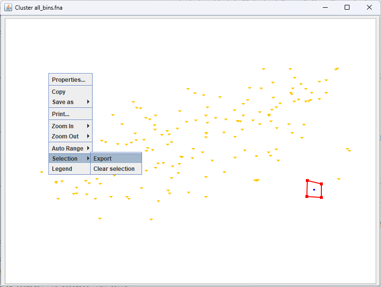

# Manually refining bins

!!! info "Objectives"

    * [Prepare input files for `VizBin`](#prepare-input-files-for-vizbin)
    * [Project a *t-SNE* using `VizBin` and examine bin clusters](#project-a-t-sne-and-examine-bin-clusters)
    * [Refine bins by identifying incorrectly assigned contigs](#picking-refined-bins)
    * [*Optional:* Refine and filter problematic contigs from bins](#optional-refine-and-filter-problematic-contigs-from-bins)
    * [*Optional:* Comparing pre- and post-filtered bins via *CheckM*](#optional-comparing-pre--and-post-filtered-bins-via-checkm)
    * [*Optional:* Creating new `VizBin` profiles with different fragment lengths](#optional-creating-new-vizbin-profiles-with-different-fragment-lengths)
    * [*Optional:* Scripts for processing data with `ESOMana`](#optional-scripts-for-processing-data-with-esomana)

---

### Prepare input files for *VizBin*

!!! quote ""

    [**VizBin**](http://claczny.github.io/VizBin/) is a handy, GUI-based tool for creating ordinations of our binning data using the [t-Distributed Stochastic Neighbor Embedding (t-SNE)](https://lvdmaaten.github.io/tsne/) algorithm to project high-dimensional data down into a 2D plot that preserves clustering information. There's a really good video on [YouTube](https://www.youtube.com/watch?v=NEaUSP4YerM) that explains how the algorithm works in high-level terms, but for our purposes you can really consider it as a similar approach to a PCA or NMDS.
    
    On its own, `VizBin` takes a set of contigs and performs the *t-SNE* projection using compositional data. We can optionally provide it files that annotate contigs as belonging to particular bins and a file that adds coverage data to be considered when clustering. Unfortuantely, at this stage `VizBin` only allows a single coverage value per contig, which is not ideal. This is because `VizBin` only uses coverage as a means to modify the visualisation, not the ordination itself. It is possible to create your own *t-SNE* projection using multiple coverage values, however this is beyond the scope of today's exercise, and here we will be providing `VizBin` with coverage values for sample1 only. 
    
    The only required input file for `VizBin` is a single `.fna` file of the concatenated bins. An additional annotation file containing per-contig coverage values and bin IDs can also be provided. Colouring contigs by bin is a really effective way to spot areas that might need refinement.
    
    *NOTE: When running VizBin, it is often preferable to split long contigs into smaller pieces in order to increase the density of clustering in the **t-SNE**. The data we are working with today are based on our bins output by `DAS_Tool` in the last binning exercise, but have been further processed using the `cut_up_fasta.py` script that comes with the binning tool `CONCOCT` to cut long contigs into 20k fragments. When reviewing our `VizBin` plots and outputs, it is important to remember that here we are looking at the **fragmented sub-contigs**, rather than the full complete contigs (the importance of this will be clear when we are reviewing our `vb_count_table.txt` later in this exercise).*
    
    In the interests of time today, the input files have been generated and are provided in the `6.bin_refinement/` folder: 
    
    * `all_bins.fna` is a concatenation of the bins of *fragmented* sub-contigs (fragmented to 20k)
    * `all_bins.sample1.vizbin.ann` is the annotation file containing per-subcontig coverage, label (bin ID), and length values.

For future reference, and for working with your own data, a step-by-step process for generating these files from the curated bins generated by `DAS_Tool` has been provided as an [Appendix](../resources/2_APPENDIX_ex9_Generating_input_files_for_VizBin.md).

For this section, we will be working within `6.bin_refinement/`. Let's first have a quick look at the annotation file. 

```bash
# Navigate to correct directory
cd /nesi/nobackup/nesi02659/MGSS_U/<YOUR FOLDER>/6.bin_refinement

head -n 5 all_bins.sample1.vizbin.ann

# coverage,label,length
# 16.5255,bin_0.chopped,20000
# 17.8777,bin_0.chopped,20000
# 17.6983,bin_0.chopped,20000
# 16.7296,bin_0.chopped,20000
```

This file is a comma-delimited table (csv file) that presents the information in the way that VizBin expects it. The order of rows in this file corresponds to the order of contigs in the concatenated *fastA* file of our fragmented bins, `all_bins.fna`.

Create a few variations of the *.ann* file with various columns removed, in order to examine the different outputs they can generate.

```bash
cd /nesi/nobackup/nesi02659/MGSS_U/<YOUR FOLDER>/6.bin_refinement/

# Make a few different versions of the .ann file with various columns removed
## annotation with bin only (to colour by bin)
cut -f2 -d ',' all_bins.sample1.vizbin.ann > all_bins.sample1.vizbin.bin_only.ann
## no length, but coverage and bin included
cut -f1,2 -d ',' all_bins.sample1.vizbin.ann > all_bins.sample1.vizbin.no_length.ann
```

---

### Project a *t-SNE* and examine bin clusters

We can now use these files in `VizBin` to curate the contigs in our bins. We will load and view the data in a few different steps.

For this exercise, we will be using the *Virtual Desktop* on NeSI which allows us to use programmes with graphical user interfaces (GUI) within the NeSI computing environment.

#### Initiate the Virtual Desktop

1. Click on <kbd>File</kbd> on the top left corner of the Jupyter Hub, and then select <kbd>New Launcher</kbd>. You can also click on the small <kbd>+</kbd> on the tabbed bar next to your terminal tab.
2. Look for the Virtual Desktop icon and then click on centre of the icon.
    <center>
    
    </center>
3. A new browser tab named 'TurboVNC:...' should appear and the Virtual Desktop should load.
4. A successful instance of the Virtual Desktop should look like a desktop environment.

<center>
{width=600px}
</center>

!!! note "Running VizBin: local vs remote" 

    Running `VizBin` remotely (e.g. within NeSI) can be slow with full data sets. Running a GUI (such as a program like `VizBin`) remotely can also require additional set up on some PCs. For day-to-day work, we recommend installing `VizBin` on your local machine and downloading the relevant input files (e.g. via `scp ...`) to run locally.

<!--

`VizBin` cannot be opened within the NeSI `Jupyter hub`. For today's exercise, open `VizBin` via either:

**A. Install and run `VizBin` locally**

* Download `VizBin-dist.jar` from [here](https://github.com/claczny/VizBin/releases/tag/v1.0.0)
* You may also need to [install Java locally](https://www.java.com/en/download/manual.jsp) (choose the relevant version for your machine).
* Download the required files from NeSI to your machine (via `scp`, or right-click > download, from within the `Jupyter hub`), or download the example files from [this link](../resources/vizbin_files.zip).
* Double-click `VizBin-dist.jar` to open `VizBin`, and then follow the steps below.

**OR**

**B. Log in via a standard terminal.** 

* Log into NeSI via a standard terminal (*not* the terminal within `Jupyter hub`) and run the following command (*NOTE: this may return an error if X11 forwarding is not set up for your machine. In this case, proceed with the first option above*).

```bash
cd /nesi/nobackup/nesi02659/MGSS_U/<YOUR FOLDER>/6.bin_refinement/

java -jar ../tools/vizbin.jar
```

If this fails to open on your PC, or if it runs prohibitively slowly, team up with 2-3 others in the workshop to run through this exercise together on one machine.

-->

#### Initiate VizBin within the Virtual Desktop environment

1. In the Virtual Desktop, click on the terminal icon.
    <center>
    
    </center>
2. VizBin is a Java programme, therefore we will need to load the Java module for it to work. In the terminal, type the following to load the Java module
    ```bash
    module load Java/17
    ```
3. In the terminal, navigate to your directory where the Java file resides
    
    !!! warning "Replace path"

        Remember to replace `YOUR FOLDER` with your user name.

    ```bash
    cd /nesi/nobackup/nesi02659/MGSS_U/<YOUR FOLDER>/6.bin_refinement/

    ls
    ```

    !!! success ""

        ```
        all_bins.fna  all_bins.sample1.vizbin.ann  vizbin_count_table_2022.sh  VizBin-dist.jar  vizbin_example_exports
        ```

4. Type the following into your Virtual Desktop terminal to initiate VizBin.
   ```bash
   java -jar VizBin-dist.jar
   ```
5. A successful launch of VizBin will look like the following:
   <center>
   
   </center>


#### Loading the input files

Once `VizBin` is open, to get started, simply click the 'Choose...' button then navigate to the *fastA* file.


<center></center>

Once this is imported, use the 'Show additional options' button to expose the advanced options, and add your **'bin only'** *.ann* file into the 'Annotation file (optional)' field.


<center></center>

#### Executing the *t-SNE*

For now leave all other parameters as default. Click the 'Start' button to begin building the ordination. When it completes, you should see an output similar to the following:

#### Contigs coloured by bin


<center>{width="600"}</center>

??? note "Additional annotations by length and coverage"
    
    If you input `all_bins.sample1.vizbin.ann` as your annotation file, you can see that the visualisation takes contig length (represented by point size) and coverage (represented by opacity) into account.

    <center>
    
    </center>

Similar to other projection techniques, we interpret the closeness of points as a proxy for how similar they are, and because of our *.ann* file we can see which contigs belong to the same bin.

---

### Picking refined bins

We can use the interactive GUI to pick the boundaries of new bins, or to identify contigs which we do not believe should be retained in the data. Have a play around with the interface, testing out the following commands:

1. Left-click and drag: Highlight an area of the ordination to zoom into
1. Right-click, 'Zoom Out', 'Both Axes': Rest of the view
1. Left-click several points: Create a selection of contigs to extract from the data
1. Right-click, 'Selection', 'Export': Save the selected contigs into a new file
1. Right-click, 'Selection', 'Clear selection': Clear the current selection

How you proceed in this stage is up to you. You can either select bins based on their boundary, and call these the refined bins. Alternatively, you could select outlier contigs and examine these in more detail to determine whether or not they were correctly placed into the bin. Which way you proceed really depends on how well the ordination resolves your bins, and it might be that both approaches are needed.

Today, we will run through an example of selecting potentially problematic (sub)contigs, and then deciding whether or not we want to filter these contigs out of our refined bins. We can use a combination of `VizBin` and `seqmagick` to remove contigs from bins where we do not trust the placement of the contig. We are aiming to reduce each bin to a trusted set of contigs.

### 1. Export *VizBin* clusters

First, for each `VizBin` cluster, select the area around the cluster (via multiple left-clicks around the cluster), right-click, 'Selection', 'Export'. Save this output as `cluster_1.fna`. 

Try this for one or two clusters. In practice, we would do this for each `VizBin` cluster, saving each as a new `cluster_n.fna` file.

#### Highlight a cluster to zoom into


<center>{width="600"}</center>

#### Select the cluster to export

Left-click several points around the cluster


<center>{width="600"}</center>

#### Export the cluster

Right-click, 'Selection', 'Export'. Save the output as `cluster_1.fna`. 


<center>{width="600"}</center>


### 2. Export potentially problematic contigs

#### Select problematic contigs to examine

Zoom in,  make a selection of potentially problematic contigs, and export as above.


<center>{width="600"}</center>

Try this for one or two problematic contigs (or subsets of contigs). In practice, you could repeat this for all potentially problemtic contigs, saving each export as a new `contigs_n.fna` file.

!!! abstract "Note"

    For the subsequent step using `vizbin_count_table_2022.sh`, all exported cluster files must share a common prefix (e.g. `cluster...fna`), and all files of problematic contigs must also share a common prefix (e.g. `contigs...fna`).*

---

### *Optional:* Refine and filter problematic contigs from bins

#### Create a count table of counts of our problematic contigs across each bin

You'll recall that, prior running `VizBin`, the contigs in our bins were first cut into fragments to improve the density of the clusters in the *t-SNE* projection. As such, the problematic contigs we have exported from `VizBin` are *sub-contig* fragments, rather than full contigs from our bins. It is entirely possible that different fragments of the original contigs have been placed in different clusters during our `VizBin` analysis - including cases where most sub-contigs have clustered with the bin we expect, and a small number have been identified as "problematic" (i.e. clustered with other bins). Based on the information from these extracted problematic sub-contigs, we now have to carefully consider whether or not we want to remove the *full* contig from our bin data.

To do this, we will generate a table containing each exported "problematic" sub-contig, and counts of how many of its sister sub-contigs (each of the other sub-contig fragments derived from the same original parent contig) fall into each `VizBin` cluster.

For this exercise, a folder of the exported files from `VizBin` for all clusters (`cluster_[1-n].fna`) and problematic sub-contigs (`contigs_[1-n].fna`) has been provided at `vizbin_example_exports/`

We will input these files to the shell script `vizbin_count_table_2022.sh` to generate a count table of the exported subcontigs across each `VizBin` cluster (`vb_count_table.txt`), as well as a working list of contigs to potentially remove from our final bin data (`vb_omit_contigs_tmp.txt`).

For future reference, a copy of this script is available for download [here](https://github.com/GenomicsAotearoa/metagenomics_summer_school/tree/master/docs/scripts).

```bash
./vizbin_count_table_2022.sh -i vizbin_example_exports/
```

The only required input to `vizbin_count_table_2022.sh` is the path to the cluster and contigs files exported from `VizBin`. By default, the script looks for the prefix `cluster...` for the cluster file names, `contig...` for the files of problematic sub-contigs, and the file extension `.fna` for each. The arguments `-s <contig_file_prefix> -c <cluster_file_prefix> -e <fasta_file_extension>` can optionally be provided if your file name formats differ from the default.

View the output count table:

```bash
less vb_count_table.txt
```

Example excerpt:

| Subcontig_ID| Subcontig_vb_cluster | cluster_1_count | cluster_2_count | cluster_3_count | cluster_4_count | cluster_5_count | Total_count |
| :- | :-: | :-: | :-: | :-: | :-: | :-: | :-: |
| >bin_3_NODE_81_length_109410_cov_1.136244.concoct_part_1 | cluster_5 | 0 | 0 | 0 | 4 | 1 | 5 |
| >bin_3_NODE_289_length_18049_cov_1.596107.concoct_part_0 | cluster_5 | 0 | 0 | 0 | 0 | 1 | 1 |
| >bin_3_NODE_349_length_12681_cov_1.204936.concoct_part_0 | cluster_5 | 0 | 0 | 0 | 0 | 1 | 1 |

Note that in the case of the first contig from the excerpt above, the 'problematic' contig is only one of 5 sub-contigs, and all other 4 sub-contigs are in the expected cluster. In this case, we likely do *not* want to remove this contig from the bin.

#### Generate a list of contigs to *exclude* from filtering

Create a list of contigs identified from `vb_count_table.txt` that are *not* to be filtered out by seqmagick in the next step. For example, those contigs that have sub-contigs split across multiple vizbin clusters, and for which it's reasonable to actually keep the contig (such as when a flagged selected sub-contig exported from vizbin is in one unexpected cluster, but all other sub-contigs from that parent contig are in the expected cluster; in this case, you likely *don't* want to filter out the parent contig from the data set moving forward). 

Below is an example. Simply replace the contig IDs between the quotes for as many lines as necessary for your data. 

*NOTES:*

1. *The first line below must always have only one `>` character, while all subsequent lines must have two (i.e. `>>`) to append correctly to the list.*
2. *We want the original contig ID here, *not* the sub-contig, so make sure to remove the `.concoct_part_n` fragment number at the end if there is one.*

```bash
echo "bin_3_NODE_81_length_109410_cov_1.136244" > vb_keep_contigs.txt
```

#### Create final *vb_omit_contigs_filtered.txt* list of contigs to filter from bins

Using `grep`, filter contigs we wish to keep (after assessing `vb_count_table.txt`) out of the working `vb_omit_contigs_tmp.txt` list. 

This creates `vb_omit_contigs_filtered.txt`, which we will then pass to `seqmagick` to filter these contigs out of our actual bin fasta files.

```bash
grep -v -f vb_keep_contigs.txt vb_omit_contigs_tmp.txt > vb_omit_contigs_filtered.txt
```

#### Filter suspect contigs (based on *VizBin* analysis) from the bin data

Use `seqmagick --exclude-from-file ...` to filter problematic contigs (those contigs listed in `vb_omit_contigs_filtered.txt`) out of the initial *unchopped* bin fasta files, generating final bins for downstream processing.

```bash 
mkdir filtered_bins/

# Load seqmagick
module purge
module load seqmagick/0.8.4-gimkl-2020a-Python-3.8.2

# filter problematic contigs out of original bin files
for bin_file in example_data_unchopped/*.fna; do
    bin_name=$(basename ${bin_file} .fna)
    seqmagick convert --exclude-from-file vb_omit_contigs_filtered.txt ${bin_file} filtered_bins/${bin_name}.filtered.fna
done
```

Our filtered bins for downstream use are now in `filtered_bins/`

---

### *Optional:* Comparing pre- and post-filtered bins via *CheckM*

The end goal of this process is the generation of a final set of refined bins. Following this, the `CheckM` procedure should be re-run, this time on the refined `filtered_bins/`. This provides `CheckM` metrics for the final actual (filtered) bin set, and also an opportunity to compare between pre- and post-filtering to see if the `VizBin` bin refinement steps have, for example, improved the degree of contamination in the bins.

For this exercise, a copy of the output from running `CheckM` on the `filtered_bins/` is available at `6.bin_refinement/filtered_bins_checkm.txt`. View the previous `CheckM` output and the filtered bins output to compare via `cat`.

```bash
cat filtered_bins_checkm.txt 
```
??? success "content of filtered_bins_checkm.txt"

    | Bin Id | Marker lineage | # genomes | # markers | # marker sets | 0 | 1 | 2 | 3 | 4 | 5+ | Completeness | Contamination | Strain heterogeneity |
    | :- | :-: | :-: | :-: | :-: | :-: | :-: | :-: | :-: | :-: | :-: | :-: | :-: | :-: |
    | bin_0.filtered | k__Bacteria (UID3060) | 138 | 338 | 246 | 1 | 327 | 9 | 1 | 0 | 0 | 99.59 | 3.79 | 0.00 |
    | bin_1.filtered | k__Bacteria (UID3060) | 138 | 338 | 246 | 1 | 336 | 1 | 0 | 0 | 0 | 99.59 | 0.41 | 0.00 |
    | bin_2.filtered | g__Staphylococcus (UID301) | 45 | 940 | 178 | 20 | 918 | 2 | 0 | 0 | 0 | 98.32 | 0.11 | 0.00 |
    | bin_3.filtered | c__Betaproteobacteria (UID3959) | 235 | 414 | 211 | 1 | 408 | 5 | 0 | 0 | 0 | 99.97 | 0.90 | 0.00 |
    | bin_4.filtered | c__Deltaproteobacteria (UID3218) | 61 | 284 | 169 | 10 | 274 | 0 | 0 | 0 | 0 | 94.08 | 0.00 | 0.00 |
    | bin_5.filtered | o__Pseudomonadales (UID4488) | 185 | 813 | 308 | 25 | 787 | 1 | 0 | 0 | 0 | 96.87 | 0.11 | 0.00 |
    | bin_6.filtered | k__Bacteria (UID2565) | 2921 | 149 | 91 | 11 | 136 | 2 | 0 | 0 | 0 | 90.66 | 0.61 | 0.00 |
    | bin_7.filtered | p__Cyanobacteria (UID2143) | 129 | 471 | 367 | 0 | 470 | 1 | 0 | 0 | 0 | 100.00 | 0.14 | 0.00 |
    | bin_8.filtered | f__Bradyrhizobiaceae (UID3695) | 47 | 693 | 296 | 3 | 690 | 0 | 0 | 0 | 0 | 99.47 | 0.00 | 0.00 |
    | bin_9.filtered | g__Vibrio (UID4878) | 67 | 1130 | 369 | 4 | 1125 | 1 | 0 | 0 | 0 | 99.46 | 0.03 | 0.00 |


```bash
cat ../5.binning/checkm.txt 
```
??? success "content of checkm.txt"

    | Bin Id | Marker lineage | # genomes | # markers | # marker sets | 0 | 1 | 2 | 3 | 4 | 5+ | Completeness | Contamination | Strain heterogeneity |
    | :- | :-: | :-: | :-: | :-: | :-: | :-: | :-: | :-: | :-: | :-: | :-: | :-: | :-: |
    | maxbin.001.fasta | k__Bacteria (UID3060) | 138 | 338 | 246 | 1 | 327 | 9 | 1 | 0 | 0 | 99.59 | 3.79 | 0.00 |
    | maxbin.002.fasta | k__Bacteria (UID3060) | 138 | 338 | 246 | 1 | 336 | 1 | 0 | 0 | 0 | 99.59 | 0.41 | 0.00 |
    | metabat.10_sub | g__Staphylococcus (UID301) | 45 | 940 | 178 | 20 | 918 | 2 | 0 | 0 | 0 | 98.32 | 0.11 | 0.00 |
    | metabat.11 | c__Betaproteobacteria (UID3959) | 235 | 414 | 211 | 1 | 408 | 5 | 0 | 0 | 0 | 99.97 | 0.90 | 0.00 |
    | metabat.12 | c__Deltaproteobacteria (UID3218) | 61 | 284 | 169 | 10 | 274 | 0 | 0 | 0 | 0 | 94.08 | 0.00 | 0.00 |
    | metabat.2 | o__Pseudomonadales (UID4488) | 185 | 813 | 308 | 25 | 787 | 1 | 0 | 0 | 0 | 96.87 | 0.11 | 0.00 |
    | metabat.3_sub | k__Bacteria (UID2565) | 2921 | 149 | 91 | 11 | 136 | 2 | 0 | 0 | 0 | 90.66 | 0.61 | 0.00 |
    | metabat.4 | p__Cyanobacteria (UID2143) | 129 | 471 | 367 | 0 | 470 | 1 | 0 | 0 | 0 | 100.00 | 0.14 | 0.00 |
    | metabat.5 | f__Bradyrhizobiaceae (UID3695) | 47 | 693 | 296 | 3 | 690 | 0 | 0 | 0 | 0 | 99.47 | 0.00 | 0.00 |
    | metabat.7 | g__Vibrio (UID4878) | 67 | 1130 | 369 | 4 | 1125 | 1 | 0 | 0 | 0 | 99.46 | 0.03 | 0.00 |
    

An example of an updated slurm script to run `CheckM` on the `filtered_bins/` is as follows:

!!! terminal "code"

    ```bash
    #!/bin/bash -e
    #SBATCH --account nesi02659
    #SBATCH --job-name checkm_refined_bins
    #SBATCH --time 00:20:00
    #SBATCH --mem 50GB
    #SBATCH --cpus-per-task 10
    #SBATCH --error %x_%j.err
    #SBATCH --output %x_%j.out


    module purge
    module load CheckM/1.2.1-gimkl-2022a-Python-3.10.5

    cd /nesi/nobackup/nesi02659/MGSS_U/<YOUR FOLDER>/6.bin_refinement/

    checkm lineage_wf -t $SLURM_CPUS_PER_TASK --pplacer_threads $SLURM_CPUS_PER_TASK -x fna \
                      --tab_table -f filtered_bins_checkm.txt \
                      filtered_bins/ filtered_bins_checkm_out/

    ```

The data you have been working with was created using the `cut_up_fasta.py` script that comes with the binning tool `CONCOCT`. It was run to cut contigs into 20k fragments, to better add density to the cluster. If you would like to visualise the data using different contig fragment sizes, you can create these using the following commands (replace `YOUR_CONTIG_SIZE` with the size of interest, e.g. `10000`):

```bash
module load CONCOCT/1.0.0-gimkl-2018b-Python-2.7.16

mkdir custom_chop/

# Fragment contigs within each bin, outputting to custom_chop/
for bin_file in example_data_unchopped/*;
do
    bin_name=$(basename ${bin_file} .fna)
    cut_up_fasta.py -c YOUR_CONTIG_SIZE -o 0 --merge_last ${bin_file} > custom_chop/${bin_name}.chopped.fna
done

# Concatenate the chopped bins into single .fna
cat custom_chop/*.fna > all_bins_custom_chop.fna
```

You can open `all_bins_custom_chop.fna` in VizBin to view the clustering with this new fragmentation threshold. 

If you wish to also provide an annotation file to colour by bin, this can be generated with the following:

```bash
# Set up annotation file headers
echo "label" > custom_chop.vizbin.ann

# loop through custom_chop .fna files
for bin_file in custom_chop/*.fna; do
    # extract bin ID
    binID=$(basename ${bin_file} .fna)
    # loop through each sequence header in bin_file, adding binID to custom_chop.vizbin.ann for each header present
    for header in `grep ">" ${bin_file}`; do
        # Add binID to vizbin.ann for each header present
        echo "${binID}" >> custom_chop.vizbin.ann
    done
done
```

If you wish to generate the full annotation file, including coverage and length values, you will need to go through the process outlined in the [Appendix for this exercise](../resources/2_APPENDIX_ex9_Generating_input_files_for_VizBin.md).  

---

### *Optional:* Scripts for processing data with *ESOMana*

A suite of tools for creating input files for `ESOMana` can be found on github [here](https://github.com/tetramerFreqs/Binning).

The tool `ESOMana` can be downloaded from [SourceForge](http://databionic-esom.sourceforge.net/).

---
