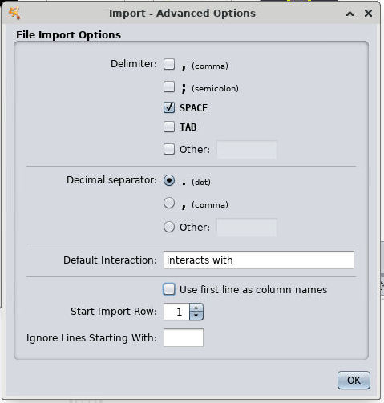
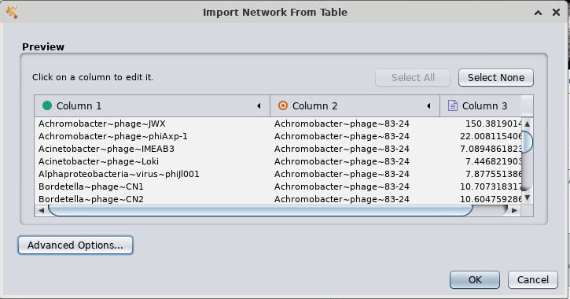

# Identifying viral contigs in metagenomic data

!!! info "Objectives"

    * [Checking quality and estimating completeness of the viral contigs via `CheckV`](#checking-quality-and-estimate-completeness-of-the-viral-contigs-via-checkv)
    * [Exercise: Examining viral output files from `VirSorter2` and `CheckV`](#exercise-examining-viral-output-files-from-virsorter2-and-checkv)
    * [Introduction to `vConTACT2` for predicting taxonomy of viral contigs](#introduction-to-vcontact2-for-predicting-taxonomy-of-viral-contigs)
    * [OPTIONAL: Visualising the `vConTACT2` gene-sharing network in `Cytoscape`](#optional-visualising-the-vcontact2-gene-sharing-network-in-cytoscape)

---

## Outputs of `VirSorter2` and `CheckV`

Key outputs from `VirSorter2` include:

- `mgss-final-viral-combined.fa`: FASTA file of identified viral sequences
- `mgss-final-viral-score.tsv`: table with score of each viral sequences across groups and a few more key features, which can also be used for further filtering
- `mgss-for-dramv/`: files to be used as input to `DRAM-v` for gene prediction and annotation (we will be running `DRAM-v` later today during the gene annotation session)

`CheckV` provides summary outputs for contamination, completeness, repeats, and an overall quality summary. Later today we will have a brief look at some examples of the information you can draw from these `CheckV` outputs. 

### Exercise: Examining viral output files from `VirSorter2` and `CheckV`

`VirSorter2` and `CheckV` provide several of different output files that are important for identifying and understanding the viruses present in your data. Explore through the following files: 

- `7.viruses/VirSorter2/mgss-final-viral-score.tsv`
- `7.viruses/checkv_out/quality_summary.tsv`

When viewing these files, see if you can find the following information:

!!! quote ""

    * How many viral contigs did `VirSorter2` identify?
    * How many viral contigs meet the "High-quality" (MIUViG) standard?
    * How many might we consider "complete" genomes based on `CheckV`'s completeness estimation?
    * Are any of the identified viral contigs complete *circular* genomes (based on identifying direct terminal repeat regions on both ends of the genome)? If not, think about why this might be the case for this dataset (hint: the workshop materials are a manufactured "metagenome" data set based on compiling several individual genomes)
    * Are there any suspicious contigs that you might want to flag for closer examination (and/or careful consideration in downstream analyses)? (Note that standard practice would be to use these `CheckV` results as one basis for filtering to remove potential false positives)

---

## Introduction to `vConTACT2` for predicting taxonomy of viral contigs

Even more so than prokaryote taxonomy, establishing a coherent system for viral taxonomy is complex and continues to evolve. In 2020, the International Committee on Taxonomy of Viruses ([ICTV](https://talk.ictvonline.org/)) overhauled the classification code into [15 hierarchical ranks](https://www.nature.com/articles/s41564-020-0709-x). Furthermore, the knowledge gap in databases of known and taxonomically assigned viruses remains substantial, and so identifying the putative taxonomy of viral contigs from environmental metagenomics data remains challenging.

There are a number of approaches that can be used to attempt to predict the taxonomy of the set of putative viral contigs output by programs such as `VIBRANT`, `VirSorter`, and `VirFinder`. [`vConTACT2`](https://www.nature.com/articles/s41587-019-0100-8) is one such method that uses 'guilt-by-contig-association' to predict the potential taxonomy of viral genomic sequence data based on relatedness to known viruses within a reference database (such as viral RefSeq). The principle is that, to the extent that the 'unknown' viral contigs cluster closely with known viral genomes, we can then expect that they are closely related enough to be able to predict a shared taxonomic rank. 

!!! note "Note"

    Anecdotally, however, in my own experience with this process I have unfortunately been unable to directly predict the taxonomy of the vast majority of the viral contigs output by `VIBRANT`, `VirSorter`, or `VirFinder` from an environmental metagenomic data set (due to not clustering closely enough with known viruses in the reference database). You can, however, visualise the gene-sharing network generated to infer the *likely* taxonomy of each of your viruses at higher taxonomic ranks due to the relatedness to known reference viral genomes.

Running `vConTACT2` can require a considerable amount of computational resources, and so we won't be running this in the workshop today. The required process is outlined for reference in an [Appendix for this exercise](../resources/4_APPENDIX_ex11_viral_taxonomy_prediction_via_vContact2.md), should you wish to experiment with this on your own data in the future. 

For today, we have provided some of the output files from this process when applied to our mock metagenome data. A selection of these can be viewed in the folder `7.viruses/vConTACT2_Results/` via `head` or `less`.

!!! terminal "code"

    ```bash
    less vConTACT2_Results/genome_by_genome_overview.csv
    ```

!!! terminal "code"

    ```bash
    less vConTACT2_Results/tax_predict_table.tsv
    ```

A few notes to consider: 

!!! quote ""

    * You will see that the `genome_by_genome_overview.csv` file contains entries for the full reference database used as well as the input viral contigs (contigs starting with `NODE`). 
    * You can use a command such as `grep "NODE" vConTACT2_Results/genome_by_genome_overview.csv | less` to view only the lines for the input contigs of interest. 
        * Note also that these lines however will *not* contain taxonomy information. 
        * See the notes in the [Appendix](../resources/4_APPENDIX_ex11_viral_taxonomy_prediction_via_vContact2.md) for further information about why this might be.
        
    * As per the notes in the [Appendix](../resources/4_APPENDIX_ex11_viral_taxonomy_prediction_via_vContact2.md), the `tax_predict_table.tsv` file contains *predictions* of potential taxonomy (and or *taxonomies*) of the input viral contigs for order, family, and genus, based on whether they clustered with any viruses in the reference database.
        * Note that these may be lists of *multiple* potential taxonomies, in the cases where viral contigs clustered with multiple reference viruses representing more than one taxonomy at the given rank.
  
        !!! note "" 
            
            The taxonomies are deliberately enclosed in square brackets (`[ ]`) to highlight the fact that these are **predictions**, rather than definitive taxonomy **assignments**.
    
---

## Visualising the `vConTACT2` gene-sharing network in `Cytoscape`

We can visualise the gene-sharing network generated by `vConTACT2` (`c1.ntw `) using the software `Cytoscape`. `Cytoscape` runs as a GUI (graphical user interface), so we will need to either download and install this software or open `Cytoscape` using NeSI's Virtual Desktop (instructions can be found [here](../day2/ex9_refining_bins.md#initiate-vizbin-within-the-virtual-desktop-environment)). With our Virtual Desktop open, `Cytoscape` can then be loaded as follows.

!!! warning "Copy/paste in the Virtual Desktop"

    You will not be able to copy text from outside the Virtual Desktop and paste into the Virtual Desktop, in which case you will need to manually type these commands.

!!! note "Open a terminal in Virtual Desktop prior to running code below"

!!! terminal "code"

    ```bash
    # Load the module
    module purge
    module load Cytoscape/3.9.1
    # Run cytoscape
    Cytoscape
    ```

!!! warning "Do not update `Cytoscape`!" 
    
    A dialog box will appear telling you about a new version of `Cytoscape`. **Click "close"**, as we will not be installing any new versions today!

### Load the network

1. With `Cytoscape` open, click on *File* $\rightarrow$ *Import* $\rightarrow$ *Network from file*
2. Open the `c1.ntw` file by (a) typing in the absolute path in the *File Name* box: `/nesi/nobackup/nesi02659/MGSS_U/<YOUR FOLDER>/7.viruses/vConTACT2_Results/c1.ntw` or (b) navigate to the file using the GUI.
3. In the *Import Network From Table* pop-up box:
    1. Click on *Advanced Options*
        1. Select *SPACE* as the delimiter
        2. Uncheck *Use first line as column names*
        3. Click *OK*
   
    

    2. In the drop-down menu for 'Column 1', select the green dot (source node)
    3. For Column 2 select the red target (Target node)
    4. Click *OK*
   
    

It will now ask if you want to create a view for your large networks now. Click *OK*. This may take a minute to generate the network visualisation. 

### Annotate the network 

There are many ways to modify and inspect this visualisation. One basic addition that will help us interpret the results here is to colour code the viral genomes based on reference (RefSeq) genomes and the viral contigs recovered from our dataset. We can do this by loading the `genome_by_genome_overview.csv` file. 

!!! note "`Dataset` column" 

    For the purposes of this workshop, we have added the additional column `Dataset` to the `genome_by_genome_overview.csv` file stating whether each viral sequence originated from either the reference database (`RefSeq`) or our own data (`Our_data`). This column is not generated by `vConTACT2`, but you can open the file in Excel to add any additional columns you would like to colour code the nodes by.

Click `File/Import/Table from file` and select the `genome_by_genome_overview.csv` file to open. In the pop-up box, leave the settings as default and click *OK*. This will add a bunch of metadata to your network table. We can now use this to colour code the nodes in the network.

To colour code the nodes by genome source (`Refseq` or `Our_data`): 

1. Click the `Style` tab on the far left
2. Select the dropdown arrow by `Fill Color`
3. Next to `Column` click on *--select value--* and select `Dataset` 
4. For `Mapping Type`, select `Discrete Mapping`. 
5. Then for each of `Refseq` and `Our_data`, click the three dots in the empty box to the right of the label and select a colour for that dataset.

You can now zoom in on the network and select viral contigs from your own dataset, and examine which reference viruses may be the most closely related. This can give an indication of the possible taxonomy of your own viruses based on their gene-sharing relatedness to the known reference genomes.

---