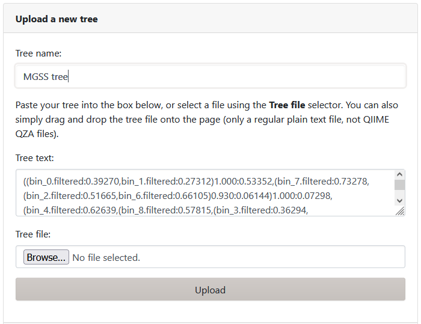
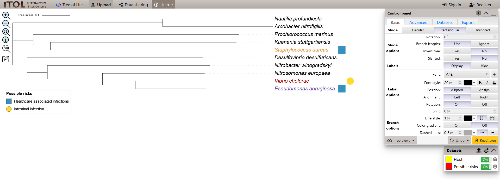

# Inferring phylogenetic relationships

GTDB-Tk is very helpful in inferring the taxonomy of our MAGs. It also has a bunch of additional files that is generated so we can visualise the phylogenetic relationships between the MAGs (both in the larger context of the entire GTDB tree, or just our MAGs). 

## Available software and models

There are several software options for inferring phylogenetic relationships, some more commonly used than others. Popular options include BEAST (Bayesian Evolutionary Analysis Sampling Trees), FastTree 2, Geneious, IQ-TREE 2, MEGA (Molecular Evolutionary Genetics Analysis), and RAxML (Randomized Axelerated Maximum Likelihood). A requirement common to all software listed is that they require a multiple sequence alignment (MSA). For this workshop, GTDB-Tk has conveniently output this file for us.

??? tip "Software for MSAs"

    GTDB-Tk generates an MSA based on a concatenated set of core single-copy genes identified within each of our MAGs. However, if you are studying other genes, you will need to generate (and curate) your own MSA. Popular software include MAFFT, ClustalW, Clustal Omega, and MUSCLE. 

**Phylogenetic inference methods** 

To start, we start need a set of aligned (and ideally, trimmed) orthologous genes. These are genes in different species that, by speciation, have evolved from a common ancestor and tend to retain the same function over the course of evolution. From here, there are two ways to generate an input for phylogenetic inference:

!!! note ""

    === "Super-tree approach"

        Alignment of each gene is analysed individually to estimate a tree. Then, these distinct trees are integrated to estimate the species tree.

    === "Supermatrix approach (most common)"

        Aligned orthologous genes are concatenated (this is the supermatrix) and then used to estimate a tree. This is the most commonly used method.

From here, we then choose one of two ways to reconstruct the phylogeny:

!!! note ""

    === "Distance-based"

        This involves the calculation of a pairwise genetic distance matrix and then using it to iteratively construct a tree. A common implementation of this method is the Neighbour-Joining algorithm. While computationally efficient, it tends not to perform well for distantly related organisms.

    === "Character-based"

        Infers phylogeny based on the characters (nucleic/amino acid alphabet) in the MSA via one of three methods:

        * **Maximum parsimony** This method tries to find a tree topology with the least the number of character changes required to explain the data (i.e., the most parsimonious tree). While computationally efficient, this method is the least commonly applied due to unrealistic assumptions about evolution.
        * **Maximum likelihood (ML)** Estimates the parameters of a statistical model such that the probability of observing the data (i.e., the likelihood) is maximal. The general idea behind this method is that if the estimated parameter values of a model makes it more likely to observe the data, it is assumed to approximate the true topology of the tree. This framework is employed in software such as RAxML, IQ-TREE2, and FastTree2.
        * **Bayesian methods** This method uses a similar approach to ML in that it relies on a model and maximises the likelihood of observing the data. The difference is in its implementation, where parameters are inferred under the Bayesian framework. Here, unknown model parameter values are described using probability distributions (i.e., these values have a degree of uncertainty and are not fixed values). These are then integrated with the likelihood of observing the data (as in ML) to generate a posterior distribution from which tree model parameters are actually inferred/sampled from.

**Confidence in tree inference**

How would we know if the placement of branches are correct in our inferred trees? For ML- and parsimony-based tree reconstruction, a common way to test that is via bootstrapping. This is the generation of pseudo-data of similar size to the observed data via iterative resampling of the observed data. New trees are then inferred from the resampled data, and the number of times the same tree or branch placements (clades) are observed based on the pseudo-data. This is analogous to permutations in non-parametric tests. For Bayesian method-based inference, confidence is estimated based on posterior probabilities (a.k.a. the posterior support; i.e., the product of prior probabilities and maximal likelihood).

## Building a phylogenetic tree

The exercises for this section is performed in the `8.prokaryotic_taxonomy/` directory. Here, we will build a bootstrapped ML tree using FastTree2 with an MSA provided by GTDB-Tk of our MAGs.

We begin by loading the required modules:

!!! terminal "code"

    ```bash
    module purge
    module load FastTree/2.1.11-GCCcore-9.2.0
    ```

Then, we prepare the input file based on our GTDB-Tk outputs:

!!! terminal "code"

    ```bash
    # Copy file from previous exercise
    cp gtdbtk_out/align/gtdbtk.bac120.user_msa.fasta.gz .

    # Decompress file
    gzip -d gtdbtk.bac120.user_msa.fasta.gz
    ```

Finally, we can build the tree using the following code:

!!! terminal "code"

    ```bash
    FastTree gtdbtk.bac120.user_msa.fasta > bin.tree
    ```

We can inspect what the output looks like:

!!! terminal "code"

    ```bash
    cat bin.tree
    ```

    ??? success "Output"

        ```
        ((bin_0.filtered:0.39270,bin_1.filtered:0.27312)1.000:0.53352,(bin_7.filtered:0.73278,(bin_2.filtered:0.51665,bin_6.filtered:0.66105)0.930:0.06144)1.000:0.07298,(bin_4.filtered:0.62639,(bin_8.filtered:0.57815,(bin_3.filtered:0.36294,(bin_5.filtered:0.24898,bin_9.filtered:0.28774)1.000:0.11846)1.000:0.19589)1.000:0.07212)0.970:0.05113);
        ```

## Visualise the tree

We will use [iTOL](https://itol.embl.de/) to visualise the tree we made. iToL (Interactive Tree Of Life) is a powerful online, browser-based tool for the display, annotation and management of phylogenetic and trees. 

!!! tip "iToL subscription"

    For the purposes of today's workshop, the free version of iToL will suffice. However, if you think you will need to perform more phylogenetic analyses, you should consider creating an account and subscribing to the web service. This allows you to save your trees online for future use.
 
**Navigate to iTOL**

On your web browser, navigate to [iTOL](https://itol.embl.de/).


Click on the Upload button on the top left.


**Add tree information**

As we are working with a small tree, we can go back to the Jupyter terminal to copy the contents of `bin.tree` into the 'Tree text' area.

!!! terminal "code"

    ```bash
    cat bin.tree
    ```

    ??? success "Content of `bin.tree`"

        ```
        ((bin_0.filtered:0.39270,bin_1.filtered:0.27312)1.000:0.53352,(bin_7.filtered:0.73278,(bin_2.filtered:0.51665,bin_6.filtered:0.66105)0.930:0.06144)1.000:0.07298,(bin_4.filtered:0.62639,(bin_8.filtered:0.57815,(bin_3.filtered:0.36294,(bin_5.filtered:0.24898,bin_9.filtered:0.28774)1.000:0.11846)1.000:0.19589)1.000:0.07212)0.970:0.05113);
        ```

We can also name our tree.

Once we are done, click Upload.



**Annotate tree**

We can also add additional information to highlight some or all of the tips. iTOL requires annotation files in a specific format. We have provided you with some example ones to use in this workshop:

- [Relabel the bin IDs to their taxon](../resources/Relabelling.txt)
- [Add colour to highlight relevant taxa](../resources/Color.txt)
- [Add shapes to highlight risk-associated taxa](../resources/Risks.txt)

After downloading the files, simply drag and drop them into the iTOL page and it will annotate the tips accordingly.



**Play around with the tree**

We can edit and add annotations by clicking within the iTol website environment. However, the annotation files are a great way to maintain annotations for the phylogenetic trees and automatically display information you need to highlight on the tree.

!!! question "**Exercise** Alternative display and additional information"

    See if you can add/change the following from your tree:

    * Show bootstrap support values in blue
    * Show branch lengths in red
    * Change display format of your tree

!!! book-atlas "References"

    [Kapli, P., Yang, Z. and Telford M.J. (2020) Phylogenetic tree building in the genomic age. Nat Rev Genet 21: 428-444](https://doi.org/10.1038/s41576-020-0233-0)
    [Yang, Z. and Rannala, B. (2012) Molecular phylogenetics: principles and practice. Nat Rev Genet 13: 303-314.](https://doi-org.ezproxy.auckland.ac.nz/10.1038/nrg3186)
