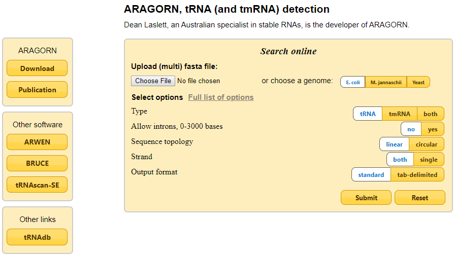

# Gene prediction

!!! info "Objectives"

    * [Overview/refresher of `prodigal`](#overviewrefresher-of-prodigal)
    * [Predicting protein coding sequences in metagenome-assembled genomes](#predicting-protein-coding-sequences-in-mags)
    * [Predicting RNA features and non-coding regions](#predicting-rna-features-and-non-coding-regions)

---

## Overview/refresher of `prodigal`

At this stage we have recovered a number of high quality genomes or population genomes. While there are interesting biological questions we can ask of the genomes at the DNA/organisational level, it is more likely that we are interested in the genes present in the organism.

How we predict genes in the metagenomic data varies depending on what features we are trying to detect. Most often, we are interested in putatively protein coding regions and open reading frames. For features that are functional but not not translated, such as ribosomal RNA and tRNA sequences we need to use alternative tools. When considering protein coding sequences, we avoid the use of the term 'open reading frame' (ORF). The nature of a fragmented assembly is that you may encounter a partial gene on the start or end of a contig that is a function gene, but lacks the start or stop codon due to issues with assembly or sequencing depth.

There are many software tools to predict gene sequences and in this workshop we will start with the tool `prodigal` (PROkaryotic Dynamic Programming Genefinding ALgorithm). `prodigal` has gone on to become one of the most popular microbial gene prediction algorithms as in incorporates modelling algorithms to profile the coding sequences within your genome and better identify the more cryptic (or partial) genes.

`prodigal` is excellent for the following use cases:

!!! quote ""
    1. Predicting protein-coding genes in draft genomes and metagenomes  
    1. Quick and unsupervised execution, with minimal resource requirements
    1. Ability to handle gaps, scaffolds, and partial genes 
    1. Identification of translation initiation sites 
    1. Multiple output formats, including either straight *fastA* files or the DNA sequence and protein translation for genes, as well as detailed summary statistics for each gene (e.g. contig length, gene length, GC content, GC skew, RBS motifs used, and start and stop codon usage)

`prodigal` is not the best tool to use for the following cases:

1. Predicting RNA genes 
1. Handling genes with introns 
1. Deal with frame shifts

It is also not advised to use `prodigal` when making predictions through your unassembled reads. If you are working with unassembled data, `FragGeneScan` is a better tool, as it is more sensitive for partial genes and does not assume every piece of DNA in the input *fastA* file must be coding.

---

## Predicting protein coding sequences in MAGs

To get started, move into the exercise directory.

!!! terminal-2 "Navigate to working directory"

    ```bash
    cd /nesi/nobackup/nesi02659/MGSS_U/<YOUR FOLDER>/9.gene_prediction/
    ```

### Examine the `prodigal` parameters

Before we start running `prodigal`, we will take a quick look at the parameters.

!!! terminal "code"

    ```bash
    module purge
    module load prodigal/2.6.3-GCC-11.3.0

    prodigal -h
    ```

!!! circle-check "Terminal output"

    ```
    Usage:  prodigal [-a trans_file] [-c] [-d nuc_file] [-f output_type]
                     [-g tr_table] [-h] [-i input_file] [-m] [-n] [-o output_file]
                     [-p mode] [-q] [-s start_file] [-t training_file] [-v]

             -a:  Write protein translations to the selected file.
             -c:  Closed ends.  Do not allow genes to run off edges.
             -d:  Write nucleotide sequences of genes to the selected file.
             -f:  Select output format (gbk, gff, or sco).  Default is gbk.
             -g:  Specify a translation table to use (default 11).
             -h:  Print help menu and exit.
             -i:  Specify FASTA/Genbank input file (default reads from stdin).
             -m:  Treat runs of N as masked sequence; don't build genes across them.
             -n:  Bypass Shine-Dalgarno trainer and force a full motif scan.
             -o:  Specify output file (default writes to stdout).
             -p:  Select procedure (single or meta).  Default is single.
             -q:  Run quietly (suppress normal stderr output).
             -s:  Write all potential genes (with scores) to the selected file.
             -t:  Write a training file (if none exists); otherwise, read and use
                  the specified training file.
             -v:  Print version number and exit.
    ```

There are a few parameters that are worth considering in advance.

**Output files**

When running `prodigal` the default behaviour is to create a *gbk* file (this is a Genbank-like feature table, see [here](https://github.com/hyattpd/prodigal/wiki/understanding-the-prodigal-output) for more information) from your genome and write it to the stdout of your interface. This can either be captured using a redirect, or the output can instead be placed into a file using the `-o` flag. You can also change the format of the file using the `-f` flag.

Since we often want to go straight from gene prediction to annotation, `prodigal` also has the option to create *fastA* files of the gene prediction (`-d`) and protein translation (`-a`) at the same time. This is an extremely helpful feature, and it is worth running all three outputs at the same time. **_Generally_** speaking, you will probably find that the amino acid sequence for your genes is all you need for most practical purposes, but having the corresponding nucleotide sequence can sometimes be useful if we want to mine other data sets.

**Modes of gene prediction**

As mentioned in the introduction to this exercise, `prodigal` uses the profiles of genes it detects in your data set to better tune its prediction models and improve coding sequence recovery. It has three algorithms for how the training is performed which you must determine in advance:

|Parameter|Mode|Description|
|:---|:---|:---|
|Normal mode|`-p single`|Take the sequence(s) you provide and profiles the sequence(s) properties. Gene predictions are then made based upon those properties.<br>Normal mode should be used on finished genomes, reasonable quality draft genomes, and big viruses.|
|Anonymous mode|`-p meta`|Apply pre-calculated training files to the provided input sequences.<br>Anonymous mode should be used on metagenomes, low quality draft genomes, small viruses, and small plasmids.|
|Training mode|`-p train`|Works like normal mode, but `prodigal` saves a training file for future use. |

Anecdotally, when applied to a MAG or genome, anonymous mode (`-p meta`) will identify slightly fewer genes than normal mode (`-p single`). However, single mode can miss laterally transferred elements. There is not necessarily a best choice for which version to use and this is at the users discretion.

### Execute `prodigal`

We will now run `prodigal` over the 10 bins in *anonymous* mode using an array.

!!! terminal-2 "Create script named `prodigal.sl`"

    ```bash
    nano prodigal.sl
    ```

!!! warning "Remember to update <YOUR FOLDER> to your own folder"

!!! terminal "code"

    ```bash linenums="1"
    #!/bin/bash -e

    #SBATCH --account       nesi02659
    #SBATCH --job-name      prodigal
    #SBATCH --partition     milan
    #SBATCH --time          00:10:00
    #SBATCH --mem           1GB
    #SBATCH --cpus-per-task 1
    #SBATCH --array         0-9
    #SBATCH --error         %x_%A_%a.err
    #SBATCH --output        %x_%A_%a.out

    # Load modules
    module purge
    module load prodigal/2.6.3-GCCcore-7.4.0

    # Working directory
    cd /nesi/nobackup/nesi02659/MGSS_U/<YOUR FOLDER>/9.gene_prediction

    # Output directory
    mkdir -p predictions/

    # Variables
    bin_file=dastool_bins/bin_${SLURM_ARRAY_TASK_ID}.filtered.fna
    pred_file=$(basename ${bin_file} .fna)

    # Run prodigal
    prodigal -i ${bin_file} -p meta \
             -d predictions/${pred_file}.genes.fna \
             -a predictions/${pred_file}.genes.faa \
             -o predictions/${pred_file}.genes.gbk
    ```

!!! terminal-2 "Submit the script"

    ```bash
    sbatch prodigal.sl
    ```

Once `prodigal` has completed, let's check one of the output files:

!!! terminal "code"

    ```bash
    head -n 5 predictions/bin_0.filtered.genes.faa
    ```

!!! circle-check "Terminal output"

    ```
    >bin_0_NODE_6_length_607162_cov_1.000759_1 # 2 # 667 # -1 # ID=1_1;partial=10;start_type=ATG;rbs_motif=AGGAG;rbs_spacer=5-10bp;gc_cont=0.321
    MIKSNGILFTGKKFVMGAVVSALLATSGIAADYTLKFSHVVSPNTPKGKAADFFAKRLEE
    LSGGKIDVQVYPSSQLYNDSAVLKALRLDSVQMAAPSFSKFGKIVPQLALFNLPFLFKDI
    DQLHRVQDGPVGEKLKSLVTAKGFVALNFWDNGFKQLSSSKEPLLMPKDAEGQKFRIMSS
    KVLEAQFKAVGANPQMMPFSEVYSGLQQGVIDAAENPFSNIY
    ```

There are a few thing to unpack here. First lets look at the first line (the header) of the FASTA file:

!!! terminal-2 "Sequence header"

    ```
    >bin_0_NODE_6_length_607162_cov_1.000759_1 # 2 # 667 # -1 # ID=1_1;partial=10;start_type=ATG;rbs_motif=AGGAG;rbs_spacer=5-10bp;gc_cont=0.321
    |                                        |   |   |     |    |      |
    A                                        B   C   D     E    F      G
    ```

| Section | Example text | Description |
| :--- | :--- | :--- |
| A | `>bin_0_NODE_6_length_607162_cov_1.000759` | Contig ID |
| B | `_1` | Gene suffix for the contig |
| C | `2` | Start position relative to contig |
| D | `667` | Stop position relative to contig |
| E | `-1` | Orientation |
| F | `ID=1_1` | Unique gene ID |
| G | `partial=10` | Completeness of gene boundaries (0 = complete; 1 = partial) |

Here are the first few pieces of information in the FASTA header identified by what they mean. `prodigal` names genes using the contig name followed by an underscore then the number of the gene along the contig. The next two pieces of information are the start and stop coordinates of the gene. Next, a 1 is report for a gene that is in the forward orientation (relative to the start of the contig) and a -1 for genes that are in reverse orientation.

There is also a unique gene ID provided although this may not be necessary. As long as your contig names are unique, then all gene names generated from them will also be unique.

The last option that is important to check is the *partial* parameter. This is reported as two digits which correspond to the start and end of the gene and report whether or not the gene has the expected amino acids for the start (M) and end of a gene (* in the protein file). A 0 indicates a complete gene edge, and 1 means partial. In this case, we have '10' which indicates the gene runs off the left edge of the contig. Alternate outcomes for this field are '00', '01', or '11'.

### Strip metadata

While this header information can be very informative, its presence in the FASTA files can lead to some downstream issues. The FASTA file format specifies that the sequence name for each entry runs from the '>' character to the first space, and everything after the space is metadata. Some bioinformatic programs are aware of this convention and will strip the metadata when producing their outputs, but some tools do not do this. It's really easy to end up in situations where your gene names are failing to match between analyses because of this inconsistency, so we recommend creating new FASTA files with the metadata removed to preempt this problem.

!!! terminal "code"

    ```bash
    for pred_file in predictions/*.fna;
    do
        file_base=$(basename ${pred_file} .fna)
    
        cut -f1 -d ' ' predictions/${file_base}.fna > predictions/${file_base}.no_metadata.fna
        cut -f1 -d ' ' predictions/${file_base}.faa > predictions/${file_base}.no_metadata.faa
    done
    ```

!!! magnifying-glass "`cut` flags"

    * `-f` argument is how we specify which columns to keep. It can be used to specify a range as well
    * `-d-` **delimiter** : `cut` uses tab as a default field delimiter but can also work with other delimiter by using `-d` option

!!! terminal "code"

    ```bash
    head -n 5 predictions/bin_0.filtered.genes.no_metadata.faa
    ```

!!! circle-check "Terminal output"

    ```
    >bin_0_NODE_6_length_607162_cov_1.000759_1
    MIKSNGILFTGKKFVMGAVVSALLATSGIAADYTLKFSHVVSPNTPKGKAADFFAKRLEE
    LSGGKIDVQVYPSSQLYNDSAVLKALRLDSVQMAAPSFSKFGKIVPQLALFNLPFLFKDI
    DQLHRVQDGPVGEKLKSLVTAKGFVALNFWDNGFKQLSSSKEPLLMPKDAEGQKFRIMSS
    KVLEAQFKAVGANPQMMPFSEVYSGLQQGVIDAAENPFSNIY
    ```

---

## Predicting RNA features and non-coding regions

### Predict rRNA sequences

While they will not be covered in great detail here, there are a few other prediction tools that are useful when working with metagenomic data. The first of these is `MeTaxa2`, which can be used to predict ribosomal RNA sequences in a genome. Detection of these is a handy way to link your MAGs to the scientific literature and taxonomy, although recovery of ribosomal sequences like the 16S rRNA subunit is often not successful.

To attempt to find the small (16S, SSU) and large (28S, LSU) ribosomal subunits in our data, use the following commands.

!!! terminal-2 "Create script named `metaxa2.sl`"

    ```bash
    nano metaxa2.sl
    ```

!!! warning "Remember to update <YOUR FOLDER> to your own folder"

!!! terminal "code"

    ```bash linenums="1"
    #!/bin/bash -e
    
    #SBATCH --account       nesi02659
    #SBATCH --job-name      metaxa2
    #SBATCH --partition     milan
    #SBATCH --time          00:05:00
    #SBATCH --mem           1GB
    #SBATCH --cpus-per-task 4
    #SBATCH --array         0-9
    #SBATCH --error         %x_%A_%a.err
    #SBATCH --output        %x_%A_%a.out
    
    # Load modules
    module purge
    module load Metaxa2/2.2.3-gimkl-2022a
    
    # Working directory
    cd /nesi/nobackup/nesi02659/MGSS_U/<YOUR FOLDER>/9.gene_prediction
    
    # Output directory
    mkdir -p ribosomes/
    
    # Variables
    bin_file=dastool_bins/bin_${SLURM_ARRAY_TASK_ID}.filtered.fna
    pred_file=$(basename ${bin_file} .fna)
    
    # Run Metaxa2
    for ribosome_type in ssu lsu; do
      metaxa2 --cpu $SLURM_CPUS_PER_TASK -g ${ribosome_type} --mode genome \
              -i ${bin_file} -o ribosomes/${pred_file}.${ribosome_type}
    done
    ```

!!! terminal-2 "Submit the script"

    ```bash
    sbatch metaxa2.sl
    ```

The parameters here are fairly self-explanatory, so we won't discuss them in detail. Briefly, `--cpu` tells the program how many CPUs to use in sequence prediction, and the `-g` flag determines whether we are using the training data set for SSU or LSU regions. the `-i` and `-o` flags denote the input file and output prefix.

The only other parameter that can be helpful is the `-t` flag to indicate taxa type (`b`, bacteria, `a`, archaea, `e`, eukaryota, `m`, mitochondrial, `c`, chloroplast, `A`, all, `o`, other). By default, `MeTaxa2` will search your genome for the following ribosomal signatures:

1. Bacteria
1. Archaea
1. Chloroplast
1. Mitochondira
1. Eukaryote

It is usually worth letting it search for all options as detecting multiple rRNAs from different lineages can be a good sign of binning contamination. However, if you want to restrict the search or provide a custom training set this can be set with the `-t` flag.

### Predict tRNA and tmRNA sequences

The [MIMAG](https://www.ncbi.nlm.nih.gov/pubmed/28787424) standard specifies that in order to reach particular quality criteria, a MAG must contain a certain number or tRNA sequences. We can search a MAG or genome for these using `Aragorn` ([link here](http://130.235.244.92/ARAGORN/)).



---
