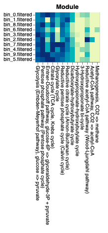
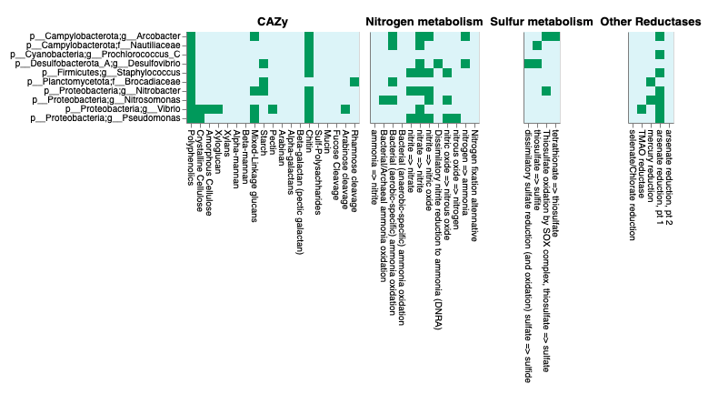

# Gene annotation (part 3)

!!! info "Objectives"

    * [Overview of `DRAM.py annotate` output](#overview-of-drampy-annotate-output)
    * [`DRAM` Distillation step and visualization of results](#dram-distillation-of-the-results)
    * [Tie findings to your initial goal](#tie-findings-to-your-initial-goal)

---

### Overview of *DRAM.py annotate* output

The submitted job from the previous session should now be completed. If we examine the output directory `10.gene_annotation/annotation_dram/` we will see the following files:

|File name | Description|
|:--- | :--- | 
|**genes.faa** and **genes.fna** | Fasta files with all the genes called by `Prodigal`, with additional header information gained from the annotation as nucleotide and amino acid records, respectively |
|**genes.gff** | GFF3 file with the same annotation information as well as gene locations |
|**scaffolds.fna** | A collection of all scaffolds/contigs given as input to `DRAM.py annotate` with added bin information |
|**annotations.tsv** | This file includes all annotation information about every gene from all MAGs |
|**trnas.tsv** | Summary of the tRNAs found in each MAG |
|**rrnas.tsv** | Summary of the rRNAs found in each MAG |

If we inspect the head of the annotation file we will see the following

```bash
cd /nesi/nobackup/nesi02659/MGSS_U/<YOUR FOLDER>/10.gene_annotation/

head annotation_dram/annotation.tsv

#fasta	scaffold	gene_position	start_position	end_position	strandedness	rank	kegg_id	kegg_hit	uniref_id	uniref_hit	uniref_taxonomy	uniref_RBH	uniref_identity	uniref_bitScore	uniref_eVal	peptidase_id	peptidase_family	peptidase_hit	peptidase_RBH	peptidase_identity	peptidase_bitScore	peptidase_eVal	pfam_hits	cazy_hits	vogdb_description	vogdb_categories	heme_regulatory_motif_count
#bin_0_1f9359e86e6a75bcff340e6a8b60ef98_1	bin_0	1f9359e86e6a75bcff340e6a8b60ef98	1	205	1371	1	B	K02338	DNA polymerase III subunit beta [EC:2.7.7.7]	Q7V9E7_PROMM	UniRef90_Q7V9E7 Beta sliding clamp n=10 Tax=Prochlorococcus TaxID=1218 RepID=Q7V9E7_PROMM	Prochlorococcus	True	0.8959999999999999	726.0	1.5509999999999984e-233								DNA polymerase III beta subunit, C-terminal domain [PF02768.16]; DNA polymerase III beta subunit, N-terminal domain [PF00712.20]; DNA polymerase III beta subunit, central domain [PF02767.17]		sp|P9WNU1|DPO3B_MYCTU Beta sliding clamp; XhXr	Xr;Xh	0

```

For each gene annotated, `DRAM` provides a summary rank (from A to E), representing the confidence of the annotation based on reciprocal best hits (RBH). The following figure briefly explains how this summary rank is calculated:


---

### *DRAM* distillation of the results

After the annotation is finished, we will summarise and visualise these annotations with the so-called *Distillation* step. We do so by running the following command directly in the terminal. This will generate the distillate and liquor files.

```bash
module purge
module load DRAM/1.3.5-Miniconda3


cd /nesi/nobackup/nesi02659/MGSS_U/<YOUR FOLDER>/10.gene_annotation/

DRAM.py distill -i annotation_dram/annotations.tsv -o dram_distillation --trna_path annotation_dram/trnas.tsv --rrna_path annotation_dram/rrnas.tsv

conda deactivate
```


The distillation step generates the following files that can be found within the ```dram_distillation``` directory :

|File name | Description|
|:--- | :--- |
|**genome_stats.tsv**| Genome quality information required for [MIMAG](https://www.nature.com/articles/nbt.3893) |
|**metabolism_summary.xlsx**| Summarise metabolism table containing number of genes with specific metabolic function identifiers |
|**product.html**| HTML file displaying a heatmap summarising pathway coverage, electron transport chain component completion, and presence/absence of specific functions |
|**product.tsv**| Data table with product.html information |


First, let's have a look at the ```genome_stats.tsv``` file to check the assembly quality of our bins by double-clicking the file within the `Jupyter` environment, viewing from the terminal via `less` or `cat`, or downloading the files from [here](https://github.com/GenomicsAotearoa/metagenomics_summer_school/blob/master/materials/resources/DRAM_results.zip) and opening locally (e.g. via excel).


??? success "content of genome_stats.tsv"

    |genome|number of scaffolds|taxonomy|completeness score|contamination score|5S rRNA|16S rRNA|23S rRNA|tRNA count|assembly quality|
    |:--- | :--- |:--- | :--- |:--- | :--- |:--- | :--- |:--- | :--- |
    |bin_0|1|d__Bacteria;p__Cyanobacteria;c__Cyanobacteriia;o__Synechococcales;f__Cyanobiaceae;g__Prochlorococcus_C;s__|100|0.14|-|2 present|2 present|47|med|
    |bin_1|4|d__Bacteria;p__Firmicutes;c__Bacilli;o__Staphylococcales;f__Staphylococcaceae;g__Staphylococcus;s__|99.51|0.08|6 present|5 present|5 present|60|med|
    |bin_2|1|d__Bacteria;p__Proteobacteria;c__Gammaproteobacteria;o__Pseudomonadales;f__Pseudomonadaceae;g__Pseudomonas;s__|96.45|0.11|3 present|-|-|43|med|
    |bin_3|3|d__Bacteria;p__Proteobacteria;c__Gammaproteobacteria;o__Enterobacterales;f__Vibrionaceae;g__Vibrio;s__|99.73|0.03|9 present|8 present|8 present|98|med|
    |bin_4|1|d__Bacteria;p__Proteobacteria;c__Gammaproteobacteria;o__Burkholderiales;f__Nitrosomonadaceae;g__Nitrosomonas;s__|99.97|0.74|bin_4, (74043, 74150)|bin_4, (69143, 70676)|bin_4, (71085, 73967)|42|high|
    |bin_5|1|d__Bacteria;p__Proteobacteria;c__Alphaproteobacteria;o__Rhizobiales;f__Xanthobacteraceae;g__Nitrobacter;s__|99.8|0|bin_5, (643507, 643615)|bin_5, (638306, 639791)|bin_5, (640621, 643431)|49|high|
    |bin_6|1|d__Bacteria;p__Campylobacterota;c__Campylobacteria;o__Nautiliales;f__Nautiliaceae;g__;s__|99.59|0.41|4 present|4 present|4 present|49|med|
    |bin_7|1|d__Bacteria;p__Campylobacterota;c__Campylobacteria;o__Campylobacterales;f__Arcobacteraceae;g__Arcobacter;s__|99.59|2.98|4 present|4 present|4 present|54|med|
    |bin_8|19|d__Bacteria;p__Desulfobacterota_A;c__Desulfovibrionia;o__Desulfovibrionales;f__Desulfovibrionaceae;g__Desulfovibrio;s__|99.41|0|2 present|bin_8, (3744, 5289)|bin_8, (379, 3300)|57|med|
    |bin_9|1|d__Bacteria;p__Planctomycetota;c__Brocadiae;o__Brocadiales;f__Brocadiaceae;g__;s__|97.8|1.65|bin_9, (1066028, 1066130)|bin_9, (1069811, 1071397)|bin_9, (1066309, 1069302)|46|high|

---

To finish, we visualize the *Product*, an .HTML file produced in the Distillation step, by double-clicking on it in our *Jupyter* lab notebook or downloading from [here](https://github.com/GenomicsAotearoa/metagenomics_summer_school/blob/master/materials/resources/DRAM_results.zip). The *Product* has three primary parts:

1. **Modules.** Central metabolism pathways coverage. Completion of pathways is based on the structure of KEGG modules, with the pathway coverage calculated as the percent of steps with at least one gene present.<center></center>

2. **ETC Complexes.** Electron Transport Chain component completion<center></center>

3. Presence of specific functions, including CAZy, Nitrogen metabolism, Sulfur metabolism and Photosynthesis. Note that the taxonomic classification of each of the bins is also shown in the first figure 


<center></center>


---

### Tie findings to your initial goal

It is now time to explore the genomes and try to address your original goal!

You were tasked with identifying one of the following.

!!! abstract ""

    1. Denitrification (Nitrate or nitrite to nitrogen)
    2. Ammonia oxidation (Ammonia to nitrite or nitrate)
    3. Anammox (Ammonia and nitrite to nitrogen)
    4. Sulfur oxidation (SOX pathway, thiosulfate to sulfate)
    5. Sulfur reduction (DSR pathway, sulfate to sulfide)
    6. Photosynthetic carbon fixation
    7. Non-photosynthetic carbon fixation (Reverse TCA or Wood-Ljundahl)
    8. Non-polar flagella expression due to a chromosomal deletion
    9. Plasmid-encoded antibiotic resistance
    10. Aerobic (versus anaerobic) metabolism

Depending on what you are looking for, you will either be trying to find gene(s) of relevance to a particular functional pathway, or the omission of genes that might be critical in function. In either case, make sure to use the taxonomy of each MAG to determine whether it is likely to be a worthwhile candidate for exploration, as some of these traits are quite restricted in terms of which organisms carry them.

To conduct this exersise, you should use the information generated with ```DRAM``` as well as the annotation files we created yesterday and that are available in the directory ```10.gene_annotation/gene_annotations```. 

Please note that we have also provided further annotation files within the directory ```10.gene_annotation/example_annotation_tables``` that contain information obtained after annotating the MAGs against additional databases (UniProt, UniRef100, KEGG, PFAM and TIGRfam). These example files can also be downloaded from [here](https://github.com/GenomicsAotearoa/metagenomics_summer_school/blob/master/materials/resources/example_annotation_tables.zip). 

---
