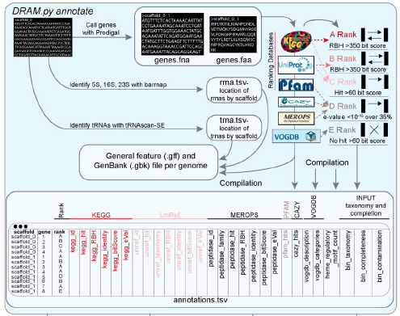
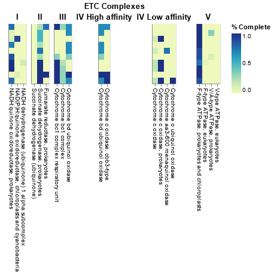

# Gene annotation III: DRAM distillation

!!! info "Objectives"

    * [Overview of `DRAM.py annotate` and `DRAM-v.py annotate` output](#overview-of-drampy-annotate-and-dramvpy-annotate-output)
    * [`DRAM` and `DRAM-v` distillation step and visualization of results](#dram-and-dramv-distillation-of-the-results)
    * [Tie findings to your initial goal](#tie-findings-to-your-initial-goal)

---

## Overview of `DRAM.py annotate` output

The submitted jobs from the previous session should now be completed. If we examine the output directory `10.gene_annotation_and_coverage/dram_annotations/` we will see the following files:

|File name | Description|
|:--- | :--- | 
|`genes.faa` and `genes.fna` | FASTA files with all the genes called by `Prodigal`, with additional header information gained from the annotation as nucleotide and amino acid records, respectively |
|`genes.gff` | GFF3 file with the same annotation information as well as gene locations |
|`scaffolds.fna` | A collection of all scaffolds/contigs given as input to `DRAM.py annotate` with added bin information |
|`annotations.tsv` | This file includes all annotation information about every gene from all MAGs |
|`trnas.tsv` | Summary of the tRNAs found in each MAG |
|`rrnas.tsv` | Summary of the rRNAs found in each MAG |

If we inspect the head of the annotation file we will see the following

!!! terminal "code"

    ```bash
    cd /nesi/nobackup/nesi02659/MGSS_U/<YOUR FOLDER>/10.gene_annotation_and_coverage/

    head -n 5 dram_annotations/annotations.tsv 
    ```

!!! circle-check "Terminal output"
    
    ```
       fasta   scaffold        gene_position   start_position  end_position    strandedness    rank    ko_id   kegg_hit        peptidase_id    peptidase_family        peptidase_hit    peptidase_RBH   peptidase_identity      peptidase_bitScore      peptidase_eVal  pfam_hits       cazy_id cazy_hits       heme_regulatory_motif_count     bin_taxonomy    bin_completeness bin_contamination
    bin_0.filtered_bin_0_NODE_11_length_361162_cov_0.994424_1       bin_0.filtered  bin_0_NODE_11_length_361162_cov_0.994424        1       2       277     -1      D               Fumarate hydratase (Fumerase) [PF05681.17]                       0       d__Bacteria;p__Campylobacterota;c__Campylobacteria;o__Campylobacterales;f__Arcobacteraceae;g__Arcobacter;s__Arcobacter nitrofigilis      99.59   3.79
    bin_0.filtered_bin_0_NODE_11_length_361162_cov_0.994424_2       bin_0.filtered  bin_0_NODE_11_length_361162_cov_0.994424        2       474     764     1       E               0d__Bacteria;p__Campylobacterota;c__Campylobacteria;o__Campylobacterales;f__Arcobacteraceae;g__Arcobacter;s__Arcobacter nitrofigilis     99.59   3.79
    bin_0.filtered_bin_0_NODE_11_length_361162_cov_0.994424_3       bin_0.filtered  bin_0_NODE_11_length_361162_cov_0.994424        3       775     1452    1       D               Response regulator receiver domain [PF00072.27]; Transcriptional regulatory protein, C terminal [PF00486.31]                     0       d__Bacteria;p__Campylobacterota;c__Campylobacteria;o__Campylobacterales;f__Arcobacteraceae;g__Arcobacter;s__Arcobacter nitrofigilis      99.59   3.79
    bin_0.filtered_bin_0_NODE_11_length_361162_cov_0.994424_4       bin_0.filtered  bin_0_NODE_11_length_361162_cov_0.994424        4       1449    2696    1       D               GHKL domain [PF14501.9]                  0       d__Bacteria;p__Campylobacterota;c__Campylobacteria;o__Campylobacterales;f__Arcobacteraceae;g__Arcobacter;s__Arcobacter nitrofigilis      99.59   3.79
    ```

For each gene annotated, `DRAM` provides a summary rank (from A to E), representing the confidence of the annotation based on reciprocal best hits (RBH). The following figure briefly explains how this summary rank is calculated:

<center>{width="500"}</center>

## Overview of `DRAM-v.py annotate` output

`DRAM-v` generates the same output files as `DRAM`, but this time for the viral contigs. These files can be viewed in the output directory `10.gene_annotation_and_coverage/dramv_annotations/`. In this case, `annotations.tsv` also includes some viral-specific columns, including viral gene database matches (`vogdb`), and categories that are used by `DRAM-v.py distill` to identify putative auxiliary metabolic genes (AMGs) (`virsorter_category`, `auxiliary_score`,  `is_transposon`, `amg_flags`)

---

## `DRAM` and `DRAM-v` distillation of the results

After the annotation is finished, we will summarise and visualise these annotations with the so-called *distillation* step. We do so by running the following commands directly in the terminal. This will generate the distillate and liquor files for each dataset.

For the viral annotations, we will also include the parameters `--remove_transposons` ("Do not consider genes on scaffolds with transposons as potential AMGs") and `--remove_fs` ("Do not consider genes near ends of scaffolds as potential AMGs") to filter out some potential false positives for auxiliary metabolic gene identification.

!!! terminal "code"

    ```bash
    module purge
    module load DRAM/1.3.5-Miniconda3
    
    cd /nesi/nobackup/nesi02659/MGSS_U/<YOUR FOLDER>/10.gene_annotation_and_coverage/
    
    # Prokaryote annotations
    DRAM.py distill -i dram_annotations/annotations.tsv \
                    -o dram_distillation \
                    --trna_path dram_annotations/trnas.tsv \
                    --rrna_path dram_annotations/rrnas.tsv
    
    # viral annotations
    DRAM-v.py distill --remove_transposons --remove_fs \
    -i dramv_annotations/annotations.tsv \
    -o dramv_distillation
    ```

## `DRAM.py distill` output files 

The `DRAM` distillation step generates the following files that can be found within the ```dram_distillation``` directory :

|File name | Description|
|:--- | :--- |
|`genome_stats.tsv`| Genome quality information required for [MIMAG](https://www.nature.com/articles/nbt.3893) |
|`metabolism_summary.xlsx`| Summarised metabolism table containing number of genes with specific metabolic function identifiers |
|`product.html`| HTML file displaying a heatmap summarising pathway coverage, electron transport chain component completion, and presence/absence of specific functions |
|`product.tsv`| Data table visualised in `product.html` |

First, let's have a look at the `genome_stats.tsv` file to check the assembly quality of our bins by double-clicking the file within the `Jupyter` environment, viewing from the terminal via `less` or `cat`, or downloading the files from [here](../resources/dram_distillation.zip) and opening locally (e.g. via Excel).


??? magnifying-glass "Content of `genome_stats.tsv`"

    |genome|number of scaffolds|taxonomy|completeness score|contamination score|5S rRNA|16S rRNA|23S rRNA|tRNA count|assembly quality|
    |:--- | :--- |:--- | :--- |:--- | :--- |:--- | :--- |:--- | :--- |
    |bin_0|1|d__Bacteria;p__Cyanobacteria;c__Cyanobacteriia;o__Synechococcales;f__Cyanobiaceae;g__Prochlorococcus_C;s__|100|0.14|-|2 present|2 present|47|med|
    |bin_1|4|d__Bacteria;p__Firmicutes;c__Bacilli;o__Staphylococcales;f__Staphylococcaceae;g__Staphylococcus;s__|99.51|0.08|6 present|5 present|5 present|60|med|
    |bin_2|1|d__Bacteria;p__Proteobacteria;c__Gammaproteobacteria;o__Pseudomonadales;f__Pseudomonadaceae;g__Pseudomonas;s__|96.45|0.11|3 present|-|-|43|med|
    |bin_3|3|d__Bacteria;p__Proteobacteria;c__Gammaproteobacteria;o__Enterobacterales;f__Vibrionaceae;g__Vibrio;s__|99.73|0.03|9 present|8 present|8 present|98|med|
    |bin_4|1|d__Bacteria;p__Proteobacteria;c__Gammaproteobacteria;o__Burkholderiales;f__Nitrosomonadaceae;g__Nitrosomonas;s__|99.97|0.74|bin_4, (74043, 74150)|bin_4, (69143, 70676)|bin_4, (71085, 73967)|42|high|
    |bin_5|1|d__Bacteria;p__Proteobacteria;c__Alphaproteobacteria;o__Rhizobiales;f__Xanthobacteraceae;g__Nitrobacter;s__|99.8|0|bin_5, (643507, 643615)|bin_5, (638306, 639791)|bin_5, (640621, 643431)|49|high|
    |bin_6|1|d__Bacteria;p__Campylobacterota;c__Campylobacteria;o__Nautiliales;f__Nautiliaceae;g__;s__|99.59|0.41|4 present|4 present|4 present|49|med|
    |bin_7|1|d__Bacteria;p__Campylobacterota;c__Campylobacteria;o__Campylobacterales;f__Arcobacteraceae;g__Arcobacter;s__|99.59|2.98|4 present|4 present|4 present|54|med|
    |bin_8|19|d__Bacteria;p__Desulfobacterota_A;c__Desulfovibrionia;o__Desulfovibrionales;f__Desulfovibrionaceae;g__Desulfovibrio;s__|99.41|0|2 present|bin_8, (3744, 5289)|bin_8, (379, 3300)|57|med|
    |bin_9|1|d__Bacteria;p__Planctomycetota;c__Brocadiae;o__Brocadiales;f__Brocadiaceae;g__;s__|97.8|1.65|bin_9, (1066028, 1066130)|bin_9, (1069811, 1071397)|bin_9, (1066309, 1069302)|46|high|

To finish, we visualize the *Product*, an .HTML file produced in the distillation step, by double-clicking on it in our *Jupyter* lab notebook or downloading from [here](../resources/dram_distillation.zip). The *Product* has three primary parts:

!!! circle-check "*Product* visualisation"

    === "Modules"

        Central metabolism pathways coverage. Completion of pathways is based on the structure of KEGG modules, with the pathway coverage calculated as the percent of steps with at least one gene present.

        <center>
        
        </center>

    === "ETC Complexes"

        Electron Transport Chain component completion

        <center>
        
        </center>

    === "Other functions"

        Presence of specific functions, including CAZy, Nitrogen metabolism, Sulfur metabolism and Photosynthesis. Note that the taxonomic classification of each of the bins is also shown in the first figure

        <center>
        
        </center>

## `DRAM-v.py distill` output files 

The `DRAM-v` distillation step for the viral contigs generates the following files that can be found within the ```dramv_distillation/``` directory :

| <div style="width:200px">File name</div> | Description|
|:--- | :--- |
|`vMAG_stats.tsv`| "Genome" (in this case viral contigs of varying completeness) information including: total gene counts, viral vs host gene counts, and counts of genes related to viral replication, structure, and those with presumed viral or host benefits |
|`amg_summary.tsv`| Genes identified as putative auxiliary metabolic genes (AMGs) and various columns for metabolic characterisation of each gene |
|`product.html`| HTML file displaying a heatmap summarising AMG counts and presence/absence for different broad metabolic categories for each viral contig |

When viewing these files, see if you can find the following information:

!!! quote ""

    * What are some annotations of interest within the output annotations file? 
      * *NOTE: the *VirSorter2* annotations file includes multiple columns for both **prokaryote** and **viral** protein predictions. Be careful as to which column you are looking at (as well as its associated confidence score) when assessing viral annotations vs. AMGs*.
    * Among these annotations, how many were flagged as AMGs by `DRAM-v`?
    * What broad metabolic categories did the AMGs fall into? 
    * Discussion point: How might we investigate whether identified putative AMGs are actually *within* the viral genomes, rather than residual contaminating host genomic sequence attached to the end of integrated prophage (but incompletely trimmed off in the excision process)?

---

## Tie findings to your initial goal

It is now time to explore the genomes and try to address your original goal!

You were tasked with identifying one of the following.

!!! abstract ""

    1. Denitrification (Nitrate or nitrite to nitrogen)
    2. Ammonia oxidation (Ammonia to nitrite or nitrate)
    3. Anammox (Ammonia and nitrite to nitrogen)
    4. Sulfur oxidation (SOX pathway, thiosulfate to sulfate)
    5. Sulfur reduction (DSR pathway, sulfate to sulfide)
    6. Photosynthetic carbon fixation
    7. Non-photosynthetic carbon fixation (Reverse TCA or Wood-Ljundahl)
    8. Non-polar flagella expression due to a chromosomal deletion
    9. Plasmid-encoded antibiotic resistance
    10. Aerobic (versus anaerobic) metabolism

Depending on what you are looking for, you will either be trying to find gene(s) of relevance to a particular functional pathway, or the omission of genes that might be critical in function. In either case, make sure to use the taxonomy of each MAG to determine whether it is likely to be a worthwhile candidate for exploration, as some of these traits are quite restricted in terms of which organisms carry them.

To conduct this exersise, you should use the information generated with `DRAM` as well as the annotation files we created yesterday and that are available in the directory `10.gene_annotation_and_coverage/gene_annotations`. 

Please note that we have also provided further annotation files within the directory `10.gene_annotation_and_coverage/example_annotation_tables` that contain information obtained after annotating the MAGs against additional databases (UniProt, UniRef100, KEGG, PFAM and TIGRfam). These example files can also be downloaded from [here](../resources/example_annotation_tables.zip). 

---
