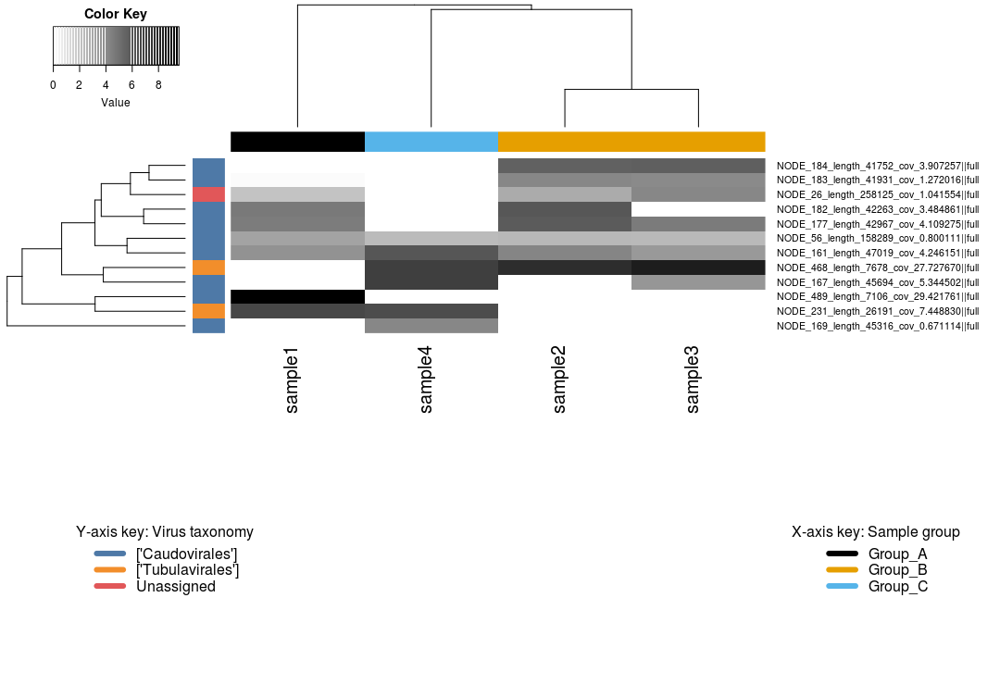

# Presentation of data: Per-sample coverage heatmaps

!!! info "Objectives"

    * [Building a heatmap of MAG coverage per sample](#part-1---building-a-heatmap-of-mag-coverage-per-sample)
    * [Building a heatmap of viral contigs per sample](#part-2---building-a-heatmap-of-viral-contigs-per-sample)

---

### Build a heatmap of average coverage per sample using *R*

!!! quote ""

    One of the first questions we often ask when studying the ecology of a system is: What are the pattens of abundance and distribution of taxa across the different samples? In the previous [coverage calculation](../day3/ex14_gene_annotation_part2.md) exercises we generated per-sample coverage tables by mapping the quality-filtered unassembled reads back to the refined bins and the viral contigs to then generate coverage profiles for each. 

    As a reminder:

    > Genomes in higher abundance in a sample will contribute more genomic sequence to the metagenome, and so the average depth of sequencing coverage for each of the different genomes provides a proxy for abundance in each sample.

    A simple way to present this information is via a heatmap. In this exercise we will build a clustered heatmap of these coverage profiles in `R`. Since we also have tables of taxonomy assignments (via `gtdb-tk` for MAGs) and/or predictions (via `vContact2` for viral contigs), we will also use these to add taxonomy information to the plot.

    The coverage and taxonomy tables generated in earlier exercises have been copied to `11.data_presentation/coverage/` for use in these exercises.

    In addition to this, a simple mapping file has also been created (`11.data_presentation/coverage/mapping_file.txt`). This is a tab-delimited file listing each sample ID in the first column, and the sample "Group" in the second column (*Group_A*, *Group_B*, and *Group_C*). This grouping might represent, for example, three different sampling sites that we want to compare between. If you had other data (such as environmental measures, community diversity measures, etc.) that you wish to incorporate in other downstream analyses (such an fitting environmental variables to an ordination, or correlation analyses) you could also add new columns to this file and load them at the same time.

!!! note "Note"

    As discussed in the [coverage and taxonomy exercises](../day3/ex11_coverage_and_taxonomy.md), it is usually necessary to normalise coverage values across samples based on equal sequencing depth. This isn't necessary with the mock metagenome data we're working with, but if you include this step in your own work you would read the **normalised** coverage tables into the steps outlined below.*

---

### Part 1 - Building a heatmap of MAG coverage per sample

To get started, if you're not already, log back in to NeSI's [Jupyter hub](https://jupyter.nesi.org.nz/hub/login) and make sure you are working within RStudio with the required packages installed (see the [data presentation intro](../day4/ex16a_data_presentation_Intro.md) for more information).

#### 1.1 Prepare environment

First, set the working directory and load the required libraries.

!!! r-project "code"

    ```R
    # Set working directory ----
    setwd('/nesi/nobackup/nesi02659/MGSS_U/<YOUR FOLDER>/11.data_presentation/coverage')

    # Load libraries ----
    # Tidyverse packages 
    library(tidyr)
    library(dplyr)
    library(readr)
    library(stringr)
    library(tibble)

    # Visualisation package
    library(gplots)

    # Ecological analyses
    library(vegan)
    ```

*NOTE: after copying this code into the empty script file in `Rstudio`, remember that, to run the code, press `<shift> + <enter>` with the code block selected.*

Import all relevant data as follows:

!!! r-project "code"

    ```R
    # Read files ----
    contig_cov <- read_tsv("bins_cov_table.txt") # Bin contig coverage table
    gtdbtk_out <- read_tsv("gtdbtk.bac120.summary.tsv") # Prokaryotic taxonomy from GTDB-Tk
    virus_cov <- read_tsv("viruses_cov_table.txt") # Viral contig coverage table
    checkv_summary <- read_tsv("checkv_quality_summary.tsv") # Viral contig quality from CheckV
    vContact2_out <- read_tsv("tax_predict_table.txt") # Viral taxonomy from vContact2
    metadata <- read_tsv("mapping_file.txt") # Metadata/mapping file of environmental parameters
    ```

#### 1.2 Wrangle data

After importing the data tables, we need to subset the tables to only relevant columns. As noted during the [coverage](../day3/ex14_gene_annotation_part2.md) exercises, it is important to remember that we currently have a table of coverage values for all *contigs* contained within each MAG. Since we're aiming to present coverage for each *MAG*, we need to reduce these contig coverages into a single mean coverage value per MAG per sample.

In the following code, we first `select()` columns of interest (i.e. the contig ID and sample coverages). We then remove the `.bam` suffix using the `rename_with()` function. Given that we require mean coverages per MAG, we create a column of MAG/bin IDs (via `mutate`) by extracting the relevant text from the contig ID using `str_replace()`. Finally, we group the data by the bin ID (via `group_by()`) then use a combination of `summarise()` and `across()` to obtain a mean of coverage values per bin per sample. Here, `summarise()` calculates the `mean` based on grouping variables set by `group_by()`, and this is done `across()` columns that have the column header/name which `contains("sample")`.

!!! r-project "code"

    ```R
    ## 1. Obtain average coverage per MAG per sample ----
    MAG_cov <- contig_cov %>%
      # Pick relevant columns
      select(contigName, ends_with(".bam")) %>%
      # Remove ".bam" from sample columns
      rename_with(
        .fn = function(sample_name) str_remove(sample_name, ".bam"),
        .cols = ends_with(".bam")
      ) %>%
      # Add bin ID to data
      mutate(
        binID = str_replace(contigName, "(.*)_NODE_.*", "\\1")
      ) %>%
      # Designate "binID" as a grouping factor
      group_by(binID) %>%
      # Calculate average coverage per sample per bin
      summarise(
        across(
          contains("sample"), mean
        )
      )
    ```

Next, we would also like to append the lowest identified taxonomy to each MAG. But before that, we will need to tidy up the taxonomy table to make it more readable.

In the following code, we first `select()` the `user_genome` (which is equivalent to `binID` above) and the relevant taxonomic `classification` columns. We then `separate()` the taxonomic `classification` column from a long semicolon-separated (`;`) string to 7 columns describing the MAG's `domain`, `phylum`, `class`, `order`, `family`, `genus`, and `species`. Finally, we polish the taxonomy annotations. We remove the hierarchical prefixes by retaining everything after the double underscores (`__`) via `str_replace` across all columns except `user_genome` (via inverse selection).

!!! r-project "code"

    ```R
    ## 2. Clean up taxonomy table ----
    bin_taxonomy <- gtdbtk_out %>%
      # Select relevant columns
      select(user_genome, classification) %>%
      # Split taxonomic classifications into individual columns
      separate(
        col = classification,
        into = c("domain", "phylum", "class", "order", "family", "genus", "species"),
        sep = ';'
      ) %>%
      mutate(
        # Remove ".filtered" from the bin ID
        user_genome = str_remove(user_genome, ".filtered"),
        # Remove "d__" from all taxonomy columns
        across(
          # Negative selection: change all columns except "user_genome"
          -user_genome,
          .fns = function(taxa) str_replace(taxa, "[a-z]__(.*)", "\\1")
        )
      )
    ```

After obtaining a tidy taxonomy table, we append the species annotations to the bin IDs as follows:

1. `left_join()` a subset of the columns (`user_genome`, `species`) from `bin_taxonomy` generated above based on bin IDs. Bin IDs is `binID` in `MAG_cov` and in `user_genome` in `bin_taxonomy`, so we must specifically tell `left_join()` which columns to join `by`.
2. We `unite()` the columns `binID` and `species` as 1 column and place an underscore `_` betwee the strings.
3. We then convert the `binID` column into `rownames` for the `data.frame` in preparation for the other steps.

!!! r-project "code"

    ```R
    ## 3. Add species to bin ID ----
    MAG_cov <- MAG_cov %>%
      left_join(
        select(bin_taxonomy, user_genome, species),
        by = c("binID" = "user_genome")
      ) %>%
      unite(col = "binID", c(binID, species), sep = "_") %>%
      column_to_rownames("binID")
    ```

??? note "Too much data?"

    In your own work, if you have too many MAGs, it can be difficult to present them concisely in a heatmap. Thus, you may want to only retain MAGs that fulfill some criteria. 
    
    For example, you may only be interested in the top 10 MAGs based on coverage:

    ```R
    # Create a vector of top 10 MAGs
    top10 <- sort(rowSums(MAG_cov), decreasing = TRUE)[1:10]

    # Retain only top 10 MAGs
    MAG_cov_top10 <- MAG_cov[rownames(MAG_cov) %in% names(top10), ]
    ```

    Perhaps you want to filter MAGs based on their prevalence across your sampling regime? Assuming you would like to retain MAGs that are present in at least 50% of your samples:

    ```R
    # Create a presence/absence matrix
    MAG_prevalence <- ifelse(MAG_cov > 0, 1, 0)

    # Create a logical vector that fulfill criteria
    top_prev <- rowSums(MAG_prevalence) > (0.5 * ncol(MAG_prevalence))

    # Retain only MAGs in coverage table that fulfill criteria
    MAG_cov_top_prev <- MAG_cov[top_prev, ]
    ```

Very often, coverage data generated using metagenomic methods can be sparse and/or have values that differ by large orders of magnitude. This can hamper effective visualisation of the data. To remedy this, we can perform numeric transformations that can enhance visualisation of relative differences between values. Here, we will use a logarithm (base 2) transform with 1 added as a pseudocount (because $\log 0$ is undefined).

!!! note "On data transformation"

    Transformations applied to enhance data visualisation are not necessarily suitable for downstream statistical analyses. Depending on the attributes of your data (shape, sparseness, potential biases, etc.) and choice of analyses, it is recommended that you become familiar with field and tool-specifc assumptions, norms and requirements for data transformation.

```R
## 4. Transform coverage data ----
MAG_cov_log2 <- log2(MAG_cov + 1)
```

#### 1.3 Order the heatmap

We then need to prepare some form of ordering for our heatmap. This is usually presented in the form of a dendrogram based on results from hierarchical clustering. To do this, we first need to generate two dissimilarity/distance matrices based on transformed coverage values:

* Sample-wise dissimilarities
* MAG-wise dissimilarities

Here, we calculate [Bray-Curtis dissimilarity](https://en.wikipedia.org/wiki/Bray%E2%80%93Curtis_dissimilarity) using `vegdist()` to generate dissimilarities between samples and MAGs. Then, the matrices are used as input to perform hierarchical clustering and plotted.

!!! r-project "code"

    ```R
    # Perform hierarchical clustering ----
    ## Dissimilarities between samples
    sample_dist <- vegdist(t(MAG_cov_log2), method = "bray")
    sample_hclust <- hclust(sample_dist, "average")

    plot(
      sample_hclust,
      main = "Bray-Curtis dissimilarities between samples\n(MAG)",
      xlab = "Sample",
      ylab = "Height",
      sub = "Method: average linkage",
      hang = -1
    )

    ## Dissimilarities between MAGs
    MAG_dist <- vegdist(MAG_cov_log2)
    MAG_hclust <- hclust(MAG_dist, "average")

    plot(
      MAG_hclust,
      main = "Bray-Curtis dissimilarities between MAGs",
      xlab = "MAGs",
      ylab = "Height",
      sub = "Method: average linkage",
      hang = -1,
      cex = 0.75
    )
    ```


!!! note "Exporting figures"
    To export figures you have made, navigate your mouse pointer to the bottom right pane, then click on 'Export' on the second toolbar of the pane. You can export your figure as an image (e.g. TIFF, JPEG, PNG, BMP), a vector image (i.e. PDF, SVG) or PostScript (EPS). 
    
    If you would like to do this via code, you can wrap the plot code in between functions for graphic devices (i.e. `png()`, `jpeg()`, `tiff()`, `bmp()`, `pdf()`, and `postscript()`) and `dev.off()`. The following is an example:

    ```R
    png(filename = "file.png", ...)
    plot(...)
    dev.off()
    ```

#### 1.4 Set colour palettes

The penultimate step before building our heatmap is to set the colours that will be used to represent annotations and the cell/tile values. In this case, annotations are sample groups as designated in the metadata (a.k.a. mapping) file and MAG taxonomy. In the code below, we will set 3 palettes:

* Sample groups
* MAG phylum
* Cell/tile values

!!! note "Pre-installed colour palettes"

    Base `R` has many colour palettes that come pre-installed. Older versions of R had colour palettes (also known as palette `R3`) that were not ideal for people with colour vision deficiencies. However, newer versions (4.0+) now carry better palettes that are more colour-blind friendly (see [here](https://developer.r-project.org/Blog/public/2019/11/21/a-new-palette-for-r/)).

    You can also quickly check what these colour palettes are:

    ```R
    # What colour palettes come pre-installed?
    palette.pals()

    # Plotting the "Okabe-Ito" palette
    # (Requires the "scales" package)
    scales::show_col(
      palette.colors(palette = "Okabe-Ito")
    )
    ```
    

!!! r-project "code"

    ```R
    # Set colour palette ----
    ## Prepare sample groups and colour
    metadata <- metadata %>%
      mutate(
        Group = as.factor(Group)
      )

    group_colour <- data.frame(
      Group = levels(metadata$Group),
      colour = palette.colors(
        n = length(levels(metadata$Group)),
        palette = "Okabe-Ito")
    )

    sample_colour <- left_join(metadata, group_colour)

    ## Prepare MAG colours based on taxonomic class
    ### Remember that the new labels (bin ID) are 'binID_species'
    bin_phylum <- bin_taxonomy %>%
      select(user_genome, species, phylum) %>%
      unite(col = "binID", user_genome, species, sep = "_") %>%
      mutate(
        phylum = as.factor(phylum)
      )

    phylum_colour <- data.frame(
      phylum = levels(bin_phylum$phylum),
      colour = palette.colors(
        n = length(levels(bin_phylum$phylum)),
        palette = "R4")
    )

    MAG_colour <- left_join(bin_phylum, phylum_colour)

    ## Set a grayscale for cell colours
    cell_colour <- colorRampPalette(c("white", "black"), space = "Lab")(2^8)
    ```

#### 1.5 Build heatmap

!!! r-project "code"

    ```R
    heatmap.2(
        x = as.matrix(MAG_cov_log2), # Log2 transformed coverage table
        Colv = as.dendrogram(sample_hclust), # Arrange columns based on sample-wise dissimilarities
        Rowv = as.dendrogram(MAG_hclust), # Arrange rows based on MAG-wise dissimilarities
        margins = c(30, 20), # Numbers represent margins for bottom & right side
        RowSideColors = MAG_colour$colour, # Colours on the row represent MAG phylum
        ColSideColors = sample_colour$colour, # Colours on the column represent sample groups
        scale = "none", # Do not scale values provided
        col = cell_colour, # Colour shading based on values
        trace = "none", 
        density.info = "none"
    )
    ## Legend for MAG phyla
    legend(
      x = "bottomleft", # Legend position
      legend = phylum_colour$phylum, # Legend text
      col = phylum_colour$colour, # Legend colour
      lty = 1, # Line type
      lwd = 6, # Line width
      ncol = 1, # Number of columns for legend,
      bty = "n", # Border type (set to no border)
      title = "Y-axis key: MAG taxonomy"
    )
    ## Legend for sample grouping
    legend(
      x = "bottomright",
      legend = group_colour$Group,
      col = group_colour$colour,
      lty = 1,
      lwd = 6,
      ncol = 1,
      bty = "n",
      title = "X-axis key: Sample group"
    )
    ```

<center>

</center>

!!! vial-virus "Results at a glance"

    The heatmap shows us that:
    
    * 4 MAGs belong to the phylum Proteobacteria
    * Sample 4 belonging to Group C is somewhat of an outlier, with only 2 MAGs recovered from this sample
    * `bin_8`, a Nitrobacter, is only found in sample 4
    * Presumably, sample 4 has a high abundance of nitrogen cycling MAGs
    * Samples from Groups A and B recovered the same bins

You can and should experiment with different paramters and arguments within the `heatmap.2` function. A good starting point is `cex = ...` which controls "character expansion" (i.e. text size). Here, we use the `...SideColors` argument to annotate MAG phylum and sample grouping. We also use `legend` to provide additional information on what those colours represent. Read the help page for `heatmap.2()` by typing `?heatmap.2` into the console. The help manual will appear on the bottom right pane.

Here, we arrange our columns based Bray-Curtis dissimilarities between samples. However, you may want to enforce or preserve some form of sample order (samples from the same transect, chronological/topological order, etc.). You can do this by setting `Colv = FALSE`.

!!! note "Arranging figure elements"

    As observed in the above plot, the positioning and arrangement of the colour key and legends relative to the main heatmap may not be ideal. Often times, it is desirable to manually arrange or resize elements of a figure (legends, keys, text). This is usually done by exporting the figure in a format capable of preseving vectors (e.g. SVG or PDF) and then post-processing them in vector graphics software such as Adobe Illustrator or Inkscape.

---

### Part 2 - Building a heatmap of viral contigs per sample

We can run through the same process for the viral contigs. Many of the steps are as outlined above, so we will work through these a bit quicker and with less commentary along the way. However, we will highlight a handful of differences compared to the commands for the MAGs above, for example:  steps for selecting and/or formatting the taxonomy; importing the quality output from `CheckV`; and the (optional) addition of filtering out low quality contigs.

#### 2.1 Prepare environment

This has already been done above. We will immediately begin wrangling the data.

#### 2.2 Wrangle data

To start, we need to identify viral contigs of at least medium quality. THis will be used as a filtering vector.

!!! r-project "code"

    ```R
    ## 1. Clean up viral taxonomy annotation quality ----
    virus_quality <- checkv_summary %>%
      mutate(
        checkv_quality = factor(
          checkv_quality,
          levels = c(
            "Not-determined",
            "Low-quality",
            "Medium-quality",
            "High-quality",
            "Complete"
          ))
      ) %>%
      select(contig_id, checkv_quality)

    ## Subset good quality predictions
    virus_hq <- virus_quality %>%
      filter(!(checkv_quality %in% c("Not-determined", "Low-quality"))) %>%
      pull(contig_id)

    virus_taxonomy_hq <- vContact2_out %>%
      filter(Genome %in% virus_hq) %>%
      mutate(
        Order_VC_predicted = as.factor(Order_VC_predicted)
      )
    ```

We then obtain the coverage matrix and transform the values to enhance visualisation.

!!! r-project "code"

    ```R
    ## 2. Obtain viral contig coverage matrix ----
    ## Unlike MAGs, we do not need to average coverage values.
    ## However, we do need to filter out annotations of lesser quality.
    ## We find 15 contigs that needs to be kept
    virus_cov_matrix <- virus_cov %>%
      select(contigName, ends_with(".bam")) %>%
      rename_with(
        .fn = function(name) str_remove(name, ".bam"),
        .cols = everything()
      ) %>%
      filter(contigName %in% virus_hq) %>%
      column_to_rownames("contigName") %>%
      as.matrix()

    ## 3. Log2 transform coverage matrix ----
    virus_cov_matrix_log2 <- log2(virus_cov_matrix + 1)
    ```

#### 2.3 Order the heatmap

!!! r-project "code"

    ```R
    # Perform hierarchical clustering (viral contigs) ----
    ## Dissimilarities between samples
    virus_sample_dist <- vegdist(t(virus_cov_matrix_log2))
    virus_sample_hclust <- hclust(virus_sample_dist, "average")

    plot(
      sample_hclust,
      main = "Bray-Curtis dissimilarities between samples\n(virus)",
      xlab = "Sample",
      ylab = "Height",
      sub = "Method: average linkage",
      hang = -1
    )

    ## Dissimilarities between viruses
    virus_dist <- vegdist(virus_cov_matrix_log2)
    virus_hclust <- hclust(virus_dist, "average")

    plot(
      virus_hclust,
      main = "Bray-Curtis dissimilarities between viruses",
      xlab = "Viral contigs",
      ylab = "Height",
      sub = "Method: average linkage",
      hang = -1,
      cex = 0.75
    )
    ```


#### 2.4 Set colour palettes

For colours based on sample group, we will retain the colours set as above. Here, we will only set a new palette (Tableau 10) for viruses based on the predicted taxonomy.

```R
# Prepare grouping variables and colour palettes ----
# Check palette colours
scales::show_col(
  palette.colors(
    palette = "Tableau 10"
  )
)
```


!!! r-project "code"

    ```R
    ## Set colours for viral orders
    virus_order_colour <- data.frame(
      "virus_order" = levels(virus_taxonomy_hq$Order_VC_predicted),
      "colour" = palette.colors(
        n = length(levels(virus_taxonomy_hq$Order_VC_predicted)),
        palette = "Tableau 10"
      )
    )
    
    ## Set colours for viruses
    virus_colour <- virus_taxonomy_hq %>%
      select(Genome, Order_VC_predicted) %>%
      left_join(virus_order_colour, by = c("Order_VC_predicted" = "virus_order"))
    ```

#### 2.5 Build heatmap

!!! r-project "code"

    ```R
    heatmap.2(
      x = virus_cov_matrix_log2,
      Colv = as.dendrogram(virus_sample_hclust),
      Rowv = as.dendrogram(virus_hclust),
      margins = c(30, 20),
      RowSideColors = virus_colour$colour,
      ColSideColors = sample_colour$colour,
      scale = "none",
      col = cell_colour,
      trace = "none",
      keysize = 1,
      density.info = "none"
    )
    ## Legends
    legend(
      x = "bottomleft",
      legend = virus_order_colour$virus_order,
      col = virus_order_colour$colour,
      lty = 1,
      lwd = 6,
      ncol = 1,
      bty = "n",
      title = "Y-axis key: Virus taxonomy"
    )
    legend(
      x = "bottomright",
      legend = group_colour$Group,
      col = group_colour$colour,
      lty = 1,
      lwd = 6,
      ncol = 1,
      bty = "n",
      title = "X-axis key: Sample group"
    )
    ```

<center>

</center>

---