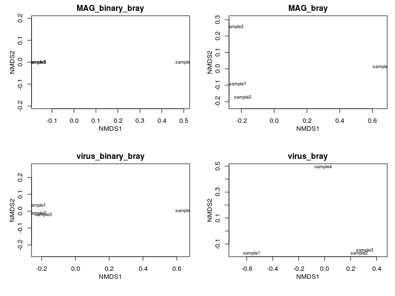
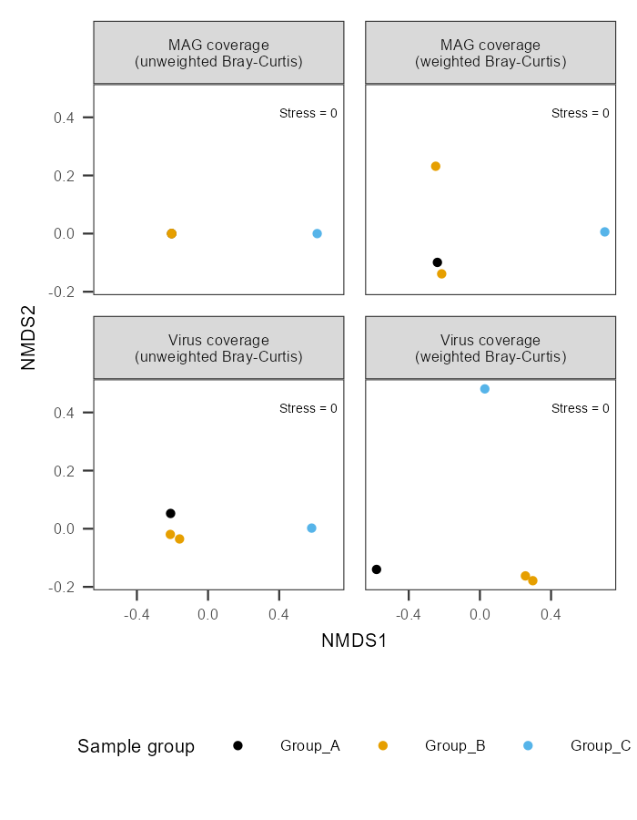

# Presentation of data: Ordinations

!!! info "Objectives"

    * [Import and wrangle data in `R`](#1-import-and-wrangle-data-in-r)
    * [Calculate weighted and unweighted Bray-Curtis dissimilarity metrics and nMDS analyses](#2-calculate-weighted-and-unweighted-bray-curtis-dissimilarity-and-nmds-using-r)
    * [Build nMDS plots in `R` using the `ggplot2` package](#3-build-nmds-plots-in-r-using-the-ggplot2-package)
    * [Discussion: Follow-up analyses](#follow-up-analyses)

---

### Introduction

A common method to investigate the relatedness of samples to one another is to calculate [ordinations](https://en.wikipedia.org/wiki/Ordination_(statistics)) and to visualise this in the form of a principal components analysis (PCA) or non-metric multidimensional scaling (nMDS) plot. In this exercise, we will calculate ordinations based on weighted and unweighted (binary) [Bray-Curtis dissimilarity](https://en.wikipedia.org/wiki/Bray%E2%80%93Curtis_dissimilarity) and present these in nMDS plots.

The coverage tables generated in earlier exercises have been copied to `11.data_presentation/coverage/` a for use in these exercises.

In addition to this, a simple mapping file has also been created (`11.data_presentation/coverage/mapping_file.txt`). This is a tab-delimited file listing each sample ID in the first column, and the sample "Group" in the second column (*Group_A*, *Group_B*, and *Group_C*). This grouping might represent, for example, three different sampling sites that we want to compare between. If you had other data (such as environmental measures, community diversity measures, etc.) that you wish to incorporate in other downstream analyses (such an fitting environmental variables to an ordination) you could also add new columns to this file and load them at the same time.

!!! note "Note"

    As discussed in the [coverage exercises](../day3/ex14_gene_annotation_part2.md), it is usually necessary to normalise coverage values across samples based on equal sequencing depth. This isn't necessary with the mock metagenome data we're working with, but if you include this step in your own work you would read the **normalised** coverage tables into the steps outlined below.*

---

### 1. Import and wrangle data in *R*

To get started, open `RStudio` and start a new document.

!!! note "Note"

    You will recognise that the first few steps will follow the same process as the previous exercise on [generating coverage heatmaps](../day4/ex16b_data_presentation_Coverage.md). In practice, these two workflows can be combined to reduce the repetitive aspects.

#### 1.1 Prepare environment

First, set the working directory and load the required libraries.

!!! r-project "code"

    ```R
    # Set working directory
    setwd('/nesi/nobackup/nesi02659/MGSS_U/<YOUR FOLDER>/11.data_presentation/coverage')
    
    # Load libraries ----
    # Tidyverse libraries
    library(readr)
    library(dplyr)
    library(tidyr)
    library(stringr)
    library(tibble)
    library(purrr)
    library(ggplot2)
    
    # Ecological analyses
    library(vegan)
    ```

Import coverage tables and mapping file.

!!! r-project "code"

  ```R
  # Read files ----
  contig_cov <- read_tsv("bins_cov_table.txt") # Bin contig coverage table
  virus_cov <- read_tsv("viruses_cov_table.txt") # Viral contig coverage table
  metadata <- read_tsv("mapping_file.txt") # Metadata/mapping file of environmental parameters
  ```

#### 1.2 Wrangle data

As before in [coverage exercise](../day4/ex16b_data_presentation_Coverage.md), we need to obtain per MAG and sample average coverage values. We begin by selecting relevant columns and renaming them.

!!! r-project ""

    ```R
    ## Select relevant columns and rename them
    contig_cov <- contig_cov %>%
      select(contigName, ends_with(".bam")) %>%
      rename_with(
        .fn = function(sample_name) str_remove(sample_name, ".bam"),
        .cols = everything()
      )

    virus_cov <- virus_cov %>%
      select(contigName, ends_with(".bam")) %>%
      rename_with(
        .fn = function(sample_name) str_remove(sample_name, ".bam"),
        .cols = everything()
      )

    ## Calculate average bin coverage based on contig coverage
    MAG_cov <- contig_cov %>%
      mutate(
        binID = str_replace(contigName, "(.*)_NODE_.*", "\\1")
      ) %>%
      group_by(binID) %>%
      summarise(
        across(
          -contigName,
          .fns = function(coverage) mean(coverage)
        )
      )
    ```

### Calculate weighted and unweighted dissimilarities

It is often useful to examine ordinations based on both weighted and unweighted (binary) dissimilarity (or distance) metrics. Weighted metrics take into account the proportions or abundances of each variable (in our case, the coverage value of each bin or viral contig). This can be particularly useful for visualising broad shifts in overall community structure (while the membership of the community may remain relatively unchanged). Unweighted metrics are based on presence/absence alone, and can be useful for highlighting cases where the actual membership of communities differs (ignoring their relative proportions within the communities).

Here we will use the functions `vegdist()` and `metaMDS()` from the `R` package `vegan` to generate weighted and unweighted Bray-Curtis dissimilarity matrices and nMDS solutions for the microbial bin data and viral contigs data.

!!! tip "Setting seed"

    You may also wish to make use of the `set.seed()` function before each calculation to ensure that you obtain consistent results if the same commands are re-run at a later date.

!!! r-project "code"

    ```R
    # Calculate dissimilarities ----
    ## Unweighted dissimilarities (presence/absence)
    MAG_binary_bray <- MAG_cov %>%
      # Convert "binID" column into rownames
      # (vegan prefers to work on numeric matrices)
      column_to_rownames("binID") %>%
      # Transpose the data frame
      t() %>%
      # Calculate dissimilarities
      vegdist(x = ., method = "bray", binary = T)

    virus_binary_bray <- virus_cov %>%
      column_to_rownames("contigName") %>%
      t() %>%
      vegdist(x = ., method = "bray", binary = T)

    ## Weighted dissimilarities
    MAG_bray <- MAG_cov %>%
      column_to_rownames("binID") %>%
      t() %>%
      vegdist(x = ., method = "bray")

    virus_bray <- virus_cov %>%
      column_to_rownames("contigName") %>%
      t() %>%
      vegdist(x = ., method = "bray")
    ```

From here on out, we will process the data using the same functions/commands. We can make our code less redundant by compiling all necessary inputs as a list, then processing them together. This is achieved by using the `map(...)` family of functions from the `purrr` package.

!!! r-project "code"

    ```R
    # Collect dissimilarities into a list for collective processing ----
    bray_list <- list(
      "MAG_binary_bray" = MAG_binary_bray,
      "MAG_bray" = MAG_bray,
      "virus_binary_bray" = virus_binary_bray,
      "virus_bray" = virus_bray
    )
    ```

### 3. Generate ordination

We now generate and visualise all ordinations in 4 panels them using native plotting methods.

!!! r-project "code"

    ```R
    # Perform non-metric multidimensional scaling (nMDS) ----
    nmds_list <- map(bray_list, function(bray) metaMDS(bray, trymax = 999))

    ## Check nMDS plot natively
    par(mfrow = c(2, 2)) # Sets panels
    map2(nmds_list, names(nmds_list), function(nmds, lbl) {
      ordiplot(nmds, main = lbl, type = "t", display = "sites")
    })
    ```

<center>

</center>

Plotting via this method is a quick and easy way to look at what your ordination looks like. However, this method is often tedious to modify to achieve publication quality figures. In the following section, we will use `ggplot2` to generate a polished and panelled figure.

!!! info "[The `map(...)` function](https://raw.githubusercontent.com/rstudio/cheatsheets/main/purrr.pdf)"

    The `map(...)` function iterates through a list and applies the same set of commands/functions to each of them. For `map2(...)`, two lists are iterated concurrently and one output is generated based on inputs from both lists. The base `R` equivalent is the `apply(...)` family of functions. Here, we need to perform the same analyses on similar data types (dissimilarities of different kinds and organisms). These are powerful functions that can make your workflow more efficient, less repetitive, and more readable. However, this is not a panacea and there will be times where `for` loops or brute coding is necessary.

### 4. Extract data from ordination

Before proceeding to plotting using `ggplot2`. We need to extract the X and Y coordinates from the ordination result using `scores()`. We then also need to "flatten" the list to a single data frame as well as extract other relevant statistics (e.g. [stress values](https://www.researchgate.net/post/What_is_the_importanceexplanation_of_stress_values_in_NMDS_Plots)).

!!! r-project "code"

    ```R
    # Extract data from nMDS ----
    ## Obtain coordinates
    scrs_list <- map(nmds_list, function(nmds) {
      scores(nmds, display = "sites") %>%
        as.data.frame() %>%
        rownames_to_column("sample")
    })

    ## Collect nMDS scores in a single data frame
    scrs_all <- bind_rows(scrs_list, .id = "data_type")

    ## Collect nMDS statistics (stress values)
    stress_values <- map(nmds_list, function(nmds) {
      data.frame("label" = paste("Stress =", nmds$stress))
    }) %>%
      bind_rows(.id = "data_type")
    ```

If you click on `scrs_all` in the 'Environment' pane (top right), you will see that it is a data frame with the columns:

* `data_type`: Label for data output (weighted MAG coverage; unweighted MAG coverage, ...)
* `sample`: Sample names
* `NMDS1` and `NMDS2`: X and Y coordinates for each plot

### 5. Build the ordination plot

After obtaining the coordinates (and associated statistics), we can use it as input to `ggplot()` (the function is `ggplot()` from the package called `ggplot2`). As before, we will set our colour palette first. We will also generate a vector of panel headers.

!!! r-project "code"

    ```R
    # Plot nMDS using ggplot2 ----
    ## Set up colours
    metadata <- metadata %>%
      mutate(
        Group = as.factor(Group)
      )

    group_colour <- palette.colors(n = length(levels(metadata$Group)),
                                   palette = "Okabe-Ito") %>%
      setNames(., levels(metadata$Group))

    ## Append sample grouping to scores
    scrs_all <- left_join(scrs_all, metadata, by = c("sample" = "SampleID"))

    ## Create panel headers
    panel_labels <- c(
      "MAG_binary_bray" = "MAG coverage\n(unweighted Bray-Curtis)",
      "MAG_bray" = "MAG coverage\n(weighted Bray-Curtis)",
      "virus_binary_bray" = "Virus coverage\n(unweighted Bray-Curtis)",
      "virus_bray" = "Virus coverage\n(weighted Bray-Curtis)"
    )

    ## Call ggplot
    ggplot(data = scrs_all, aes(x = NMDS1, y = NMDS2, colour = Group)) +
      # Plot scatterplot
      geom_point(size = 0.5) +
      # Designate sample group colours
      scale_colour_manual(values = group_colour, name = "Sample group") +
      # Split plots based on "data_type"
      facet_wrap(~ data_type, labeller = labeller(data_type = panel_labels)) +
      # Add text annotations
      geom_text(data = stress_values, aes(label = label), inherit.aes = F,
                x = 0.4, y = 0.4, vjust = 0, hjust = 0,
                size = 1.2) +
      # Set general theme
      theme_bw() +
      theme(
        panel.grid = element_blank(), # remove grid lines
        legend.position = "bottom", # set legend position at the bottom
        text = element_text(size = 5), # All text size should be 5 points
        rect = element_rect(size = 0.25), # All edges of boxes should be 0.25 wide
        line = element_line(size = 0.25) # 
      )
    ```

The code above can be summarised to the following:

1. Call `ggplot()` which initiates an empty plot. It reads in the data frame `scrs_all` as the main source of data and sets `NMDS1` and `NMDS1` as `x` and `y` coordinates, as well as designates colour based on the `Group` column.
2. `geom_point` specifies that we want to plot points (i.e. a scatterplot), and we also set a size for all points.
3. `scale_colour_manual` specifies our preferred colour palette and names our colour legend.
4. `facet_wrap` specifies that we want to panel our figure based on the `data_type` column and that the labels/headers (a.k.a. `labellers`) should be printed according to the `panel_label` object.
5. We also add text annotations using `geom_text`, but that it should read data from the `stress_values` data frame and do not use data arguments (via `inherit.aes = F`) specified above in `ggplot()`. Text adjustments were made using `size`, `vjust` and `hjust`.
6. `theme_bw` specifies the application of a general, monochromatic theme.
7. Elements of the monochromatic theme were modified based on arguments within `theme()`

You should try and modify any of the arguments above to see what changes: Change sizes, colours, labels, etc...

`ggplot2` implements extremely flexible plotting methods. It uses the concept of layers where each line after `+` adds another layer that modifies the plot. Each geometric layer (the actual plotted data) can also read different inputs. Nearly all aspects of a figure can be modified provided one knows which layer to modify. To start out, it is recommended that you take a glance at the [cheat sheet](https://raw.githubusercontent.com/rstudio/cheatsheets/main/data-visualization.pdf).



!!! note "Note"
    How informative these types of analyses are depends in part on the number of samples you actually have and the degree of variation between the samples. As you can see in the nMDS plots based on unweighted (binary) Bray-Curtis dissimilarities (especially for the MAGs data) there are not enough differences between any of the samples (in this case, in terms of community membership, rather than relative abundances) for this to result in a particularly meaningful or useful plot in these cases.

---

### Follow-up analyses

It is often valuable to follow these visualisations up with tests for $\beta$-dispersion (whether or not sample groups have a comparable *spread* to one another, i.e. is one group of communities more heterogeneous than another?) and, provided that beta-dispersion is not significantly different between groups, PERMANOVA tests (the extent to which the variation in the data can be explained by a given variable (such as sample groups or other environmental factors, based on differences between the *centroids* of each group).

Beta-dispersion can be calculated using the  `betadisper()` function from the `vegan` package (passing the `bray.dist` data and the `map$Group` variable to group by), followed by `anova()`, `permutest()`, or `TukeyHSD()` tests of differences between the groups (by inputting the generated `betadisper` output). PERMANOVA tests can be conducted via the `adonis()` function from the `vegan` package. For example: 

!!! r-project "code"

    ```r
    adonis(bray.dist ~ Group, data=map, permutations=999, method="bray")
    ```

---
