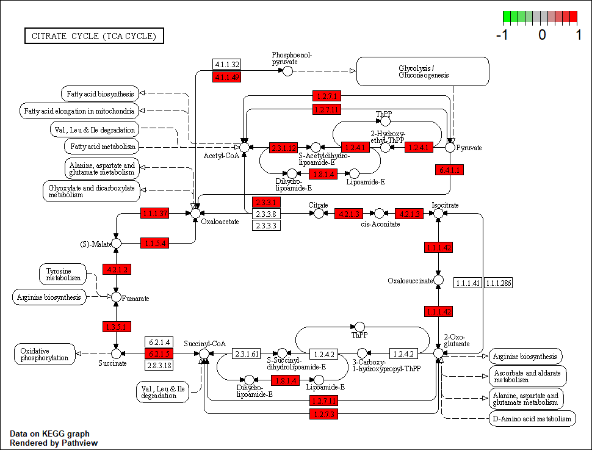
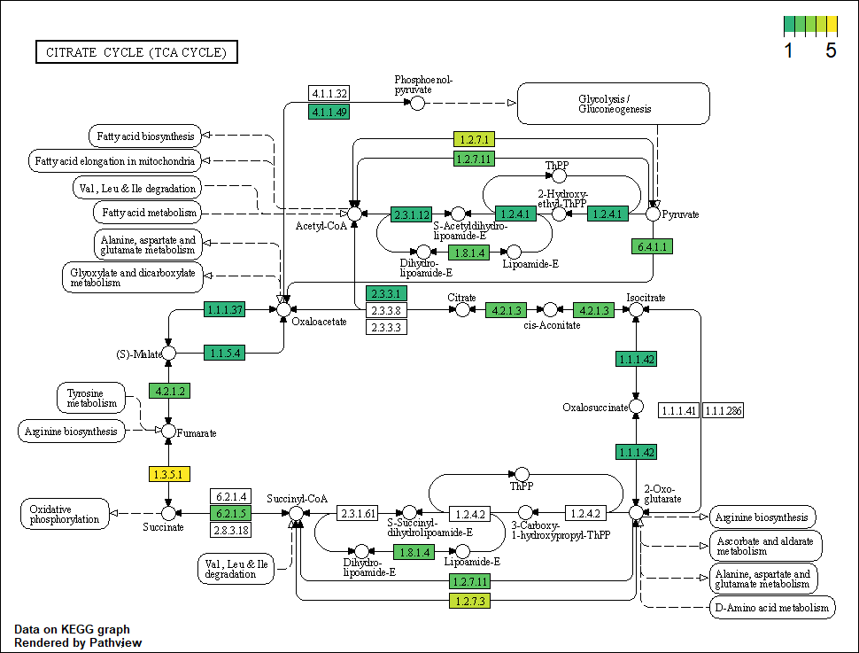
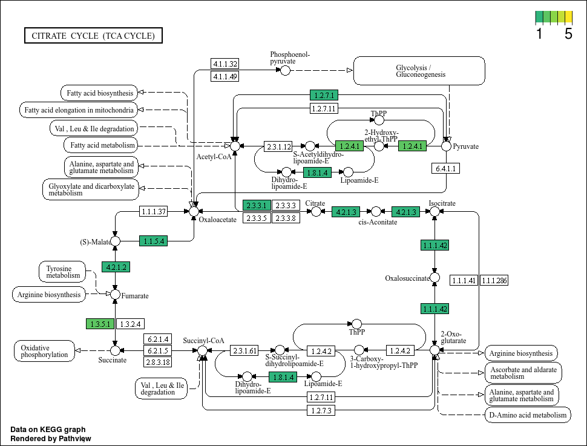
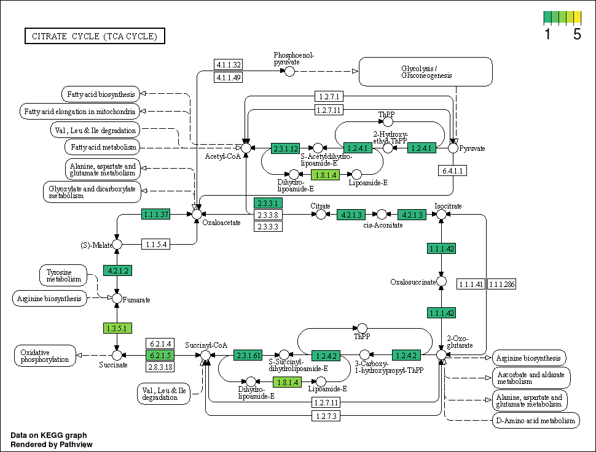
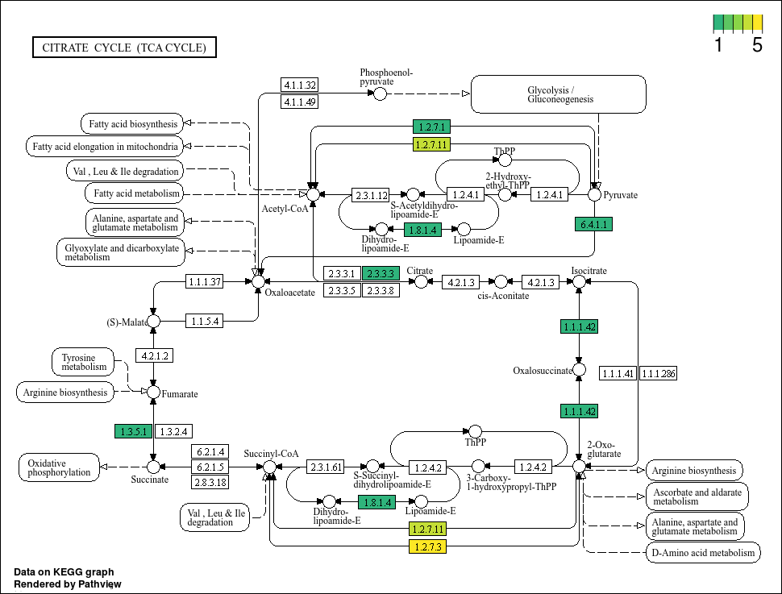
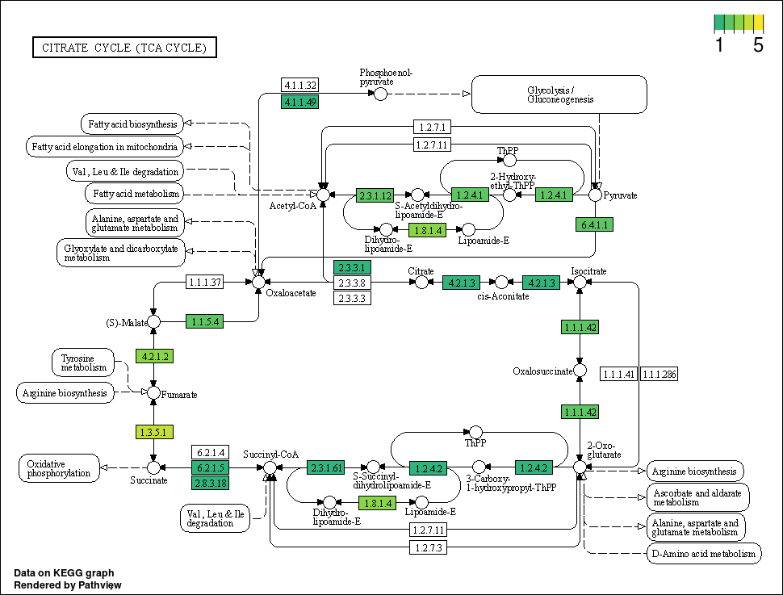
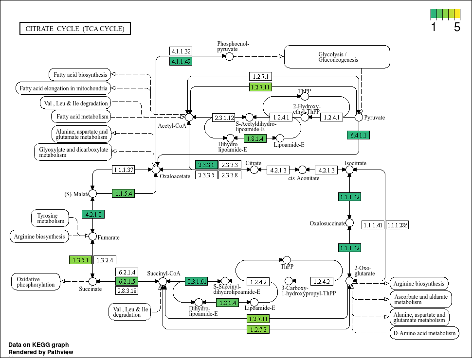
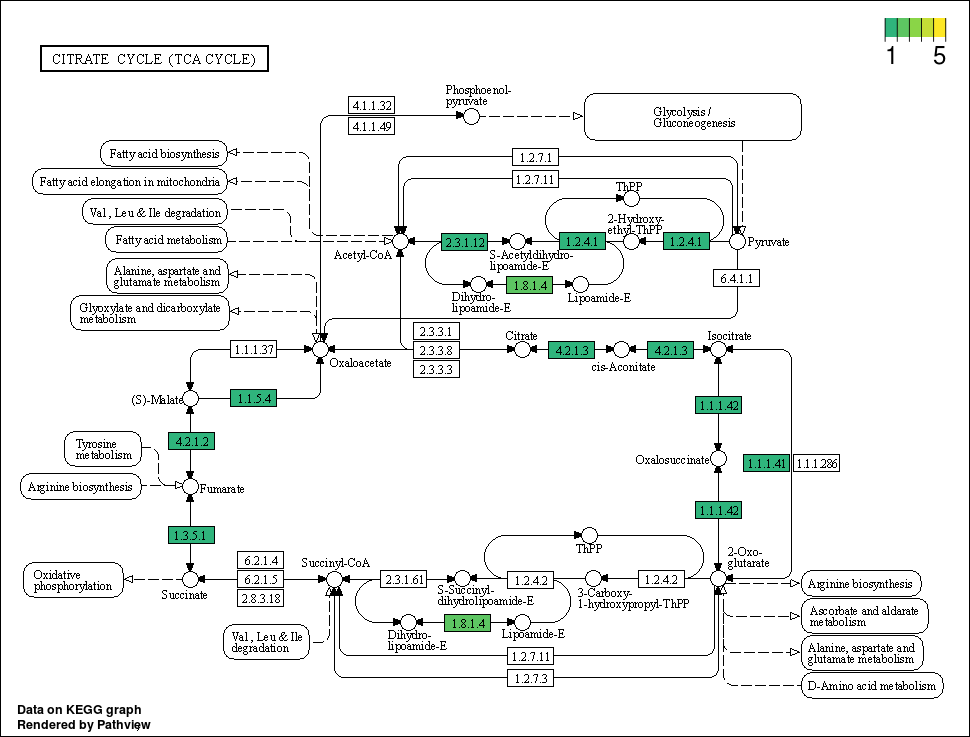
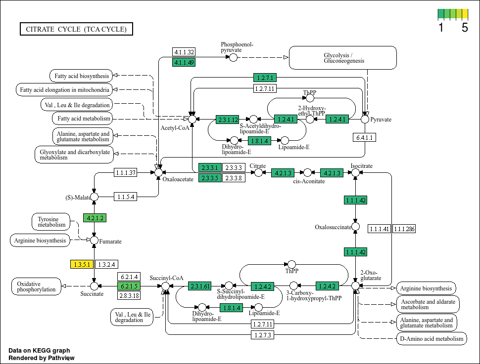
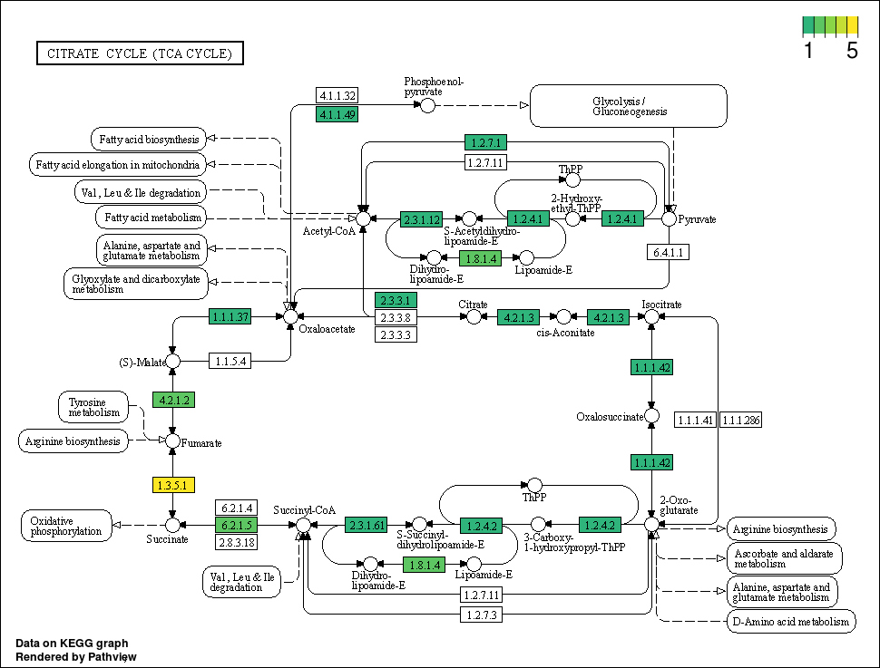

# KEGG pathway maps

!!! info "Objectives"

    * [Build a KEGG pathway map using `R`](#build-a-kegg-pathway-map-using-r)

---

## Build a KEGG pathway map using *R*

In this exercise, we will generate KEGG a pathways map from genome annotations to visualize potential pathways present in our assembled, binned genome sequences.

The key package used here is [pathview](https://academic.oup.com/bioinformatics/article/29/14/1830/232698), available from `Bioconductor` (for installation on your local version of `RStudio`, see the previous [intro to data presentation](../day4/ex16a_data_presentation_Intro.md) section). `pathview` is mainly used in transcriptomic analyses but can be adapted for any downstream analyses that utilise the KEGG database. For this exercise, we are interested in visualising the prevalence of genes that we have annotated in a pathway of interest.

To get started, if you're not already, log back in to NeSI's [Jupyter hub](https://jupyter.nesi.org.nz/hub/login) and open `RStudio`.

### 1. Prepare environment

Set the working directory, load the required packages, and import data.

!!! r-project "code"

    ```R linenums="1"
    # Set working directories ----
    setwd('/nesi/nobackup/nesi02659/MGSS_U/<YOUR FOLDER>/11.data_presentation/kegg_map')

    # Load libraries ----
    # Tidyverse packages
    library(dplyr)
    library(purrr)
    library(tidyr)
    library(readr)
    library(stringr)
    library(tibble)

    # Colour package
    library(viridis)

    # KEGG maps
    library(pathview)
    library(KEGGREST)
    ```

### 2. Subset the data

For this exercise, we will use KEGG Orthologies generated via `DRAM`. We'll start by loading the annotation file and extracting the relevant column. 

!!! r-project "code"

    ```R linenums="1"
    dram <- read_tsv("dram_annotations.tsv")

    KEGG_annotations <- dram %>%
      # Subset relevant data
      select(fasta, scaffold, gene_position, ko_id) %>%
      # Create a gene_id that matches what is in the bin FASTA files
      mutate(gene_id = paste0(scaffold, "_", gene_position))
    ```

### 3. Summarise KO per bin

Here, we are interested in the available KO in each bin. Thus, we can summarise the data by the bin to generate a list of KO per bin. Note that some annotations do not have KO numbers attached to them. In these cases, we will filter these data out.

!!! info "Multiple KOs per bin"

    Multiple annotations per bin is possible and not entirely rare, even if you did filter by E-value/bitscore. Some genes may just be very difficult to tell apart based on pairwise sequence alignment annotations. In this case, we are looking for overall trends. Our question here is: Does this MAG have this pathway? We can further refine annotations by comparing domains and/or gene trees to known, characterised gene sequences if gene annotations look suspicious.

!!! r-project "code"

    ```R linenums="1"
    KO_bins <- KEGG_annotations %>%
      # Tally by bin (as column fasta) and KO
      group_by(fasta, ko_id) %>%
      tally(name = "hits") %>%
      # Remove rows without valid annotations
      drop_na()
    ```

### 4. Identify pathway maps of interest

Before moving on, we must first identify the pathway map ID of our pathway of interest. Lets say, for this exercise, we are interested in the TCA cycle. Here, we will use `KEGGREST` to access the KEGG database and query it with a search term. 

`KEGGREST` can also help you identify other information stored in the KEGG database. For more information, the `KEGGREST` vignette can be viewed using the `vignette` function in `R`: `vignette("KEGGREST-vignette")`

!!! r-project "code"

    ```R
    keggFind(database = "pathway", query = "TCA cycle")
    ```

!!! circle-check "Console output"

    ```
                  path:map00020 
    "Citrate cycle (TCA cycle)"
    ```

!!! r-project "code"

    ```r
    # We find the map ID is 00020 and assign it to an object.
    tca_map_id <- "00020"
    ```

### 5. Reshaping the data for input into pathview

`pathview` needs the data as a numeric matrix with IDs as row names and samples/experiments/bins as column names. Here, we will reshape the data into a matrix of counts per KO number in each bin.

!!! r-project "code"

    ```R linenums="1"
    KO_matrix <- KO_bins %>%
      # Create a wide format table
      pivot_wider(names_from = "fasta", 
                  values_from = "hits", 
                  values_fill = NA) %>%
      # KO numbers become our rownames
      column_to_rownames("ko_id") %>%
      # Coercion to matrix
      as.matrix()
    ```

If you click on `KO_matrix` in the Environment pane, you can see that it is now a matrix of counts per KO per bin. Bins that do not possess a particular KO number is given NA. Do not worry about that as `pathview` can deal with that.

### 6. Creating pathway map of genes related to TCA cycle

Now we can generate images of the KEGG pathway maps using the matrix we just made. For this section, we will try to find genes invovled in the TCA cycle.

!!! r-project "code"

    ```R linenums="1"
    pv_bin_0 <- pathview(
      gene.data = KO_matrix[, "bin_0"],
      pathway.id = tca_map_id,
      species = "ko",
      out.suffix = "pv_bin_0"
    )
    ```

There is no plot output for this command as it automatically writes the results into the current working directory. By default, it names the file as `<species><mapID>.<out.suffix>.png`. If this is the first time this is run, it will also write the pathway map's original image file `<species><mapID>.png` and the `<species><mapID>.xml` with information about how the pathway is connected.

Lets take a look at our first output.

<center>

</center>

Boxes highlighted in red means that our MAG has this gene. However, the colour scale is a little strange seeing as there cannot be negative gene annotation hits (its either NA or larger than 0). Also, we know that there are definitely bins with more than 1 of some KO, but the colour highlights do not show that. Lets tweak the code further and perhaps pick better colours. For the latter, we will use the `viridis` colour package that is good for showing a gradient.

!!! r-project "code"

    ```R linenums="1"
    # Set colours
    path_colours <- viridis(n = 3, begin = 0.65, end = 1, direction = 1)

    # For more information on the viridis package: 
    # vignette("intro-to-viridis")

    # Plot pathway
    pv_bin_0.2 <- pathview(
      gene.data = KO_matrix[, "bin_0"],
      pathway.id = tca_map_id,
      species = "ko",
      # Lets make an arbitrary assumption that 5 copies is a lot
      limit = list(
        gene = c(1, 5),
        cpd = c(1, 5)
      ),
      bins = list(
        gene = 4,
        cpd = 4
      ),
      # We are plotting number of hits, so specify TRUE for this
      # If plotting, say, gene/transcript abundance, set this to FALSE
      discrete = list(
        gene = TRUE,
        cpd = TRUE
      ),
      # Tally colours
      low = path_colours[1],
      mid = path_colours[2],
      high = path_colours[3],
      out.suffix = "pv_bin_0.2"
    )
    ```

<center>

</center>

This plot looks much better. We can see that some genes do have more hits than others. Now, lets propagate this using `map(...)` based on our bin IDs.

!!! r-project "code"

    ```R linenums="1"
    pv_bin_all <- map(bin_ids, function(bin) {
      # Get column with correct bin ID
      bin_data <- KO_matrix[, bin]
      # Prepare output suffix
      out.suffix = paste0("TCA.", bin)
      # Plot
      pathview(
        gene.data = bin_data,
        pathway.id = tca_map_id,
        species = "ko",
        # Lets make an arbitrary assumption that 5 copies is a lot
        limit = list(
          gene = c(1, 5),
          cpd = c(1, 5)
        ),
        bins = list(
          gene = 4,
          cpd = 4
        ),
        # We are plotting number of hits, so specify TRUE for this
        # If plotting, say, gene/transcript abundance, set this to FALSE
        discrete = list(
          gene = TRUE,
          cpd = TRUE
        ),
        # Tally colours
        low = path_colours[1],
        mid = path_colours[2],
        high = path_colours[3],
        out.suffix = out.suffix
      )
    })
    ```

!!! success "Results"
    
    === "Bin 0"

        

    === "Bin 1"

        

    === "Bin 2"

        

    === "Bin 3"

        
        
    === "Bin 4"

        

    === "Bin 5"

        

    === "Bin 6"

        

    === "Bin 7"

        

    === "Bin 8"

        

    === "Bin 9"

        

Based on the plots, it seems that not all bins have a complete TCA cycle.

Now that you know how to make pathway maps, try it using different pathways of interest!

---
