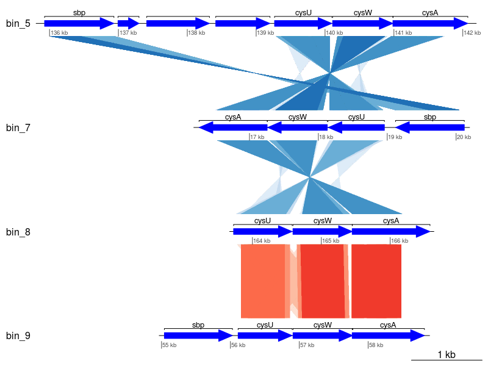
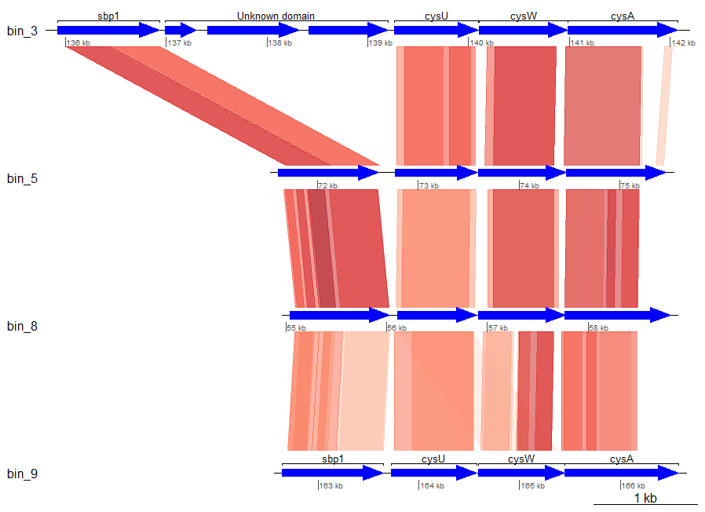

# Gene synteny

!!! info "Objectives"

    * [Build a sulfur assimilation gene alignment figure to investigate gene synteny using `R`](#build-a-sulfur-assimilation-gene-alignment-figure-to-investigate-gene-synteny-using-r)
    * [Parsing files in `bash`](#part-1---parsing-files-in-bash)
    * [Import and wrangle data in `R`](#part-2---producing-the-figure-in-r)

---

## Build a sulfur assimilation gene alignment figure to investigate gene synteny using `R`

When investigating the evolution of genomes, we sometimes want to consider not only the presence/absence of genes in a genome, but also how they are arranged in an operon. For this exercise, we are going to visualise several sulfur assimilation genes from our MAGs and compare their arrangements.

This exercise involves the use of commands in `bash` and `R`. In the first part, we will need to find and parse gene coordinates in `bash`. This is followed by data wrangling and plot generation in `R`.

For this exercise, navigate to the directory `11.data_presentation/gene_synteny/`. You have been provided with a copy of the `prodigal` gene predictions for each of the bins (`.faa` files), an annotation output table using multiple databases (`.aa` files), a small table of the annotation of some key genes of interest (`cys.txt` files), and tBLASTx output (`blast*.txt`) comparing the genes of interest from these organisms. The annotation files were created by manually searching the annotations obtained in the previous exercises.

!!! note "Note"

    Refer to [this appendix](../resources/5_APPENDIX_ex15_Prepare_gene_synteny_inputs.md) for detailed information on how to generate input data.

### Part 1 - Parsing files in *bash*

We will be performing this exercise in two stages. Firstly, in `bash`, we will use `cut` and `tail` to pull out the genes of interest listed in the `*cys.txt` files from the `prodigal` files. The gene names will then be used to create a table of gene coordinates from the `prodigal` output using `grep`, `cut`, and `sed`.

For these `bash` steps, we will need to return to our logged in NeSI terminal. Switch over to a NeSI `Jupyter hub` terminal or log in to a fresh session in a new terminal. 

Navigate to the `11.data_presentation/gene_synteny/` folder, and then perform the `cut` and `tail` steps outlined above.

!!! terminal "code"

    ```bash
    cd /nesi/nobackup/nesi02659/MGSS_U/<YOUR FOLDER>/11.data_presentation/gene_synteny/
    
    for bin_file in *_cys.txt; do
      bin=$(basename ${bin_file} _cys.txt)
      cut -f1 ${bin_file} | tail -n+2 > ${bin}_cys.genes
    done
    ```

We now have three new files, ending with the `.genes` suffix which are simply a list of the genes that we wish to extract from the `prodigal` files. We can then use each of these files as input for `grep` to pull out the FASTA entries that correspond to these genes.

!!! terminal "code"
    
    ```bash
    for gene_list in *.genes; do
      bin=$(basename ${gene_list} _cys.genes)
      grep -f ${gene_list} ${bin}.filtered.genes.faa \
        | sed -e 's/ # /\t/g' -e 's/>//g' \
        | cut -f 1-4 > ${bin}_cys.coords
    done
    ```

As previously, we will quickly go through the steps of this command:

* `grep -f ${gene_list} ${bin}.filtered.genes.faa` searches the `prodigal` FASTA amino acid sequence output for headers that match those in our `.genes` file
* `sed -e 's/ # /\t/g' -e 's/>//g'` replaces the default `prodigal` header line delimiter " # " with a tab, then removes `>` from the header.
* `cut -f 1-4` selects the first 4 columns delimited by a tab (default for `cut`).

Check the content of the `.coords` files now. You should see something like the following:

!!! terminal "code"

    ```bash
    cat bin_3_cys.coords
    ```
  
!!! circle-check "Terminal output"

    ```
    bin_3_NODE_53_length_158395_cov_1.135272_128    135928  136935  1
    bin_3_NODE_53_length_158395_cov_1.135272_129    136994  137299  1
    bin_3_NODE_53_length_158395_cov_1.135272_130    137411  138322  1
    bin_3_NODE_53_length_158395_cov_1.135272_131    138413  139201  1
    bin_3_NODE_53_length_158395_cov_1.135272_132    139267  140100  1
    bin_3_NODE_53_length_158395_cov_1.135272_133    140110  140988  1
    bin_3_NODE_53_length_158395_cov_1.135272_134    140985  142073  1
    ```

If you recall from the previous exercise on gene prediction, we have taken the first four entries from each line of the `prodigal` output, which consists of:

!!! quote ""
    1. Gene name, written as [CONTIG]\_[GENE]
    2. Start position of the gene
    3. Stop position of the gene
    4. Orientation of the gene

We will now use these tables, together with the annotation tables to create the gene synteny view in `R`.

### Part 2 - Producing the figure in `R`

First, move back to the [Jupyter hub](https://jupyter.nesi.org.nz/hub/login) pane and start an `RStudio` session

#### 2.1 Prepare environment

Similar to previous sessions, we will begin by preparing the environment by setting our working directory and loading required libraries.

!!! r-project "code"
    
    ```R
    # Set working directory
    setwd('/nesi/nobackup/nesi02659/MGSS_U/<YOUR FOLDER>/11.data_presentation/gene_synteny/')
    
    # Load libraries
    # Tidyverse packages
    library(dplyr)
    library(readr)
    library(purrr)
    library(stringr)
    library(tidyr)
    
    # Gene synteny
    library(genoPlotR)
    ```

#### 2.2 Import files

Using genoPlotR requires files with 3 different types of information:

* Gene coordinates (from `prodigal`)
* Gene annotations (from our annotation workflows)
* Contig comparisons (from tBLASTx output)

First, we will import the `.coords` files, and set column names to the files.

!!! r-project "code"
    
    ```R
    # Gene coordinates
    coords_files <- list.files(pattern = ".coords")
    coords_header <- c("name", "start", "end", "strand")
    coords_list <- map(coords_files, function(file) {
      read_tsv(file, col_names = coords_header)
    }) %>%
      setNames(., str_remove(coords_files, "cys."))
    ```

Take a look at the content of each of these data.frames, by entering their names into the terminal. You should notice that the coordinates occur at quite different positions between the genomes. If we were looking at complete genomes, this would indicate their position relative to the *origin of replication*, but as these are unclosed genomes obtained from MAGs, they reflect the coordinates upon their particular *contig*.

Lets continue to import the other files

!!! r-project "code"
    
    ```R
    # Gene annotations
    annot_files <- list.files(pattern = "^bin_.*.txt")
    annot_list <- map(annot_files, function(file) {
      read_tsv(file, col_names = TRUE)
    }) %>%
      setNames(., str_replace(annot_files, "cys.txt", "annot"))
    
    # BLAST outputs
    blast_files <- list.files(pattern = "^blast_.*.txt")
    blast_list <- map(blast_files, function(file) {
      read_comparison_from_blast(file)
    }) %>%
      setNames(., str_remove(blast_files, ".txt"))
    ```

Notice that the file reading function for BLAST files are different (`read_comparison_from_blast()` versus `read_tsv()`). This is a function specific to `genoPlotR` for parsing BLAST outputs. If you have some custom comparison pipeline, `genoPlotR` can also read tab-delimited files via `read_comparison_from_tab()`

#### 2.3 Wrangle data

We now need to do the following:

* Parse coordinate data into a format genoPlotR can use
* Tidy up annotation tables so they will show the correct labels

We start by converting our coordinate data into a `dna_seg` (DNA segment) data class, then check what is in one of the objects in the list.

!!! r-project "code"
    
    ```R
    # Transform coordinate tables into "dna_seg" objects
    ds_list <- map(coords_list, dna_seg)

    ds_list$bin_5_coords
    ```

|                                       name | start |   end | strand |  col | fill | lty | lwd | pch | cex | gene_type |
|-------------------------------------------:|------:|------:|-------:|-----:|-----:|----:|----:|----:|----:|----------:|
| bin_5_NODE_95_length_91726_cov_0.379302_67 | 71608 | 72606 |      1 | blue | blue |   1 |   1 |   8 |   1 |    arrows |
| bin_5_NODE_95_length_91726_cov_0.379302_68 | 72768 | 73586 |      1 | blue | blue |   1 |   1 |   8 |   1 |    arrows |
| bin_5_NODE_95_length_91726_cov_0.379302_69 | 73597 | 74466 |      1 | blue | blue |   1 |   1 |   8 |   1 |    arrows |
| bin_5_NODE_95_length_91726_cov_0.379302_70 | 74470 | 75459 |      1 | blue | blue |   1 |   1 |   8 |   1 |    arrows |

Now we tidy our annotations table and create a joint coordinate-annotation table. But first, lets take a look at our annotation tables to get a feel for what needs to change.

!!! r-project "code"

    ```R
    annot_list
    ```

!!! circle-check "Console output"

    ```
    $bin_3_annot
    # A tibble: 7 × 3
      `Query gene`                                 KO                                      Annotation                                 
      <chr>                                        <chr>                                   <chr>                                      
    1 bin_3_NODE_53_length_158395_cov_1.135272_128 K02048                                  sbp1; Prokaryotic sulfate-/thiosulfate-bin…
    2 bin_3_NODE_53_length_158395_cov_1.135272_129 possible predicted diverged CheY-domain possible predicted diverged CheY-domain    
    3 bin_3_NODE_53_length_158395_cov_1.135272_130 Domain of unknown function 2            Domain of unknown function 2               
    4 bin_3_NODE_53_length_158395_cov_1.135272_131 Domain of unknown function 2            Domain of unknown function 2               
    5 bin_3_NODE_53_length_158395_cov_1.135272_132 K02046                                  cysU; cysU; sulfate transport ABC transpor…
    6 bin_3_NODE_53_length_158395_cov_1.135272_133 K02047                                  cysW; cysW; sulfate transport ABC transpor…
    7 bin_3_NODE_53_length_158395_cov_1.135272_134 K02045                                  cysA; cysA; sulfate transport ATP-binding …
    
    $bin_5_annot
    # A tibble: 4 × 3
      `Query gene`                               KO     Annotation                                                        
      <chr>                                      <chr>  <chr>                                                             
    1 bin_5_NODE_95_length_91726_cov_0.379302_67 K02048 sbp; sulfate-binding protein                                      
    2 bin_5_NODE_95_length_91726_cov_0.379302_68 K02046 cysT; sulfate transporter CysT                                    
    3 bin_5_NODE_95_length_91726_cov_0.379302_69 K02047 cysW; sulfate transporter CysW                                    
    4 bin_5_NODE_95_length_91726_cov_0.379302_70 K02045 cysA; sulfate.thiosulfate ABC transporter ATP-binding protein CysA
    
    $bin_8_annot
    # A tibble: 4 × 3
      `Query gene`                                KO     Annotation                                    
      <chr>                                       <chr>  <chr>                                         
    1 bin_8_NODE_60_length_149231_cov_0.651774_55 K02048 Thiosulphate-binding protein                  
    2 bin_8_NODE_60_length_149231_cov_0.651774_56 K02046 sulfate ABC transporter permease subunit CysT 
    3 bin_8_NODE_60_length_149231_cov_0.651774_57 K02047 Sulfate ABC transporter, permease protein CysW
    4 bin_8_NODE_60_length_149231_cov_0.651774_58 K02045 sulphate transport system permease protein 1  
    
    $bin_9_annot
    # A tibble: 4 × 3
      `Query gene`                                 KO     Annotation                                           
      <chr>                                        <chr>  <chr>                                                
    1 bin_9_NODE_12_length_355673_cov_0.516990_147 K02048 thiosulfate ABC transporter substrate-binding protein
    2 bin_9_NODE_12_length_355673_cov_0.516990_148 K02046 sulfate ABC transporter permease                     
    3 bin_9_NODE_12_length_355673_cov_0.516990_149 K02047 sulfate ABC transporter permease                     
    4 bin_9_NODE_12_length_355673_cov_0.516990_150 K02045 sulfate ABC transporter ATP-binding protein   
    ```

Immediately, we can see that there are some inconsistencies in the annotations. 

* In the annotations for bin 3, there are repeat gene names in the same annotation line.
* Annotations for the same KO number is inconsistent across tables. For instance, K02046 is cysU in bin 3 and cysT in bins 5 and 8.
* There is a complete lack of gene names in bin 9 annotations. 

We need to remedy this by having a consistent label system. First, create a data frame of labels you want to show in your synteny plot.

!!! r-project "code"
    
    ```R
    KO_genes <- data.frame(
      "KO" = paste0("K0204", 5:8),
      "gene_name" = c("cysA", "cysU", "cysW", "sbp1")
    )

    # Check what we have created
    KO_genes
    ```

!!! circle-check "Console output"

    ```
          KO gene_name
    1 K02045      cysA
    2 K02046      cysU
    3 K02047      cysW
    4 K02048      sbp1
    ```

Then, we join the KO_genes, annotation, and coordinate tables. We also replace rows that contain `NA` with `"Unknown domain"`.

!!! r-project "code"

    ```R
    ann_coords_list <- map2(annot_list, coords_list, function(ann, coord) {
      left_join(ann, coord, by = c('Query gene' = 'name')) %>%
        left_join(KO_genes) %>%
        mutate(
          gene_name = replace_na(gene_name, "Unknown domain")
        )
    })

    # Check one of the tables
    View(ann_coords_list$bin_3_annot) # In RStudio, View() will open a data viewing tab on the top left pane!
    ```

Much better! We can use the `gene_name` column as our annotation on our gene synteny plot.

We also need to convert the tidy annotation table into something that `genoPlotR` can use (i.e. an `annotations` class object).

!!! r-project "code"

    ```R
    annotations_list <- map(ann_coords_list, function(data) {
      annotation(
        x1 = data$start, # Where each gene starts
        x2 = data$end, # Gene end coordinate
        text = data$gene_name # Labels to show
      )
    })

    # Check one of the annotations_list objects
    annotations_list$bin_5_annot
    ```

!!! circle-check "Console output"

    ```
         x1    x2 text color rot
    1 71608 72606 sbp1 black   0
    2 72768 73586 cysU black   0
    3 73597 74466 cysW black   0
    4 74470 75459 cysA black   0
    ```

#### 2.4 Plot data

Lets plot our data to see what it looks like and if it need tweaking.

!!! r-project "code"

    ```R
    plot_gene_map(
      dna_segs = ds_list,
      comparisons = blast_list,
      annotations = annotations_list,
      dna_seg_labels = str_remove(names(ds_list), "_coords"),
      dna_seg_scale = TRUE,
      gene_type = "arrows"
    )
    ```



We have a plot! However, it is rather cluttered and could be further improved:

* Remove gene names in the middle tracks
* Concatenate the "Unknown domain" portion into a single annotation
* Showing only the best tBLASTx hits, reducing short alignments

!!! r-project "code"

    ```R
    # Filter BLAST results
    filt_blast_list <- map(blast_list, function(data) {
      data %>%
        group_by(name1, name2) %>%
        filter(e_value == min(e_value)) %>% 
        ungroup() %>%
        as.comparison()
    })

    # Concatenate "Unknown domain" in bin 3
    annotations_bin_3_mod <- annotations_list$bin_3_annot %>%
      filter(text != "Unknown domain") %>%
      add_row(
        x1 = 136994, x2 = 139201, text = "Unknown domain", color = "black", rot = 0
      )

    # Remove gene names in middle tracks
    plot_gene_map(
      dna_segs = ds_list,
      comparisons = filt_blast_list,
      annotations = list(annotations_bin_3_mod, NULL, NULL, annotations_list[[4]]),
      dna_seg_labels = str_remove(names(ds_list), "_coords"),
      dna_seg_scale = TRUE,
      gene_type = "arrows"
    )
    ```



This looks much cleaner!

??? success "Results at a glance"

    From the last plot, we see that:
    
    * The arrangement sulfur assimilation genes are well conserved
    * Gene sequences of *sbp1*, *cysW*, and *cysA* are very conserved between bins 3, 5, and 8
    * Bin 3 has 3 unknown domains between its sulfur binding protein and the other sulfur assimilation genes
    * *cysW* in bin 9 shows some sequence homology with *cysU* from bin 8
