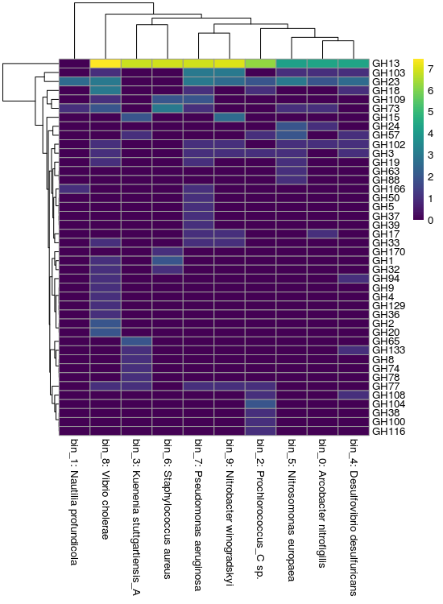

# CAZy heatmaps

!!! info "Objectives"

    * [Build a basic heatmap from annotation data using `R`](#build-a-basic-heatmap-from-annotation-data-using-r)

---

## Build a basic heatmap from annotation data using `R`

To get started, if you're not already, log back in to NeSI's [Jupyter hub](https://jupyter.nesi.org.nz/hub/login) and open `RStudio`.

For this exercise, set `11.data_presentation/cazy_heatmap/` as the working directory. We will use the DRAM annotation file as well.

### 1. Import the data into an `R` `data.frame`

The first thing we need to do is set up the environment by loading relevant libraries then import annotations into `R`. 

First, we import our `R` libraries with the `library()` command. For this workflow, we need three libraries from the `tidyverse` package:

!!! r-project "code"

    ```R linenums="1"
    # Set working directory
    setwd('/nesi/nobackup/nesi02659/MGSS_U/<YOUR FOLDER>/11.data_presentation/cazy_heatmap/')

    # Load libraries
    library(dplyr)
    library(tidyr)
    library(tibble)
    library(vegan)    # Useful functions for ecological data
    library(pheatmap) # "Pretty" heatmap package
    library(viridis)  # Colour palette

    # Import data
    dram <- read_tsv("dram_annotations.tsv")
    ```

### 2. Subset the data

Not every column is useful, so we will subset only those that we need from it. We will also create a more informative bin ID for the heatmap that incorporates genus and species level information.

!!! r-project "code"

    ```r linenums="1"
    cazy <- dram %>%
      select(fasta, cazy_id, bin_taxonomy) %>%
      mutate(cazy_id = str_split(cazy_id, "; "),
             species = if_else(str_detect(bin_taxonomy, "s__$"),
                               str_replace(bin_taxonomy, ".*;g__([^;]+);.*", "\\1 sp."),
                               str_replace(bin_taxonomy, ".*;s__([^;]+)$", "\\1")),
             bin = paste0(fasta, ": ", species)) %>%
      unnest(cazy_id)
    ```

### 3. Aggregate the data

We will now perform a summarising step, aggregating instances of multiple genes with the same annotation into a single count for each genome. We do this by

- For each bin in the data frame
    - For each annotation in the bin
        - Count the number of times the annotation is observed

For the majority of cases this will probably be one, but there will be a few cases where multiple annotations have been seen.

This process is done using the `group_by` and `tally` functions from `dplyr`, again using pipes to pass the data between functions.

!!! r-project "code"

    ```R linenums="1"
    cazy_tally <- cazy %>%
      mutate(cazy_id = str_remove(cazy_id, "_.*")) %>%
      group_by(bin, cazy_id) %>%
      tally(name = "hits") %>%
      drop_na()
    ```

!!! circle-check "Console output"

    ```
    # A tibble: 314 × 3
    # Groups:   bin [10]
       bin                            cazy_id  hits
       <chr>                          <chr>   <int>
     1 bin_0: Arcobacter nitrofigilis AA3         2
     2 bin_0: Arcobacter nitrofigilis AA4         1
     3 bin_0: Arcobacter nitrofigilis AA7         1
     4 bin_0: Arcobacter nitrofigilis CBM50       1
     5 bin_0: Arcobacter nitrofigilis CE11        1
     6 bin_0: Arcobacter nitrofigilis CE4         1
     7 bin_0: Arcobacter nitrofigilis GH102       1
     8 bin_0: Arcobacter nitrofigilis GH103       1
     9 bin_0: Arcobacter nitrofigilis GH13       10
    10 bin_0: Arcobacter nitrofigilis GH17        1
    # … with 304 more rows
    ```

### 4. Coerce the data into a wide data matrix

We now have a data.frame-like object (a [tibble](https://tibble.tidyverse.org/)) with three columns. We can convert this into a gene matrix using the `pivot_wider` function from the `tidyr` library to create a genome x gene matrix in the following form:

|Bin|CAZy_1|CAZy_2|...|CAZy_n|
|:---:|:---:|:---:|:---:|:---:|
|bin_0|N. of genes|N. of genes|...|N. of genes|
|bin_1|N. of genes|...|...|...|
|...|...|...|...|...|
|bin_9|N. of genes|...|...|...|

!!! r-project "code"

    ```R linenums="1"
    cazy_matrix <- cazy_tally %>%
      pivot_wider(names_from = "bin", values_from = "hits", values_fill = 0) %>%
      arrange(cazy_id) %>%
      # pheatmap requires the rownames to make axis labels
      column_to_rownames("cazy_id") %>%
      as.matrix()
    ```

### 5. Build the plot

Finally, we create the actual plot by passing this matrix into the `pheatmap` library. Given that it is quite big, we'll subset to plot only glycosyl hydrolases (GH).

!!! r-project "code"

    ```R linenums="1"
    # Set cell colours
    colours <- viridis(n = 100)

    # Normalise the matrix to reduce visual effect of extreme values
    norm_cazy_matrix <- decostand(cazy_matrix, method = "log", 2)

    # Plot heatmap for GH hits
    pheatmap(norm_cazy_matrix[str_detect(rownames(norm_cazy_matrix), "GH"), ], 
             col = colours, fontsize = 5)
    ```

??? circle-check "CAZy heatmap plot"

    <center>
    
    </center>

---
