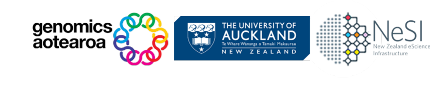

{width="350"}

<h1><b>Metagenomics Summer School</b></h1>

- - - 

| 
Day
 | 
Lesson topic
 |
| --- | --- |
| [Day 1: Assembly](#){ .md-button .md-button--primary } | [1. (Pre-Summer School) Introduction I: Shell](./day1/ex1_bash_and_scheduler.md) [2. Introduction II: HPC and job scheduler](./day1/ex2_1_intro_to_scheduler.md) [3. Filter raw reads by quality](./day1/ex2_quality_filtering.md) [4. Assembly I: Assembling contigs](./day1/ex3_assembly.md) [5. Assembly II: Variable parameters](./day1/ex4_assembly.md) [6. Assembly evaluation](./day1/ex5_evaluating_assemblies.md) |
| [Day 2: Binning](#){ .md-button .md-button--primary } | [1. Introduction to binning](./day2/ex6_initial_binning.md) [2. Binning with multiple tools](./day2/ex7_initial_binning.md) [3. Bin dereplication](./day2/ex8_bin_dereplication.md) [4. Manual bin refinement](./day2/ex9_refining_bins.md) |
| [Day 3: Annotation](#){ .md-button .md-button--primary } | [1. Assigning taxonomy to refined prokaryotic bins](./day3/ex11_coverage_and_taxonomy.md) [2. Phylogenomics](./day3/ex11.1_phylogenomics.md) [3. Identifying viral contigs in metagenomic data](./day3/ex10_viruses.md) [4. Gene prediction](./day3/ex12_gene_prediction.md) [5. Gene annotation I: BLAST-like and HMM](./day3/ex13_gene_annotation_part1.md) [6. Gene annotation II: DRAM and coverage calculation](./day3/ex14_gene_annotation_part2.md) |
| [Day 4: Visualisation](#){ .md-button .md-button--primary } | [1. Gene annotation III: DRAM distillation](./day4/ex15_gene_annotation_part3.md) [2. Introduction to data presentation](./day4/ex16a_data_presentation_Intro.md) [3. Coverage heatmaps](./day4/ex16b_data_presentation_Coverage.md) [4. Ordinations](./day4/ex16c_OPTIONAL_data_presentation_Ordination.md) [5. KEGG pathway maps](./day4/ex16d_data_presentation_KEGG_pathways.md) [6. Gene synteny](./day4/ex16e_data_presentation_Gene_synteny.md) [7. CAZy heatmaps](./day4/ex16f_OPTIONAL_data_presentation_CAZy_annotations.md) |

 

??? calendar-days "Timetable 2023"

    === "Day 1: Tuesday, 5th Sep"

        | 
Time
 | 
Event
 | 
Session leader
 |
        | --- | --- | --- |
        | 09:00 &ndash; 09:30 | **Introductions** Welcome Overview  Login to NeSI via [Jupyter Hub](https://jupyter.nesi.org.nz/) | Jian Sheng Boey |
        | 09:30 &ndash; 10:30 | :fontawesome-solid-laptop-code: **TASK** Bash scripting and Slurm scheduler I | Dinindu Senanayake |
        | 10:30 &ndash; 10:50 | :material-tea: *Morning tea* | |
        | 10:50 &ndash; 11:10 | :fontawesome-solid-laptop-code: **TASK** Bash scripting and Slurm scheduler II | Dinindu Senanayake |
        | 11:10 &ndash; 11:45 | :fontawesome-solid-microphone-lines: **TALK** Metagenomics decision tree | Kim Handley |
        | 11:45 &ndash; 12:00 | :fontawesome-solid-microphone-lines: **TALK** Project introduction and description | Kim Handley |
        | 12:00 &ndash; 12:45 | :material-silverware-fork-knife: *Lunch* | |
        | 12:45 &ndash; 13:45 | **Read QC** :fontawesome-solid-microphone-lines: **TALK** Quality filtering raw reads :fontawesome-solid-laptop-code: **TASK** Visualisation with *FastQC* :fontawesome-solid-laptop-code: **TASK** Read trimming & adapter removal :fontawesome-solid-laptop-code: **TASK** Diagnosing poor libraries :fontawesome-solid-microphone-lines: **TALK** Common issues & best practices :fontawesome-solid-laptop-code: **TASK (Optional)** Filter out host DNA | Annie West |
        | 13:45 &ndash; 15:00 | **Assembly** :fontawesome-solid-microphone-lines: **TALK** Choice of assemblers, parameter considerations, and when to stop! :fontawesome-solid-laptop-code: **TASK** Prepare data for assembly :fontawesome-solid-laptop-code: **TASK** Exploring assembler options :fontawesome-solid-laptop-code: **TASK** Submit assembly jobs to NeSI via Slurm :fontawesome-solid-laptop-code: **TASK (Optional)** Submit variant assembly jobs | Kim Handley |
        | 15:00 &ndash; 15:20 | :material-tea: *Afternoon tea* | |
        | 15:20 &ndash; 17:00 | **Assembly** :fontawesome-solid-microphone-lines: **TALK** Future considerations: co-assembly vs. single assemblies :fontawesome-solid-laptop-code: **TASK** Assembly evaluation :fontawesome-solid-laptop-code: **TASK** Short contig removal | Mike Hoggard |

    === "Day 2: Wednesday, 6th Sep"

        | 
Time
 | 
Event
 | 
Session leader
 |
        | --- | --- | --- |
        | 09:00 &ndash; 09:15 | **Introductions** Recap of day 1 Overview of the day | Annie West |
        | 09:15 &ndash; 10:15 | **Binning I** :fontawesome-solid-microphone-lines: **TALK** Overview of binning history, key parameters, and strategies I :fontawesome-solid-laptop-code: **TASK** Read mapping | Kim Handley |
        | 10:15 &ndash; 10:45 | **Binning II** :fontawesome-solid-laptop-code: **TASK** Multi-binning strategy with MetaBat and MaxBin | Mike Hoggard |
        | 10:45 &ndash; 11:00 | :material-tea: *Morning tea* | |
        | 11:00 &ndash; 11:40 | **Binning II (continued)** :fontawesome-solid-microphone-lines: **TALK** Overview of binning history, key parameters, and strategies II | Kim Handley |
        | 11:40 &ndash; 12:00 | :octicons-comment-discussion-16: **DISCUSSION** Binning strategies :fontawesome-solid-laptop-code: **TASK** Compare and contrast outputs of binning tools | Annie West |
        | 12:00 &ndash; 12:45 | :material-silverware-fork-knife: *Lunch* | |
        | 12:45 &ndash; 14:00 | **Binning III** :fontawesome-solid-laptop-code: **TASK** Bin dereplication using DAS_Tool :fontawesome-solid-laptop-code: **TASK** Evaluate bins using CheckM | Kim Handley |
        | 14:00 &ndash; 14:30 | **Binning IV** :fontawesome-solid-microphone-lines: **TALK** Additional dereplication strategies such as dRep :fontawesome-solid-microphone-lines: **TALK** Working with viral and eukaryotic bins :fontawesome-solid-microphone-lines: **TALK** Organisms possessing minimal genomes | Mike Hoggard Kim Handley |
        | 14:30 &ndash; 15:00 | :fontawesome-solid-microphone-lines: **TALK** Bin refinement: Strategies | Mike Hoggard Kim Handley |
        | 15:00 &ndash; 15:20 | :material-tea: *Afternoon tea* | |
        | 15:20 &ndash; 16:00 | :fontawesome-solid-laptop-code: **TASK** Bin refinement: VizBin | Jian Sheng Boey Mike Hoggard |
        | 16:00 &ndash; 16:15 | :material-presentation-play: **PRESENTATION** Emilie Gios - Genetic exchange in ultra-small Patescibacteria | Kim Handley |
        | 16:15 &ndash; 17:00 | **Wrap up** :fontawesome-solid-laptop-code: **TASK** Submit jobs for VirSorter2 and CheckV Summary of the day | Mike Hoggard Kim Handley |

    === "Day 3: Thursday, 7th Sep"

        | 
Time
 | 
Event
 | 
Session leader
 |
        | --- | --- | --- |
        | 09:00 &ndash; 09:20 | **Introductions** Recap of day 2 Recap of binning outputs Overview of the day | Jian Sheng Boey |
        | 09:20 &ndash; 10:30 | **Taxonomic annotation of prokaryotic bins** :fontawesome-solid-microphone-lines: **TALK** Taxonomic classification: Bin and species determination :fontawesome-solid-laptop-code: **TASK** Taxonomic classification using GTDB-Tk :fontawesome-solid-laptop-code: **TASK** View phylogenetic trait distribution using ANNOTREE | David Waite |
        | 10:30 &ndash; 10:50 | :material-tea: *Morning tea* | |
        | 10:50 &ndash; 11:20 | **Phylogenomics** :fontawesome-solid-microphone-lines: **TALK** Primer to phylogenetic analyses :fontawesome-solid-laptop-code: **TASK** Build a phylogenetic tree using FASTTREE :fontawesome-solid-laptop-code: **TASK** Visualise tree using iTOL | Valter Almeida |
        | 11:20 &ndash; 12:00 | **Viruses** :fontawesome-solid-microphone-lines: **TALK** Identifying viruses from metagenomic data :fontawesome-solid-laptop-code: **TASK** Identify viral contigs using VirSorter2 :fontawesome-solid-laptop-code: **TASK** QC of viral contigs using CheckV :fontawesome-solid-microphone-lines: **TALK** Predicting viral taxonomy using vConTACT2 :fontawesome-solid-laptop-code: **TASK (Optional)** Visualise vConTACT2 viral gene sharing network in Cytoscape | Mike Hoggard |
        | 12:00 &ndash; 12:45 | :material-silverware-fork-knife: *Lunch* | |
        | 12:45 &ndash; 13:30 | **Gene prediction** :fontawesome-solid-microphone-lines: **TALK** Tools for predicting genes: Prodigal, RNAmer, Aragorn, etc. :fontawesome-solid-laptop-code: **TASK** Predict ORFs and protein sequences using Prodigal | David Waite |
        | 13:30 &ndash; 14:00 | **Gene annotation I** :fontawesome-solid-microphone-lines: **TALK** Primer on annotation method :fontawesome-solid-laptop-code: **TASK** Annotate predicted genes using DIAMOND and HMMER3 :octicons-comment-discussion-16: **DISCUSSION** Evaluate the quality of gene assignments | Jian Sheng Boey |
        | 14:00 &ndash; 15:00 | **Gene annotation II** :fontawesome-solid-microphone-lines: **TALK** Using online resources (KEGG, BioCyc, MetaCyc, HydDB, PSORT) :fontawesome-solid-laptop-code: **TASK** View KEGG annotations online | Jian Sheng Boey |
        | 15:00 &ndash; 15:20 | :material-tea: *Afternoon tea* | |
        | 15:20 &ndash; 15:35 | :material-presentation-play: **PRESENTATION** Kitty Sriaporn - Genomic adaptations enabling *Acidithiobacillus* distribution across wide-ranging hot spring temperatures and pHs | Kim Handley |
        | 15:35 &ndash; 16:15 | **Gene annotation III** :fontawesome-solid-laptop-code: **TASK** MAG annotation with DRAM :fontawesome-solid-laptop-code: **TASK** Coverage calculation using Bowtie2 | Annie West Mike Hoggard |
        | 16:15 &ndash; 16:30 | **Group project** :fontawesome-solid-laptop-code: **TASK** Group formation :fontawesome-solid-laptop-code: **TASK** Topic selection | Kim Handley |
        | 16:30 &ndash; 17:00 | **Wrap up** Summary of the day | Jian Sheng Boey |

    === "Day 4: Friday, 8th Sep"

        | 
Time
 | 
Event
 | 
Session leader
 |
        | --- | --- | --- |
        | 09:00 &ndash; 09:15 | **Introductions** Recap of day 3 Overview of the day | Jian Sheng Boey |
        | 09:15 &ndash; 10:00 | **DRAM outputs** :fontawesome-solid-microphone-lines: **TALK** Overview of DRAM results :fontawesome-solid-laptop-code: **TASK** Explore DRAM results | Annie West |
        | 10:00 &ndash; 10:30 | **Environmental distribution** :fontawesome-solid-microphone-lines: **TALK** Visualising findings :fontawesome-solid-laptop-code: **TASK** Coverage heatmap and nMDS ordination | Mike Hoggard |
        | 10:30 &ndash; 10:50 | :material-tea: *Morning tea* | |
        | 10:50 &ndash; 11:00 | :fontawesome-solid-laptop-code: **TASK** Workshop survey | |
        | 11:00 &ndash; 12:00 | **Genomic features and metabolism** :fontawesome-solid-microphone-lines: **TALK** Visualising findings :fontawesome-solid-laptop-code: **TASK** KEGG metabolic maps :fontawesome-solid-laptop-code: **TASK** Gene synteny | Jian Sheng Boey Annie West |
        | 12:00 &ndash; 12:45 | :material-silverware-fork-knife: *Lunch* | |
        | 12:45 &ndash; 14:30 | **Group work** :fontawesome-solid-laptop-code: **TASK** Analyse data :fontawesome-solid-laptop-code: **TASK** Prepare presentations | Kim Handley Mike Hoggard David Waite |
        | 14:30 &ndash; 15:00 | **Group work** :fontawesome-solid-laptop-code: **TASK** Informal group presentations | Kim Handley Mike Hoggard David Waite |
        | 15:00 &ndash; 15:20 | :material-tea: *Afternoon tea* | |
        | 15:20 &ndash; 15:40 | **Group work** :fontawesome-solid-laptop-code: **TASK** Informal group presentations | Kim Handley Mike Hoggard David Waite |
        | 15:40 &ndash; 16:00 | **Wrap up** Final discussions | |

 

??? example "Appendices"

    |Appendix ID                                         |                        | 
    |:---------------------------------------------------|:---------------------------------------|
    | [Appendix 1](""){ .md-button } | [Dereplicating data from multiple assemblies](./resources/1_APPENDIX_ex8_Dereplication.md)|
    |[Appendix 2](""){ .md-button  } | [Generating input files for "VizBin" from "DAS_Tool" curated bins](./resources/2_APPENDIX_ex9_Generating_input_files_for_VizBin.md) |
    |[Appendix 3](""){ .md-button    }| [Normalise per-sample coverage values by average library size](./resources/3_APPENDIX_ex11_Normalise_coverage_example.md) |
    |[Appendix 4](""){ .md-button    } | [Viral taxonomy prediction via vContact2](./resources/4_APPENDIX_ex11_viral_taxonomy_prediction_via_vContact2.md) |
    |[Appendix 5](""){ .md-button } | [Preparing input files for visualising gene synteny](./resources/5_APPENDIX_ex15_Prepare_gene_synteny_inputs.md) |

 

!!! comment-dots "Post-workshop survey"
    
    Thank you for attending Metagenomics Summer School 2023! We would like your feedback on how we have done and what we can improve on. You can provide feedback [here](https://auckland.au1.qualtrics.com/jfe/form/SV_3W4gkA3XZ0qK2do).

 

!!! copyright "License"

    Genomics Aotearoa / New Zealand eScience Infrastructure / University of Auckland **Metagenomics Summer School** material is licensed under the **GNU General Public License v3.0, 29 June 2007**. ([Follow this link for more information](https://github.com/GenomicsAotearoa/shell-for-bioinformatics/blob/main/LICENSE))

 

!!! note "Slides for workshop"

    You can find a copy of the slides presented during the workshop, with published figures removed, in the [slides/](https://github.com/GenomicsAotearoa/metagenomics_summer_school/tree/master/slides) folder.

 

!!! desktop-download-24 "Snapshots of results to download"

    If you are having trouble downloading files using `scp`, we are providing exemplar output files, which you can download through your browser, [here](https://github.com/GenomicsAotearoa/metagenomics_summer_school/tree/master/docs/resources), or via the following links: 
    
    * [FastQC results](./resources/fastqc_results.zip)
    * [Quast results](./resources/quast_results_sans_reference.zip) and [required references](./resources/quast_references.zip)
    * [Input files for VizBin](./resources/vizbin_files.zip)
    * [Gene annotation tables](./resources/example_annotation_tables.zip)
    * [DRAM output files](./resources/dram_distillation.zip)
