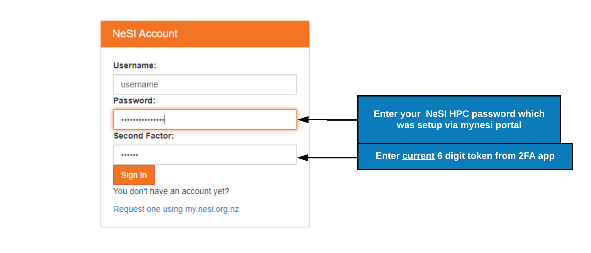
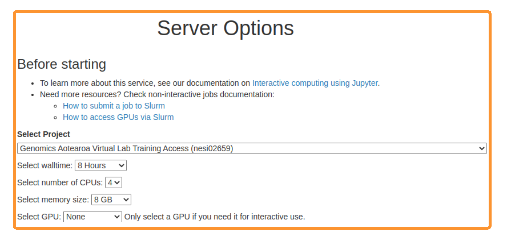
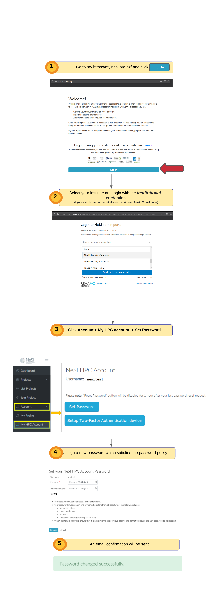

<h1>NeSI Setup</h1>

??? info "S.1.1 : NeSI Mahuika Jupyter login"

     1. 
Follow [https://jupyter.nesi.org.nz/hub/login](https://jupyter.nesi.org.nz/hub/login)

     2. 
Enter NeSI username, HPC password and 6 digit second factor token  {width="720"}
     3. 
Choose server options as below
     
     >>* make sure to choose the correct project code `nesi02659`, number of CPUs `CPUs=4`, memory `8 GB` prior to pressing {width="50"} button.
     
      
 

??? info "S.1.2 : Set NeSI HPC Password"
     
     1. Log into [mynesi portal](https://my.nesi.org.nz) with your Institutional credentials (OR Tuakiri Virtual Home) and set your **NeSI HPC password** as below

      {width="1200"}

??? info "S.1.3 : Set NeSI HPC Second Factor"