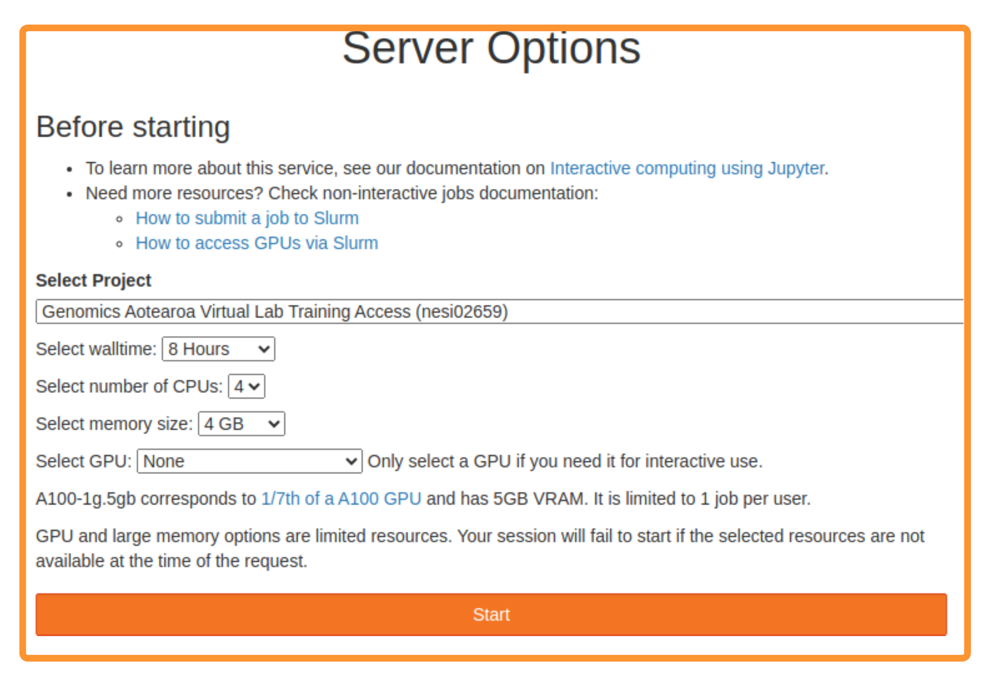

# NeSI Setup

??? info "S.1.1 : NeSI Mahuika Jupyter login"

     1. 
Follow [https://jupyter.nesi.org.nz/hub/login](https://jupyter.nesi.org.nz/hub/login)

     2. 
Enter NeSI username, HPC password and 6 digit second factor token 
 {width="720"} 
     3. 
Choose server options as below

     
          >>* make sure to choose the correct project code `nesi02659`, number of CPUs `CPUs=4`, memory `8 GB` prior to pressing {width="50"} button.
          
            

     4. 
Once logged in, click the **Terminal** tile/icon to make sure a terminal session can be launched without any issues

           

 

??? info "S.1.2 : Set NeSI HPC Password"
     
     1. Log into [mynesi portal](https://my.nesi.org.nz) with your Institutional credentials (OR Tuakiri Virtual Home) and set your **NeSI HPC password** as below

      {width="1200"}

??? info "S.1.3 : Set NeSI HPC Second Factor"

     1. Log into [mynesi portal](https://my.nesi.org.nz) with your Institutional credentials (OR Tuakiri Virtual Home) and set your **NeSI HPC Second factor** as below

      {width="1000"}

??? danger "S.1.4 : _Reset_ NeSI HPC Password"

     1. Log into [mynesi portal](https://my.nesi.org.nz) with your Institutional credentials (OR Tuakiri Virtual Home) and Reset your **NeSI HPC Second factor** as below

      {width="1000"}

??? danger "S.1.5 : _Reset_ NeSI HPC Second Factor"

     1. Log into [mynesi portal](https://my.nesi.org.nz) with your Institutional credentials (OR Tuakiri Virtual Home) and Reset your **NeSI HPC Second factor** as below

      {width="1000"}