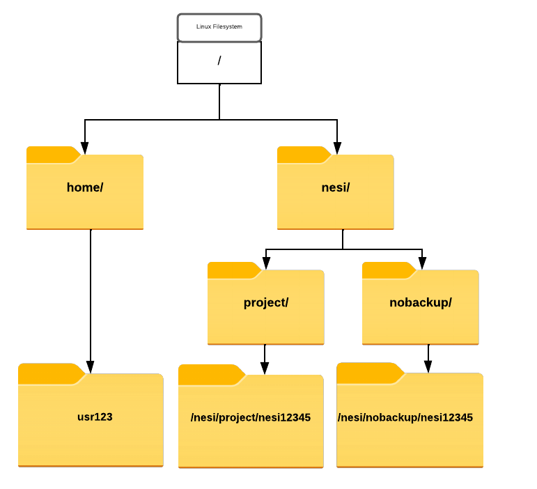

# NeSI File system, Working directory and Symlinks

The part of the operating system responsible for managing files and directories is called the **file system**. It organizes our data into files, which hold information, and directories (also called ‘folders’), which hold files or other directories.

Directories are like places — at any time while we are using the shell, we are in exactly one place called our current working directory. Commands mostly read and write files in the current working directory, i.e. ‘here’, so knowing where you are before running a command is important.

!!! pied-piper "NeSI Filesystem (For Researchers)"

    All HPC platforms have custom File Systems for the purpose of **general use** and **admin**. NeSI Filesystem looks like above 
    
    

    {width="450"}
    

    This may look a bit obscure but thing of them as different labels for some familiar names such as Desktop, Downloads, Documents

    * **`/home/username`** is for user-specific files such as configuration files, environment setup, source code, etc.
    * **`/nesi/project/projectcode`** is for persistent project-related data, project-related software, etc
    * **`/nesi/nobackup/projectode`** is a 'scratch space', for data you don't need to keep long term. Old data is periodically deleted from nobackup

    **`projectode`** for this event is `nesi02659`. If you are to open a NeSI project for your own research, it will have a unique project code with a prefix to represent your affiliated institute and a five digit number (randomly generated). 

    >Therefore, full path to persistent and nobackup/scratch space will be in the format of 

    * **`/nesi/project/nesi02659`**
    * **`/nesi/nobackup/nesi02659`**