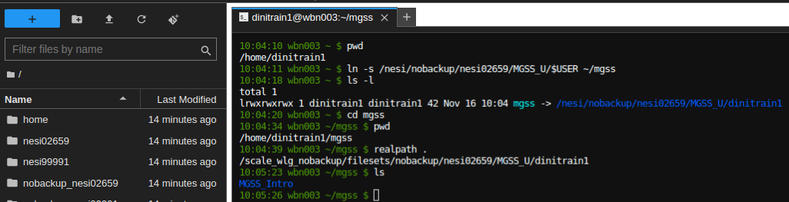
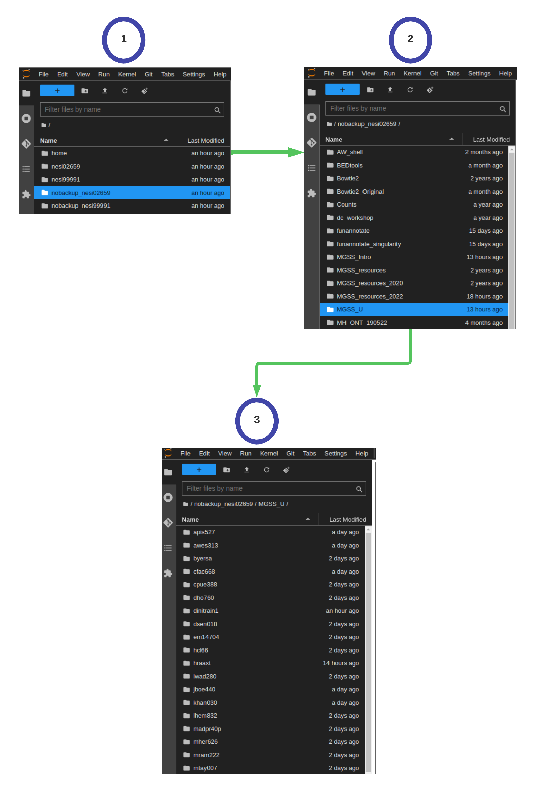

# NeSI File system, Working directory and Symlinks

The part of the operating system responsible for managing files and directories is called the **file system**. It organizes our data into files, which hold information, and directories (also called ‘folders’), which hold files or other directories.

Directories are like places — at any time while we are using the shell, we are in exactly one place called our current working directory. Commands mostly read and write files in the current working directory, i.e. ‘here’, so knowing where you are before running a command is important.

!!! pied-piper "NeSI Filesystem (For Researchers)"

    All HPC platforms have custom File Systems for the purpose of **general use** and **admin**. NeSI Filesystem looks like above 
    
    <center>
    {width="450"}
    </center>

    This may look a bit obscure but thing of them as different labels for some familiar names such as Desktop, Downloads, Documents

    * **`/home/username`** is for user-specific files such as configuration files, environment setup, source code, etc. This will be the default landing file system during a login
    * **`/nesi/project/projectcode`** is for persistent project-related data, project-related software, etc
    * **`/nesi/nobackup/projectode`** is a 'scratch space', for data you don't need to keep long term. Old data is periodically deleted from nobackup

    **`projectode`** for this event is `nesi02659`. If you are to open a NeSI project for your own research, it will have a unique project code with a prefix to represent your affiliated institute and a five digit number (randomly generated). 

    >Therefore, full path to persistent and nobackup/scratch file systems will be in the format of 

    * **`/nesi/project/nesi02659`**
    * **`/nesi/nobackup/nesi02659`**

## Symlinks (shortcuts ?) 

All of the SummerSchool material will be hosted on `/nesi/nobackup/nesi02659` file system as it is the largest and fastest filesystem. Also, each one of the attendee has an individual working space in `/nesi/nobackup/nesi02659/MGSS_U/`. Although this is great in everyway, having to type the full path to access this particular path (or having to remember it) from the default login site (`/home` filesystem) can be a tedious task. Therefore, we recommend creating a **Symbolic link** to your individual working directory from `/home` Think of it as a shortcut from your Desktop 🙂

!!! hint ""
    * Log into the NeSI Jupyter service as per **S.1.1 : NeSI Mahuika Jupyter login** in [NeSI Setup Supplementary material](http://127.0.0.1:8000/metagenomics_summer_school/supplementary/supplementary_1/) and open a terminal session
    * Let's call the symlink (shortcut) `mgss`
    * Following command will create the `mgss` symlink from your `/home` directory to individual working directory in `/nesi/nobackup/nesi02659/MGSS_U/`
    ```bash
    ln -s /nesi/nobackup/nesi02659/MGSS_U/$USER ~/mgss
    ```

    * Now, you can access your working directory with     
    ```
    cd ~/mgss
    ```
    * Run `pwd` to check the current working directory
    * `pwd` commands on symlinks will print the "relative path" (location from where we are, rather than from the root of the file system) with respect to "absolute path" (entire path from the root directory)
    * Run the command `realpath /path/you/want/to/know`  to show the absolute path of the symlink. i..e
    ```bash
    realpath ~/mgss
    ```
    OR if you are already at the symlinked path
    ```bash
    cd ~/mgss
    ```
    ```bash
    realpath .
    ```
    * **Summary**

    <center></center>

## Jupyter File explorer

!!! hint ""

    Jupyter terminal and file explorer (on left) operate independently of each other. Therefore, changing the directory via terminal to your individual directory will not change the default working directory in explorer. Changing it to your individual directories can be done will couple of click 

    <center></center>