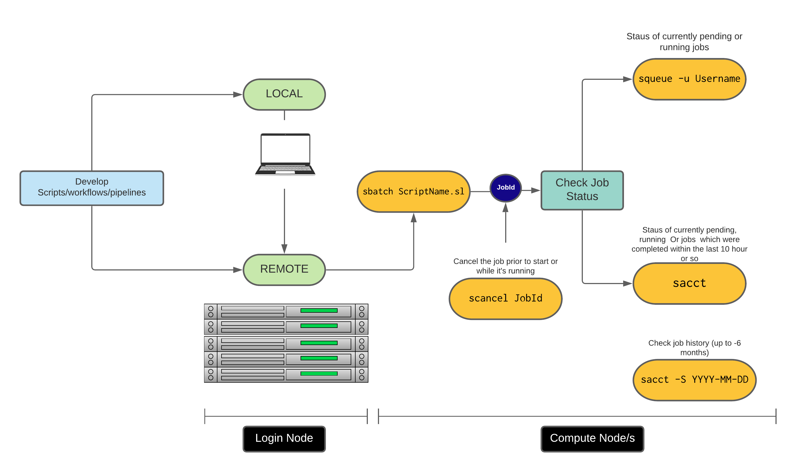

# Introduction to the command line

---

### Objectives

* Navigating your file system
* Copying, Moving, Renaming and Removing files
* Examining file contents
* Redirection, manipulation and extraction
* Text and file manipulation
* Loops
* Shell scripting
* Moving files between your laptop and NeSI
* Introduction to slurm

---

### Navigating your file system

To launch a standard **terminal** within the NeSI [Jupyter hub](https://jupyter.nesi.org.nz/hub/login):

* click on the `+` button in the top left of the screen (directly below the `File` drop-down menu) to bring up the `Jupyter` launcher window
* launch the terminal using the bottom at the bottom left of the pane (under "Other"). 

Find the current location by running the command `pwd` which stands for *print working directory*. At any given time, **current working directory** is current default directory.

```bash
pwd
# /home/UserName/
```

We can see what files and subdirectories are in this directory by running `ls`, which stands for "listing".

```bash
ls
```

Navigating to the `MGSS_Intro/` directory can be done with `cd` command which stands for *change directory*.

```bash
cd MGSS_Intro/
```

Run the `ls` command to list the content of the current directory. Check whether there are two *.fastq* files.

The `mkdir` command (*make directory*) is used to make a directory. Enter `mkdir` followed by a space, then the directory name you want to create

```bash
mkdir backup/
```

---

### Copying, Moving, Renaming and Removing files

Make a second copy of `SRR097977.fastq` and rename it as `Test_1_backup.fastq`.  Then move that file to `backup/` directory.

```bash
cp SRR097977.fastq Test_1_backup.fastq

mv Test_1_backup.fastq backup
```

Navigate to `backup/` directory and use `mv` command to rename and move `Test_1_backup.fastq` as `Test_1_copy.fastq` to the directory immediately above.

```bash
cd backup/

mv Test_1_backup.fastq ../Test_1_copy.fastq
```

Return to the directory immediately above, check whether the `Test_1_copy.fastq` was moved and renamed as instructed and remove it by using the `rm` command.

```bash
cd ..

rm Test_1_copy.fastq
```

See whether you can remove the `backup/` directory by using the `rm` command as well. 

```bash
rm backup/
# rm : can not remove 'backup/': Is a directory
```

By default, `rm` will not delete directories. This can be done by using `-r` (recursive) option.

```bash
rm -r backup
```

---

### Examining file contents

There are a number of ways to examine the content of a file. `cat` and `less` are two commonly used programs for a quick look. Check the content of `SRR097977.fastq` by using these commands. Take a note of the differences. 

```
cat SRR097977.fastq
# less SRR097977.fastq
```

A few useful shortcuts for navigating in `less`

 

There are ways to take a look at parts of a file. For an example the `head` and `tail` commands will scan the beginning and end of a file, respectively. 

```bash
head SRR097977.fastq

tail SRR097977.fastq
```

Adding `-n` option to either of these commands will print the first or last *n* lines of a file.

```bash
head -n 1 SRR097977.fastq
# @SRR097977.1 209DTAAXX_Lenski2_1_7:8:3:710:178 length=36
```

---

### Redirection, manipulation and extraction

Although using `cat` and `less` commands will allow us to view the content of the whole file, most of the time we are in search of particular characters (strings) of interest, rather than the full content of the file. One of the most commonly used command-line utilities to search for strings is `grep`. Let's use this command to search for the string `NNNNNNNNNN` in `SRR098026.fastq` file.

```bash
grep NNNNNNNNNN SRR098026.fastq
```

Retrieve and discuss the output you get when `grep` was executed with the `-B1` and `-A1` flags.

```bash
grep -B1 -A2 NNNNNNNNNN SRR098026.fastq
```

In both occasions, outputs were printed to the terminal where they can not be reproduced without the execution of the same command. In order for "string" of interest to be used for other operations, this has to be "redirected" (captured and written into a file). The command for redirecting output to a file is `>`. Redirecting the string of bad reads that was searched using the `grep` command to a file named `bad_reads.txt` can be done with

```bash
grep -B1 -A2 NNNNNNNNNN SRR098026.fastq > bad_reads.txt
```

Use the `wc` command to count the number of words, lines and characters in the `bad_reads.txt` file.

```bash
wc bad_reads.txt
```

Add `-l` flag to `wc` command and compare the number with the above output

```bash
wc -l bad_reads.txt
```

In an instance where the same operation has to be applied for multiple input files and the outputs are to be redirected to the same output file, it is important to make sure that the new output is not over-writing the previous output. This can be avoided with the use of `>>` (append redirect) command which will append the new output to the end of the file, rather than overwriting it. 

```bash
grep -B1 -A2 NNNNNNNNNN SRR097977.fastq >> bad_reads.txt
```

Executing the same operation on multiple files with the same file extension (or different) can be done with *wildcards*, which are symbols or special characters that represent other characters. For an example. Using `*` wildcard, we can run the previous `grep` command on both files at the same time.

```bash
grep -B1 -A2 NNNNNNNNNN *.fastq >> bad_reads.txt
wc -l bad_reads.txt
```

The objective of the redirection example above is to search for a string in a set of file, write the output to a file and then count the number of lines in that file. Generating output files for short routine tasks like this will end up generating an excessive number of files with little value. The `|` (pipe) command is a commonly used method to apply an operation for an ouput without creating intermediate files. It takes the output generated by one command and uses it as the input to another command. 

```bash
grep -B1 -A2 NNNNNNNNNN SRR098026.fastq | wc -l
```

---

### Text and file manipulation

There are a number of handy command line tools for working with text files and performing operations like selecting columns from a table or modifying text in a file stream. A few examples of these are below.

#### Cut

The `cut` command print selected parts of lines from each file to standard output. It is basically a tool for selecting columns of text, delimited by a particular character. The tab character is the default delimiter that `cut` uses to determine what constitutes a field. If the columns in your file are delimited by another character, you can specify this using the `-d` parameter.

See what results you get from the file `names.txt`.

```bash
cat names.txt

cut -d " " -f 1 names.txt
cut -d " " -f 1-3 names.txt
cut -d " " -f 1,3 names.txt
```

#### basename

`basename` is a function in UNIX that is helpful for removing a uniform part of a name from a list of files. In this case, we will use `basename` to remove the .fastq extension from the files that we've been working with.

```bash
basename SRR097977.fastq .fastq
```

#### sed

`sed` is a stream editor. A stream editor is used to perform basic text transformations on an input stream (a file, or input from a pipeline) like, searching, find and replace, insertion or deletion. The most common use of the `sed` command in UNIX is for substitution or for find and replace. By using `sed` you can edit files even without opening it, which is extremely important when working with large files.

View the contents of the `animals.txt` file using `cat`.

```bash
cat animals.txt
```

We will now use `sed` to make some replacements to the text in this file. 

##### Example - Replacing/substituting a string

`sed` is mostly used to replace the text in a file. In the following example, `sed` replaces the word 'dogs' with 'cats' in the file.

```bash
sed 's/dogs/cats/' animals.txt
```

Here the `s` specifies the substitution operation. The `/` characters are delimiters. The `dogs` is the search pattern and the `cats` is the replacement string.

By default, the `sed` command replaces the first occurrence of the pattern in each line and it won't replace additional occurrences in the line.

##### Example - Replacing all occurrences

The substitute flag `g` (global replacement) can be added to the command to replace all the occurrences of the string in the line.

```bash
sed 's/dogs/cats/g' animals.txt
```

##### Example - Deleting a line

To delete a particular line, we can specify the line number followed by the `d` character. For example

```bash
sed '1d' animals.txt
# Delete the first line

sed '2d' animals.txt
# Delete the second line

sed '$d' animals.txt
# Delete the last line
```

---

### Loops

Loops are a common concept in most programming languages which allow us to execute commands repeatedly with ease. There are three basic loop constructs in `bash` scripting,

* **for** - iterates over a list of items and performs the given set of commands

```
for item in [LIST]
do
    [COMMANDS]
done
```

* **while** - Performs a given set of commands an unknown number of times as long as the given condition evaluates is true

```
while [CONDITION]
do
    [COMMANDS]
done
```

* **until** - Execute a given set of commands as longs as the given condition evaluates to false

For most of our uses, a `for loop` is sufficient for our needs, so that is what we will be focusing on for this exercise.

Shell identifies the `for` command and repeats a block of commands once for each item in a list. The for loop will take each item in the list (in order, one after the other), assign that item as the value of a variable, execute the commands between the `do` and `done` keywords, then proceed to the next item in the list and repeat over. The value of a variable is accessed by placing the `$` character in front of the variable name. This will tell the interpreter to access the data stored within the variable, rather than the variable name. For example

```bash
i="DAVE WAS HERE"

echo i
# i
echo $i
# DAVE WAS HERE
echo ${i}
# DAVE WAS HERE
```

This prevents the shell interpreter from treating `i` as a string or a command. The process is known as *expanding* the variable. We will now wrtite a for loop to print the first two lines of our *fastQ* files:

```
for filename in *.fastq
do
    head -n 2 ${filename}
done
```

Another useful command to be used with `for` loops is `basename` which strips directory information and suffixes from file names (i.e. prints the filename name with any leading directory components removed).

```
basename SRR097977.fastq .fastq
```

`basename` is rather a powerful tool when used in a for loop. It enables the user to access just the file prefix which can be use to name things

```
for filename in *.fastq
do
    name=$(basename ${filename} .fastq)
    echo ${name}
done
```

---

### Scripts

Executing operations that contain multiple lines/tasks or steps such as for loops via command line is rather inconvenient. For an example, imagine fixing a simple spelling mistake made somethwhere in the middle of a for loop that was directly executed on the terminal.

The solution for this is the use of shell scripts, which are essentially a set of commands that you write into a text file and then run as a single command. In UNIX-like operating systems, in built text editors such as `nano`, `emacs`, and `vi` provide the platforms to write scripts. For this workshop we will use `nano` to create a file named `ForLoop.sh`.

```
nano ForLoop.sh
```

Add the following for loop to the script (note the header `#!/bin/bash`).

```bash
#!/bin/bash

for filename in *.fastq
do
    head -n 2 ${filename}
done
```

Because `nano` is designed to work without a mouse for input, all commands you pass into the editor are done via keyboard shortcuts. You can save your changes by pressing `Ctrl + O`, then exit `nano` using `Ctrl + X`. If you try to exit without saving changes, you will get a prompt confirming whether or not you want to save before exiting, just like you would if you were working in **Notepad** or **Word**.

Now that you have saved your file, see if you can run the file by just typing the name of it (as you would for any command run off the terminal). You will notice the command written in the file will not be executed. The solution for this is to tell the machine what program to use to run the script. 

```bash
bash ForLoop.sh
```

Although the file contains enough information to be considered as a program itself, operating system can not recognise it as a program. This is due to it's lacking "executable" permissions to be executed without the assistance of a third party. Run the `ls -l ForLoop.sh` command and evaluate the first part of the output

```bash
ls -l ForLoop.sh 
# -rw-rw-r-- 1 user user 88 Dec  6 19:52 ForLoop.sh
```

There are three file permission flags that a file we create on NeSI can possess. Two of these, the read (`r`) and write (`w`) are marked for the `ForLoop.sh` file .The third flag, executable (`x`) is not set. We want to change these permissions so that the file can be executed as a program. This can be done by using `chmod` command. Add the executable permissions (`+x`) to `ForLoop.sh` and run `ls` again to see what has changed.

```bash
chmod +x ForLoop.sh
ls -l ForLoop.sh 
# -rwxrwxr-x 1 user user 88 Dec  6 19:52 ForLoop.sh
```

Re-open the file in `nano` and append the output to **TwoLines.txt**, save and exit

```bash
#!/bin/bash

for filename in *.fastq
do
    head -n 2 ${filename} >> TwoLines.txt
done
```

Execute the file `ForLoop.sh`. We'll need to put `./` at the beginning so the computer knows to look here in this directory for the program.

```bash
./ForLoop.sh
```

---

### Moving Files between your laptop and remote cluster/machine

There are multiple commands and tools to move files between your laptop and remote clusters/machines. `scp`, `rsync` are some of the commands and `Globus`, `Cyberduck` are some of these tools. We will be using `scp` command for most of the time as this is a simple to use tool that makes use of the `ssh` configuration we have already established for connecting to NeSI.

In order it use it error free, we need to pay attention to whether the file is moving FROM or TO remote cluster/machine, Absolute paths, Relative paths, Local vs Remote, etc. 

Following templates are written in a way where the commands are to be executed from **local**

#### *FROM* local *TO* remote

```
scp /path/from/local/ ga-vl01:/path/to/remote/
```

#### *FROM* remote *TO* local

```
scp ga-vl01:/path/from/remote/ /path/to/local/
```

If the `~/.ssh/config` is not set with aliases you will need to replace the shortcut `ga-vl01` with the full address of the remote:

```
scp -oProxyCommand="ssh -W %h:%p user@lander.nesi.org.nz" /path/in/local/ user@ga-vl01.mahuika.nesi.org.nz:/path/to/remote/
```

---

### Introduction to slurm

Jobs running on NeSI are submitted in the form of a batch script containing the code you want to run and a header of information needed by a job scheduler. 

All NeSI systems use the slurm batch scheduler for the submission, control and management of user jobs.
Slurm provides a rich set of features for organising your workload and an extensive array of tools for managing your resource usage. In most cases you need to know the commands:

<p align="center"></p>


Copy the contents of the `BLAST/` folder to your current directory, using the following command

```bash
cp -r /nesi/nobackup/nesi02659/BLAST ./
```

We will then anvigate into this directory with the `cd` command, then inspect the text of theh file `blast-test.sh` using `less` or `nano`.

```bash
cd BLAST/

less blast-test.sh
```

Evaluate the contents of `blast-test.sh` script. Take a note of the basic slurm variables, path variables, etc. We will revisit these in the afternoon, when you create your own slurm scripts.

Submit the script to the job queue as below.

```
sbatch blast-test.sh
```

---
